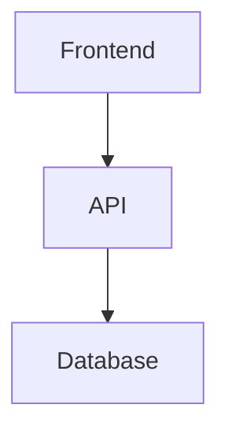

# VS Code Setup Guide - Income Platform

Complete guide to setting up VS Code for optimal development workflow with automated documentation.

---

## 🚀 Quick Start (5 Minutes)

### Step 1: Install VS Code

If you don't have it:
```bash
# Download from: https://code.visualstudio.com/
# Or via Homebrew:
brew install --cask visual-studio-code
```

### Step 2: Open Project

```bash
cd /Volumes/CH-DataOne/AlbertoDBP/Agentic/income-platform
code .
```

### Step 3: Copy VS Code Config

```bash
# From the downloaded files, copy the .vscode folder
cp -r ~/Downloads/.vscode ./

# Your project should now have:
# income-platform/
# ├── .vscode/
# │   ├── extensions.json       # Recommended extensions
# │   ├── settings.json          # Workspace settings
# │   ├── tasks.json             # Quick tasks (validate, sync, etc.)
# │   ├── markdown.code-snippets # Code snippets
# │   └── keybindings.json       # Keyboard shortcuts
# ├── docs/
# ├── scripts/
# └── ...
```

### Step 4: Install Recommended Extensions

When you open the project, VS Code will prompt:
```
"This workspace has extension recommendations"
[Install All] [Show Recommendations]
```

Click **Install All** to get:
- Markdown support with Mermaid diagrams
- Python support for automation scripts
- Git enhancements (GitLens, Git Graph)
- Spell checker
- YAML support

---

## 📦 Recommended Extensions Explained

### Core Extensions (Auto-installed)

#### Markdown Support
- **Markdown All in One** - TOC, formatting, shortcuts
- **Markdown Mermaid** - Preview diagrams inline
- **Markdown Preview Enhanced** - Better preview with export
- **markdownlint** - Linting and style checking

#### Python (for scripts & future agents)
- **Python** - IntelliSense, debugging, linting
- **Pylance** - Fast type checking
- **Ruff** - Fast linter and formatter

#### Git
- **GitLens** - See git blame, history inline
- **Git Graph** - Visualize git history

#### Quality
- **Code Spell Checker** - Catch typos
- **EditorConfig** - Consistent formatting

### Future Extensions (When coding)
- ESLint, Prettier - TypeScript/JavaScript
- Tailwind CSS IntelliSense - For Next.js

---

## ⌨️ Keyboard Shortcuts

### Documentation Tasks

| Shortcut | Action | When to Use |
|----------|--------|-------------|
| `Cmd+Shift+V` | Validate Documentation | Before committing |
| `Cmd+K Cmd+M` | Preview Markdown with Mermaid | View diagrams |
| `Cmd+K Cmd+G` | Git Sync | Pull latest changes |

### Built-in Shortcuts

| Shortcut | Action |
|----------|--------|
| `Cmd+P` | Quick Open file |
| `Cmd+Shift+P` | Command Palette |
| `Cmd+Shift+F` | Search across project |
| `Cmd+B` | Toggle sidebar |
| `Cmd+J` | Toggle terminal |
| `Ctrl+` ` | Toggle terminal |

---

## 🎯 VS Code Tasks (Run from Command Palette)

Press `Cmd+Shift+P` → Type "Tasks: Run Task"

### Available Tasks

1. **Validate Documentation**
   - Runs: `python3 scripts/validate-lenient.py`
   - Use: Check docs before committing
   - Shortcut: `Cmd+Shift+V`

2. **Validate Documentation (Strict)**
   - Runs: `python3 scripts/validate-documentation.py --strict`
   - Use: Pre-release validation

3. **Update Documentation - Design Change**
   - Runs: `./scripts/update-documentation.sh --design-change <component>`
   - Prompts for component name
   - Use: After design meetings

4. **Update Documentation - Dev Complete**
   - Runs: `./scripts/update-documentation.sh --dev-complete <component>`
   - Use: When finishing a component

5. **Full Documentation Sync**
   - Runs: `./scripts/update-documentation.sh --full-sync`
   - Use: Before releases

6. **Git: Sync with GitHub**
   - Runs: `git pull origin main && git status`
   - Use: Daily sync
   - Shortcut: `Cmd+K Cmd+G`

---

## 📝 Code Snippets

Type these prefixes in Markdown files, then press `Tab`:

### Documentation Snippets

| Prefix | Generates | Use Case |
|--------|-----------|----------|
| `funcspec` | Functional spec header | New component specs |
| `adr` | Architecture Decision Record | Document decisions |
| `changelog` | CHANGELOG entry | Update version history |
| `mermaid-flow` | Mermaid flowchart | Process diagrams |
| `mermaid-seq` | Mermaid sequence diagram | Interaction flows |

### Code Snippets (Future)

| Prefix | Generates | Use Case |
|--------|-----------|----------|
| `fastapi-endpoint` | FastAPI route | Agent service endpoints |
| `pytest-func` | Test function | Unit tests |

### Example Usage

In a `.md` file, type:
```
funcspec[Tab]
```

Generates:
```markdown
# [Component Name] - Functional Specification

**Version**: 1.0  
**Date**: 2026-01-26  
**Status**: Draft  
**Priority**: P0

## Purpose & Scope

[What does this component do]
...
```

---

## 🗂️ File Explorer Setup

### Workspace Layout

Your VS Code explorer should show:

```
INCOME-PLATFORM
├── 📁 docs/
│   ├── 📁 architecture/
│   │   └── 📄 reference-architecture.md
│   ├── 📁 diagrams/
│   │   ├── 🔷 system-architecture.mmd
│   │   └── 🔷 data-model.mmd
│   ├── 📁 functional/
│   │   └── 📄 agent-03-income-scoring.md
│   ├── 📄 index.md
│   ├── 📄 CHANGELOG.md
│   └── 📄 decisions-log.md
├── 📁 scripts/
│   ├── 🔧 update-documentation.sh
│   ├── 🐍 validate-lenient.py
│   └── 📁 templates/
├── 📁 src/                    [Future: Your code]
├── 📄 README.md
├── 📄 INTEGRATION_GUIDE.md
└── 📄 QUICK_START_SCRIPTS.md
```

### Hidden Files (Excluded)

These are hidden from explorer to reduce clutter:
- `__pycache__/`, `*.pyc` (Python bytecode)
- `.pytest_cache/` (Test cache)
- `.DS_Store` (Mac system files)
- `node_modules/` (When you add frontend)
- `.next/`, `dist/`, `build/` (Build artifacts)

---

## 🔍 Search Configuration

### Optimized Search

VS Code is configured to search only relevant files:
- ✅ Searches: `.md`, `.py`, `.ts`, `.tsx`, `.js`, `.jsx`
- ❌ Excludes: `node_modules/`, `dist/`, `__pycache__/`, `.next/`

### Search Tips

**Find across all docs**:
```
Cmd+Shift+F
Search: "Agent 3"
Files to include: docs/**/*.md
```

**Find in specific folder**:
```
Right-click docs/functional/ → "Find in Folder..."
```

---

## 🎨 Markdown Editing

### Preview Markdown

**Method 1: Side-by-side preview**
```
Cmd+K V
```

**Method 2: Enhanced preview (with Mermaid)**
```
Cmd+Shift+P → "Markdown Preview Enhanced: Open Preview"
or
Cmd+K Cmd+M (custom shortcut)
```

### Mermaid Diagrams

**Edit** `docs/diagrams/system-architecture.mmd`:


**Preview**: Opens in Markdown Preview Enhanced automatically

**Export**: Right-click preview → "Export" → PDF/PNG/HTML

### Markdown Features

- **Bold**: `Cmd+B`
- **Italic**: `Cmd+I`
- **Link**: `Cmd+K`
- **Insert image**: Type `` then drag image
- **Create TOC**: Type `<!-- TOC -->` then save

---

## 🐍 Python Configuration

### For Automation Scripts

VS Code is configured to use:
- **Interpreter**: `python3` (system Python)
- **Linter**: Ruff (fast, modern)
- **Formatter**: Ruff (auto-format on save)

### Running Scripts from VS Code

**Method 1: Integrated Terminal**
```bash
# Open terminal: Cmd+J
python3 scripts/validate-lenient.py
./scripts/update-documentation.sh --help
```

**Method 2: Tasks (Recommended)**
```
Cmd+Shift+P → "Tasks: Run Task" → "Validate Documentation"
```

**Method 3: Right-click file**
```
Right-click validate-lenient.py → "Run Python File in Terminal"
```

### Future: Agent Development

When you start coding agents:
- Virtual environment auto-detected
- Auto-complete for FastAPI, pandas, XGBoost
- Inline type checking with Pylance
- Debugging with breakpoints

---

## 🔄 Git Integration

### Built-in Git Features

**Source Control Panel** (`Cmd+Shift+G`):
- See all changes
- Stage files (click `+`)
- Commit with message
- Push/pull

**GitLens Features** (after installing):
- Inline git blame (who changed what)
- Click any line → see full commit
- Compare branches
- File history

### Git Graph (Visual History)

```
Cmd+Shift+P → "Git Graph: View Git Graph"
```

Shows visual commit tree with:
- Branch visualization
- Commit messages
- Easy cherry-pick, rebase, merge

### Recommended Git Workflow in VS Code

```
1. Cmd+Shift+G (Open Source Control)
2. Review changes (click file to see diff)
3. Stage files (click + icon)
4. Write commit message
5. Cmd+Enter to commit
6. Click "..." → Push
```

---

## 🚀 Daily Workflow

### Morning (Start Work)

```bash
# 1. Open VS Code
code /Volumes/CH-DataOne/AlbertoDBP/Agentic/income-platform

# 2. Sync with GitHub
Cmd+K Cmd+G   # Or use task: "Git: Sync with GitHub"

# 3. Check what's new
git log --oneline -5
```

### During Development

**Working on documentation**:
```
1. Open file in docs/
2. Edit in left pane
3. Preview in right pane (Cmd+K V)
4. Save (auto-formats)
```

**Working with Claude**:
```
1. Upload project to Claude
2. Claude generates specs and runs scripts
3. Download updated files
4. Copy to your local project
5. Review in VS Code
6. Commit
```

### End of Day

```
1. Validate: Cmd+Shift+V
2. Review changes: Cmd+Shift+G
3. Stage all: Click checkmark icon
4. Commit: Write message, Cmd+Enter
5. Push: Click "..." → Push
```

---

## 🎯 Advanced Tips

### Multi-Cursor Editing

```
Cmd+D      # Select next occurrence
Cmd+Shift+L # Select all occurrences
Option+Click # Add cursor
```

**Use case**: Update all agent numbers at once

### Breadcrumbs Navigation

Enabled by default at top of editor:
```
docs > functional > agent-03-income-scoring.md
```

Click any part to jump to that folder

### Zen Mode (Distraction-Free)

```
Cmd+K Z
```

Full-screen, hide everything except editor

### Snippets with Placeholders

After typing `funcspec[Tab]`:
```
1. Tab through placeholders
2. Type values
3. Tab to next placeholder
4. Tab through all → Done!
```

---

## 🔧 Customization

### Adjust Settings

```
Cmd+, (Settings)
→ Search for specific setting
→ Adjust as needed
```

**Common adjustments**:
- Font size: "Editor: Font Size"
- Theme: "Color Theme" (try "GitHub Dark")
- Auto-save: "Files: Auto Save" → "afterDelay"

### Add Your Own Snippets

```
Cmd+Shift+P → "Preferences: Configure User Snippets"
→ "markdown.json"
→ Add custom snippets
```

### Custom Tasks

Edit `.vscode/tasks.json` to add your own tasks:
```json
{
  "label": "My Custom Task",
  "type": "shell",
  "command": "echo 'Hello World'",
  "group": "test"
}
```

---

## 📚 Learning Resources

### VS Code Basics
- Interactive Playground: `Cmd+Shift+P` → "Help: Interactive Playground"
- Tips & Tricks: https://code.visualstudio.com/docs/getstarted/tips-and-tricks

### Markdown
- Cheat Sheet: https://www.markdownguide.org/cheat-sheet/
- Mermaid Docs: https://mermaid.js.org/

### Python in VS Code
- Tutorial: https://code.visualstudio.com/docs/python/python-tutorial

---

## ✅ Setup Checklist

After following this guide, verify:

- [ ] VS Code opens your project
- [ ] `.vscode/` folder exists with config files
- [ ] Recommended extensions installed
- [ ] `Cmd+Shift+V` validates documentation
- [ ] Markdown preview works (`Cmd+K V`)
- [ ] Mermaid diagrams render in preview
- [ ] Terminal opens (`Cmd+J`)
- [ ] Git integration works (Source Control panel)
- [ ] Snippets work (type `funcspec[Tab]`)
- [ ] Tasks run (`Cmd+Shift+P` → Tasks)

---

## 🆘 Troubleshooting

### Extensions Not Installing

```
Cmd+Shift+P → "Extensions: Show Recommended Extensions"
→ Install manually
```

### Python Not Found

```
Cmd+Shift+P → "Python: Select Interpreter"
→ Choose system Python 3
```

### Tasks Not Appearing

```
Verify .vscode/tasks.json exists
Cmd+Shift+P → "Tasks: Run Task" → Should see tasks
```

### Mermaid Not Rendering

```
Install "Markdown Preview Enhanced" extension
Use Cmd+K Cmd+M instead of Cmd+K V
```

---

## 🎉 You're Ready!

Your VS Code is now optimized for:
- ✅ Fast documentation editing
- ✅ Mermaid diagram preview
- ✅ One-click validation
- ✅ Quick Git operations
- ✅ Code snippets for common patterns
- ✅ Future Python development

**Next**: Start editing docs and watch the magic happen! 🚀
