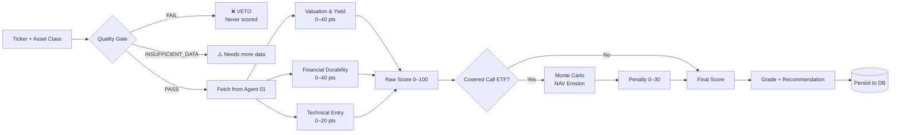
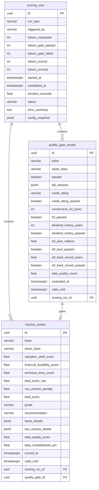
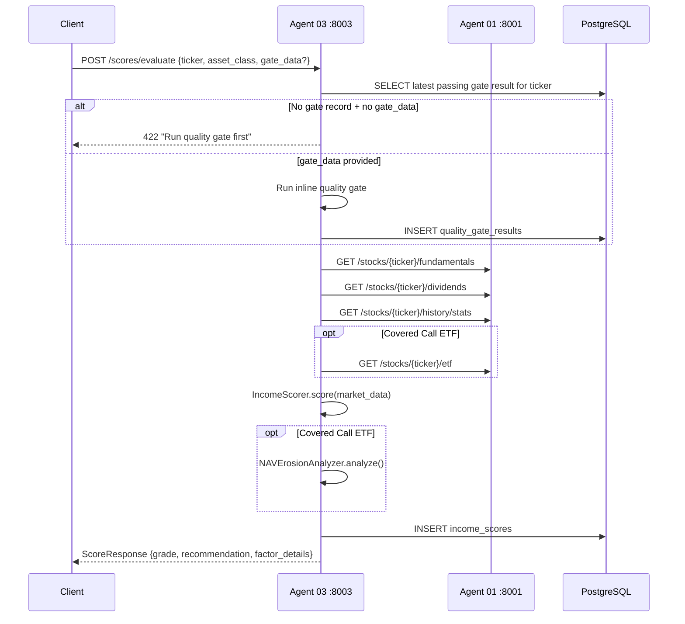
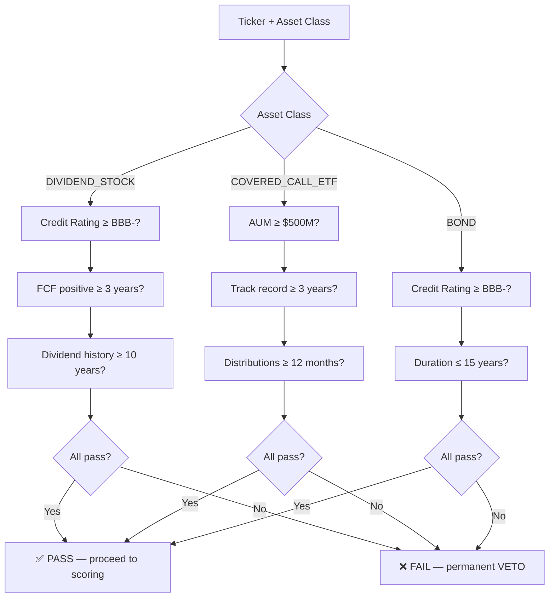

# Agent 03 — Income Scoring Service: Reference Architecture

**Version:** 1.1.0  
**Date:** 2026-02-26  
**Status:** Production Ready  
**Port:** 8003

---

## Overview

Agent 03 is the income scoring microservice of the Income Fortress Platform. It implements a two-phase evaluation pipeline: a binary quality gate (capital preservation VETO) followed by a weighted scoring engine that produces a 0–100 score with grade and recommendation.

The service consumes market data exclusively from Agent 01 via HTTP API. It never queries market data tables directly, maintaining clean microservice separation.

---

## System Architecture

```mermaid
flowchart TB
    subgraph Client["API Client"]
        REQ[Score Request]
    end

    subgraph Agent03["Agent 03 — Income Scoring Service :8003"]
        direction TB
        API[FastAPI Layer]
        
        subgraph Gate["Phase 1: Quality Gate"]
            QGE[Quality Gate Engine]
            DC_CHECK[Capital Preservation Check]
        end

        subgraph Scorer["Phase 2: Scoring Engine"]
            DC[Data Client]
            IS[Income Scorer]
            NAV[NAV Erosion Analyzer]
        end

        DB_LAYER[SQLAlchemy ORM]
    end

    subgraph Agent01["Agent 01 — Market Data Service :8001"]
        FUND[/fundamentals]
        DIV[/dividends]
        HIST[/history/stats]
        ETF[/etf]
        PRICE[/price]
    end

    subgraph DB["PostgreSQL — platform_shared"]
        T1[(scoring_runs)]
        T2[(quality_gate_results)]
        T3[(income_scores)]
    end

    REQ --> API
    API --> Gate
    Gate --> QGE
    QGE --> DC_CHECK
    DC_CHECK -->|PASS| Scorer
    DC_CHECK -->|FAIL/VETO| API

    Scorer --> DC
    DC --> FUND
    DC --> DIV
    DC --> HIST
    DC --> ETF
    DC --> PRICE

    IS --> NAV
    NAV -->|ETF only| IS

    Gate --> DB_LAYER
    Scorer --> DB_LAYER
    DB_LAYER --> T1
    DB_LAYER --> T2
    DB_LAYER --> T3

    API -->|Score Response| Client
```

---

## Component Overview

### app/api/
FastAPI routers. Three modules:

| Module | Endpoints | Purpose |
|---|---|---|
| `health.py` | `GET /health` | DB connectivity + upstream table check |
| `quality_gate.py` | `POST /quality-gate/evaluate`, `POST /quality-gate/batch` | Phase 1 evaluation |
| `scores.py` | `POST /scores/evaluate`, `GET /scores/`, `GET /scores/{ticker}` | Phase 2 scoring |

### app/scoring/
Business logic. Four modules:

| Module | Class | Purpose |
|---|---|---|
| `quality_gate.py` | `QualityGateEngine` | Binary VETO gate per asset class |
| `data_client.py` | `MarketDataClient` | Async HTTP client for Agent 01 |
| `income_scorer.py` | `IncomeScorer` | Weighted 0–100 scoring engine |
| `nav_erosion.py` | `NAVErosionAnalyzer` | Monte Carlo penalty for covered call ETFs |

### app/
Core infrastructure:

| Module | Purpose |
|---|---|
| `config.py` | Pydantic Settings — all thresholds configurable |
| `database.py` | SQLAlchemy QueuePool engine + session factory |
| `models.py` | ORM: `ScoringRun`, `QualityGateResult`, `IncomeScore` |
| `main.py` | FastAPI app, lifespan, CORS, timing middleware |

---

## Scoring Pipeline



---

## Scoring Sub-Components

### Pillar 1: Valuation & Yield (0–40 pts)

| Sub-component | Max | Logic |
|---|---|---|
| `payout_sustainability` | 16 | payout_ratio: <0.4→16, <0.6→12, <0.75→8, <0.9→4, else 0 |
| `yield_vs_market` | 14 | annual yield: >4%→14, >3%→10, >2%→6, >1%→2, else 0 |
| `fcf_coverage` | 10 | FCF>0→10, FCF=0/None→5, FCF<0→0 |

### Pillar 2: Financial Durability (0–40 pts)

| Sub-component | Max | Logic |
|---|---|---|
| `debt_safety` | 16 | D/E: <0.5→16, <1.0→12, <1.5→8, <2.0→4, else 0 |
| `dividend_consistency` | 14 | years: >25→14, >15→10, >10→7, else 4 |
| `volatility_score` | 10 | std dev: <2→10, <5→7, <10→4, <20→2, else 0 |

### Pillar 3: Technical Entry (0–20 pts)

| Sub-component | Max | Logic |
|---|---|---|
| `price_momentum` | 12 | 90d change: <-15%→12, <-5%→8, <5%→6, <15%→3, else 0 |
| `price_range_position` | 8 | (price-min)/(max-min): <0.3→8, <0.5→5, <0.7→3, else 1 |

### NAV Erosion Penalty (Covered Call ETFs only)

| P(erosion > 5%) | Risk | Penalty |
|---|---|---|
| < 0.30 | LOW | 0 |
| < 0.50 | MODERATE | 10 |
| < 0.70 | HIGH | 20 |
| ≥ 0.70 | SEVERE | 30 |

### Grades & Recommendations

| Score | Grade | Recommendation |
|---|---|---|
| ≥ 95 | A+ | AGGRESSIVE_BUY |
| ≥ 85 | A | AGGRESSIVE_BUY |
| ≥ 75 | B+ | ACCUMULATE |
| ≥ 70 | B | ACCUMULATE |
| ≥ 60 | C | WATCH |
| ≥ 50 | D | WATCH |
| < 50 | F | WATCH |

---

## Data Model



---

## Integration Architecture



---

## Quality Gate Logic per Asset Class



---

## Deployment

### Local Development
```bash
cd income-platform/src/income-scoring-service
PYTHONPATH=. python scripts/migrate.py          # run once
PYTHONPATH=. uvicorn app.main:app --host 0.0.0.0 --port 8003 --reload
```

### Docker (Production)
```bash
cd income-platform
docker-compose up agent-03-income-scoring
```

### Environment Variables (required)
```
SERVICE_NAME=agent-03-income-scoring
SERVICE_PORT=8003
DATABASE_URL=postgresql+psycopg2://...
REDIS_URL=rediss://...
FMP_API_KEY=...
MARKET_DATA_SERVICE_URL=http://localhost:8001
NAV_EROSION_SIMULATIONS=10000
SCORE_HISTORY_DAYS=90
```

---

## Known Limitations

1. **Redis required for caching** — service degrades gracefully but all Agent 01 calls are live without cache
2. **Credit rating is user-provided** — not fetched from external API (FMP /rating not available on current plan)
3. **XGBoost ML model deferred** — current scoring is rule-based; ML layer planned for Phase 3
4. **SHAP explainability deferred** — planned for Phase 3
5. **No learning loop** — shadow portfolio tracking planned for Phase 3
