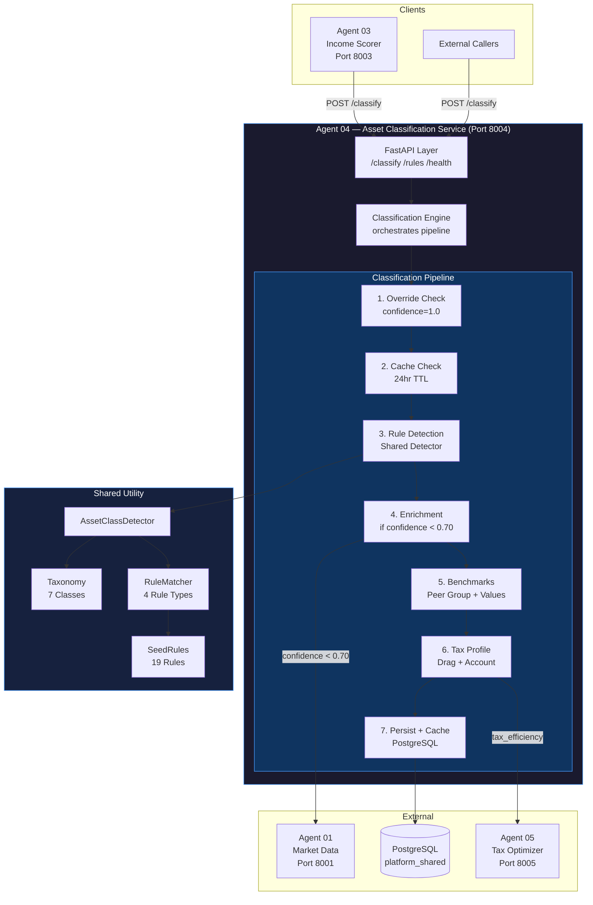
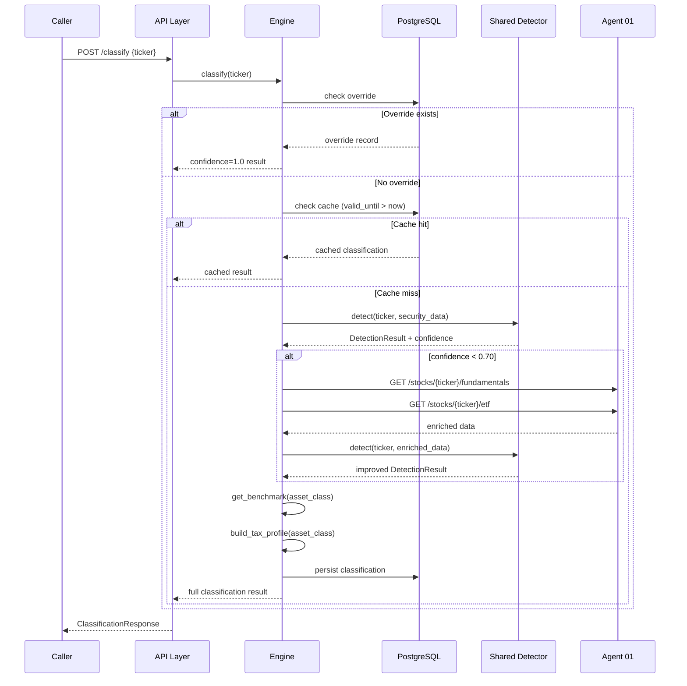
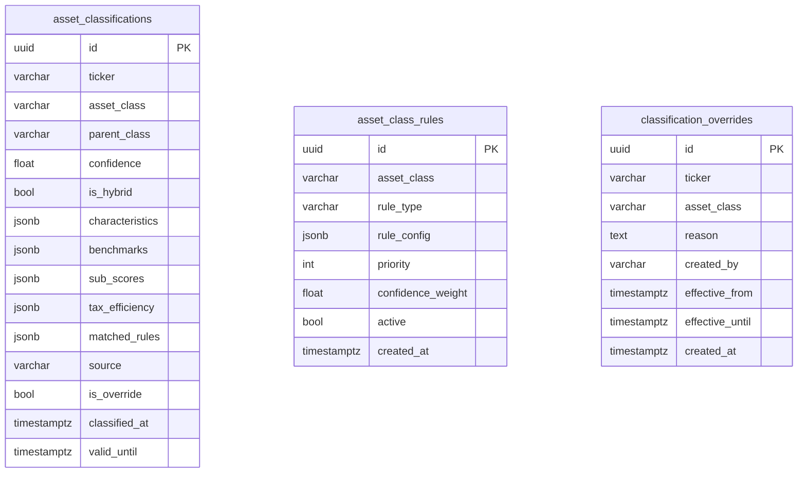

# Agent 04 — Reference Architecture

**Component:** Asset Classification Service  
**Port:** 8004  
**Last Updated:** 2026-02-27

---

## System Overview



---

## Classification Pipeline Detail



---

## Data Model



---

## Shared Utility Architecture

```mermaid
graph LR
    subgraph SharedUtil["src/shared/asset_class_detector/"]
        INIT[__init__.py\nexports: AssetClassDetector]
        TAX[taxonomy.py\nAssetClass enum\nAssetClassInfo\nHIERARCHY dict]
        RULES[rule_matcher.py\nRuleMatcher\n4 rule types\nconfidence scoring]
        SEED[seed_rules.py\n19 seed rules\n7 asset classes]
        DET[detector.py\nAssetClassDetector\ndetect()\ndetect_with_fallback()]
    end

    A03[Agent 03] -->|from shared.asset_class_detector import| INIT
    A04[Agent 04] -->|from shared.asset_class_detector import| INIT
    AN[Agent N...] -->|from shared.asset_class_detector import| INIT
    INIT --> DET
    DET --> TAX
    DET --> RULES
    RULES --> SEED
```

---

## Rule Priority System

| Priority | Rule Type | Confidence Weight | Example |
|---|---|---|---|
| 5 | ticker_pattern (known list) | 0.90–0.95 | JEPI → COVERED_CALL_ETF |
| 5 | ticker_pattern (suffix) | 0.90 | BAC-PA → PREFERRED_STOCK |
| 10 | metadata | 0.85–0.90 | fund_category=Mortgage REIT |
| 10 | sector | 0.70–0.85 | sector=Real Estate |
| 20+ | feature | 0.55–0.80 | has_maturity_date=True |
| 50 | DIVIDEND_STOCK fallback | 0.60 | common stock + yield |

Lower priority number = evaluated first = higher specificity.

---

## Deployment

| Item | Value |
|---|---|
| Service root | `src/asset-classification-service/` |
| Start command | `PYTHONPATH=src:src/asset-classification-service python3 -m uvicorn app.main:app --port 8004` |
| Migration | `python3 scripts/migrate.py` (run from service root) |
| Credentials | Root `.env` at `income-platform/` |
| DB schema | `platform_shared` (shared with Agent 03) |
| Tables | `asset_classifications`, `asset_class_rules`, `classification_overrides` |
