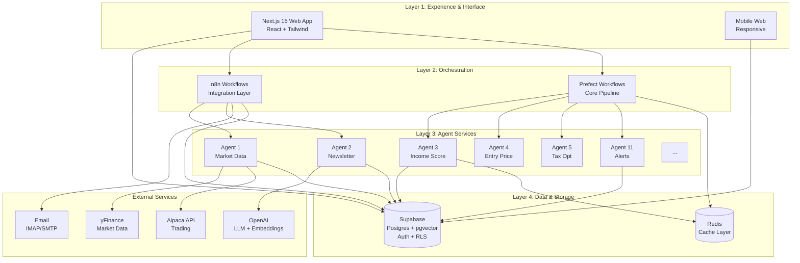
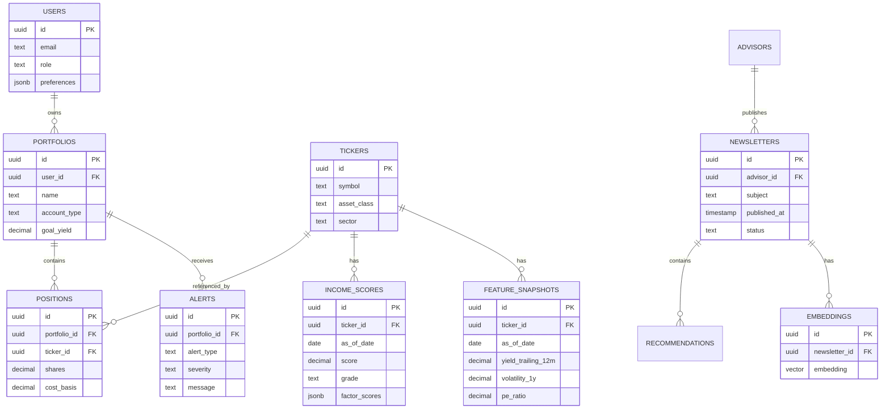
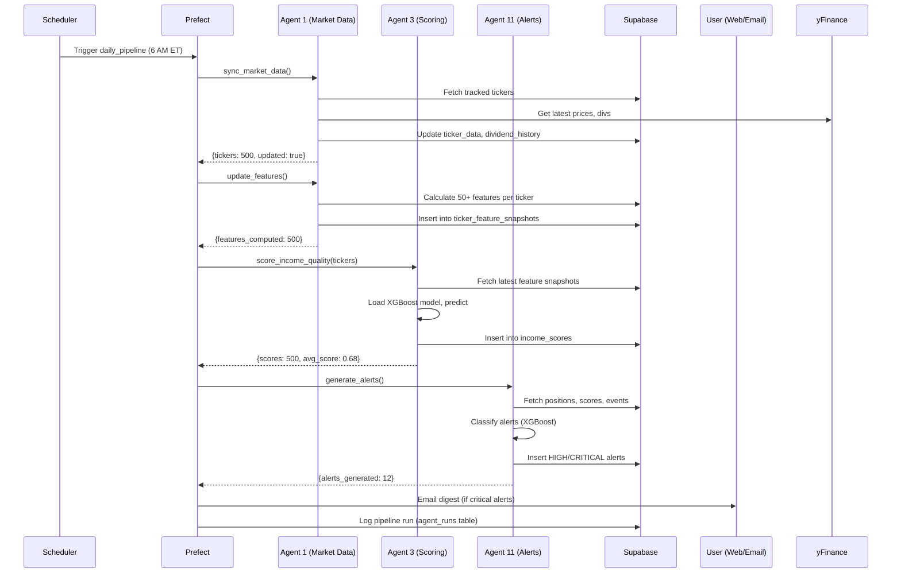
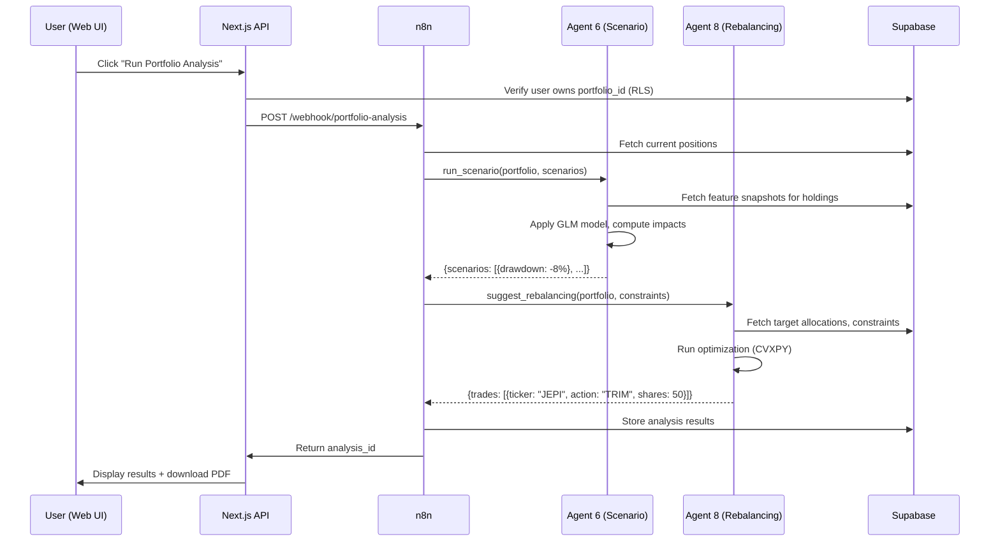

# Tax-Efficient Income Investment Platform - Reference Architecture

**Version**: 1.0  
**Date**: 2026-01-23  
**Status**: Active Development

## Document Purpose

This document provides the authoritative architectural blueprint for the Tax-Efficient Income Investment Platform. It defines the system's structure, component responsibilities, integration patterns, and design principles that guide all implementation decisions.

## Executive Summary

The Tax-Efficient Income Investment Platform is a multi-layered AI-powered system that combines:
- **ML-powered agent intelligence** for scoring, monitoring, and optimization
- **Hybrid orchestration** (n8n + Prefect) for flexible workflow management
- **Modern web stack** (Next.js 15 + Supabase) for responsive UX and data management
- **Comprehensive security** (RLS, encryption, audit logging) for multi-tenant isolation

The platform enables investors to optimize covered call ETF portfolios for 12-18% income yields while managing tax efficiency, NAV erosion, and risk through 11 specialized AI agents.

---

## System Architecture Overview

### High-Level Layers



### Architecture Principles

1. **Separation of Concerns**: Each layer has distinct responsibilities with clean interfaces
2. **Hybrid Orchestration**: Use the right tool (n8n for integrations, Prefect for core logic)
3. **Stateless Services**: All agent logic in stateless FastAPI services for horizontal scaling
4. **Data-Centric Security**: RLS enforces multi-tenancy at database level
5. **Observable by Design**: Every workflow, API call, and agent decision is logged and traceable
6. **Cost-Conscious**: Free-tier data sources (yFinance) with premium APIs (Alpaca, OpenAI) used strategically

---

## Layer 1: Experience & Interface

### Next.js 15 Web Application

**Technology Stack**:
- Framework: Next.js 15 (App Router, Server Components)
- UI: React 18 + TypeScript
- Styling: Tailwind CSS + shadcn/ui components
- State: TanStack Query (server state) + Zustand (client state)
- Auth: Supabase Auth client
- Charts: Recharts
- Deployment: Vercel Edge

**Key Pages**:
1. `/dashboard` - Portfolio overview, income metrics, alert feed
2. `/portfolios/[id]` - Position details, rebalancing suggestions
3. `/research` - Ticker search, income scores, advisor insights
4. `/alerts` - Alert management with ML feedback loop
5. `/analysis` - Scenario planning, tax optimization, projections
6. `/settings` - User preferences, notification config, agent settings

**Architecture Pattern**: Server Components for data fetching, Client Components for interactivity, optimistic UI updates with TanStack Query mutations.

**Real-time Updates**: Supabase Realtime subscriptions for critical alerts and position value changes.

### Mobile Interface (Future)

Responsive web design serves mobile users initially. Native React Native app considered for Phase 2 based on adoption metrics.

---

## Layer 2: Orchestration

### Hybrid Orchestration Strategy

#### n8n (Integration Workflows)

**Responsibilities**:
- Email-to-newsletter parsing (Agent 2)
- Webhook triggers from frontend
- Simple scheduled health checks
- Third-party API integrations

**Example Workflow**:
```
Trigger: Email Received
→ Parse HTML content
→ Call Python RAG service for extraction
→ Store in Supabase
→ Send notification to user
```

**Deployment**: Self-hosted Docker container, queue mode for reliability

#### Prefect (Core Workflows)

**Responsibilities**:
- Daily data pipeline (Agents 1, 3, 10, 11)
- Portfolio analysis workflows (Agents 6, 7, 8, 9)
- ML model training and batch scoring
- Complex multi-step reasoning

**Example Flow**:
```python
@flow(name="daily_pipeline")
def daily_data_pipeline():
    # Agent 1: Sync market data
    tickers = sync_market_data()
    
    # Update feature snapshots
    update_features(tickers)
    
    # Agent 3: Score all tickers
    scores = score_income_quality(tickers)
    
    # Agent 10: NAV erosion check
    nav_alerts = check_nav_erosion()
    
    # Agent 11: Generate alerts
    generate_alerts(scores, nav_alerts)
    
    return {"tickers_scored": len(scores)}
```

**Deployment**: Prefect Cloud (free tier) or self-hosted server

#### Communication Between Orchestrators

Both n8n and Prefect call the same **FastAPI agent services**, ensuring DRY principle. State sharing via Supabase database.

---

## Layer 3: Agent Services

### Service Architecture

All agents implemented as **FastAPI microservices** with:
- **Stateless design**: No local state, all data from Supabase
- **Docker containerized**: Easy deployment and scaling
- **Health checks**: `/health` endpoint for monitoring
- **OpenAPI docs**: Auto-generated at `/docs`

### Agent Catalog

| Agent | Service Name | Primary Model/Logic | Orchestrator |
|-------|-------------|-------------------|--------------|
| Agent 1 | `market-data-service` | yFinance + Alpaca API | n8n, Prefect |
| Agent 2 | `newsletter-service` | LLM extraction + pgvector | n8n |
| Agent 3 | `income-scoring-service` | XGBoost (50+ features) | Prefect |
| Agent 4 | `entry-price-service` | Technical + Valuation rules | Prefect |
| Agent 5 | `tax-optimization-service` | Tax calculation engine | Prefect |
| Agent 6 | `scenario-service` | ElasticNet (GLM) | Prefect |
| Agent 7 | `opportunity-scanner-service` | Composite scoring + filters | Prefect |
| Agent 8 | `rebalancing-service` | Optimization algorithm | Prefect |
| Agent 9 | `income-projection-service` | Dividend schedule forecast | Prefect |
| Agent 10 | `nav-monitor-service` | NAV trend analysis | Prefect |
| Agent 11 | `alert-service` | XGBoost alert classifier | Prefect |

### Common Service Pattern

```python
from fastapi import FastAPI, Depends, HTTPException
from pydantic import BaseModel
from supabase import create_client
import os

app = FastAPI(title="Income Scoring Service")

# Supabase client
supabase = create_client(
    os.getenv("SUPABASE_URL"),
    os.getenv("SUPABASE_SERVICE_KEY")
)

class ScoreRequest(BaseModel):
    ticker: str
    as_of_date: str
    portfolio_id: str | None = None

class ScoreResponse(BaseModel):
    score: float
    grade: str
    factor_breakdown: dict
    confidence: float

@app.post("/score", response_model=ScoreResponse)
async def score_ticker(request: ScoreRequest):
    # 1. Fetch features from Supabase
    features = fetch_features(request.ticker, request.as_of_date)
    
    # 2. Load ML model and predict
    score = model.predict(features)
    
    # 3. Store result and return
    store_score(request.ticker, score)
    return ScoreResponse(...)
```

---

## Layer 4: Data & Storage

### Supabase (Primary Database)

**Postgres 15** with extensions:
- `pgvector`: Semantic search over newsletters
- `pg_cron`: Scheduled jobs (backups, cleanup)
- `uuid-ossp`: UUID generation

**Key Features**:
- **Row-Level Security (RLS)**: Multi-tenant data isolation
- **Auth**: Built-in JWT authentication
- **Realtime**: WebSocket subscriptions for live updates
- **Edge Functions**: Serverless functions for lightweight tasks

### Database Schema Overview



### Redis Cache Layer

**Purpose**: High-speed caching for frequently accessed data

**Cached Data**:
- Latest ticker prices (TTL: 5 minutes during market hours)
- Income scores for popular tickers (TTL: 1 hour)
- Feature snapshots (TTL: 24 hours)
- User session data (TTL: per session)

**Deployment**: Redis Cloud (free tier) or self-hosted Docker container

---

## External Service Integrations

### yFinance (Market Data)

**Usage**: Primary source for free OHLCV, dividends, fundamentals  
**Rate Limits**: No official limit, but implement throttling (1 req/sec)  
**Fallback**: If yFinance fails, use cached data and alert admins

### Alpaca Markets API

**Usage**: Live trading data, positions, executions  
**Authentication**: API key + secret  
**Rate Limits**: 200 req/min (free tier)  
**Usage Pattern**: Real-time position sync, not historical data

### OpenAI API

**Usage**:
- Embeddings (text-embedding-ada-002) for newsletter semantic search
- LLM (GPT-4o-mini) for entity extraction from newsletters
- Optional: GPT-4o for complex reasoning in analysis reports

**Cost Management**:
- Cache embeddings (never re-embed same content)
- Use mini models for extraction, full models sparingly
- Batch requests where possible

### Email (IMAP/SMTP)

**Usage**: Newsletter ingestion via forwarded emails  
**Provider**: User's email provider (Gmail, Outlook, etc.)  
**Security**: OAuth2 authentication, no password storage

---

## Security Architecture

### Authentication & Authorization

**Supabase Auth**:
- Email/password + magic links
- Optional MFA (TOTP) for premium users
- JWT tokens with 1-hour expiry, automatic refresh

**Row-Level Security (RLS)**:
```sql
-- Example: Users can only see their own portfolios
CREATE POLICY "users_own_portfolios"
ON portfolios FOR ALL
USING (auth.uid() = user_id);

-- Example: Users can only see positions in owned portfolios
CREATE POLICY "users_own_positions"
ON positions FOR ALL
USING (
    portfolio_id IN (
        SELECT id FROM portfolios WHERE user_id = auth.uid()
    )
);
```

**API Security**:
- All FastAPI services verify Supabase JWT tokens
- Rate limiting per user (100 req/hour free, 1000 req/hour premium)
- IP allowlist for admin endpoints

### Data Security

**Encryption**:
- **At Rest**: Supabase encrypts all data with AES-256
- **In Transit**: TLS 1.3 for all connections
- **Secrets**: Environment variables, Supabase vault for API keys

**Audit Logging**:
Every sensitive operation logged to `audit_log` table:
- User ID, action, resource type/ID
- IP address, user agent
- Timestamp, success/failure

**Compliance**:
- GDPR: Right to access, delete, export data
- Data retention: 7 years for financial records
- Disclaimers: Clear notice that platform is informational, not financial advice

---

## Deployment Architecture

### Development Environment

**Docker Compose** stack:
```yaml
services:
  supabase:
    image: supabase/postgres:15
    # ... Postgres + pgvector
    
  n8n:
    image: n8nio/n8n:latest
    # ... n8n with queue mode
    
  prefect:
    image: prefecthq/prefect:2-python3.11
    # ... Prefect server
    
  redis:
    image: redis:7-alpine
    
  agents:
    build: ./src/agents
    # ... All FastAPI services
    
  frontend:
    build: ./src/frontend
    # ... Next.js development server
```

**Local development**: `docker-compose up` starts entire stack

### Production Deployment

**Components**:
- **Frontend**: Vercel Edge (Next.js auto-deployment from Git)
- **Supabase**: Supabase Cloud (managed Postgres + Auth + Storage)
- **Agent Services**: Fly.io (Docker containers, auto-scaling)
- **n8n**: Self-hosted on Fly.io or Railway
- **Prefect**: Prefect Cloud (free tier) or self-hosted
- **Redis**: Redis Cloud (free tier)

**CI/CD Pipeline** (GitHub Actions):
```yaml
# .github/workflows/deploy.yml
on:
  push:
    branches: [main]
    
jobs:
  test:
    runs-on: ubuntu-latest
    steps:
      - pytest src/agents/tests
      - jest src/frontend/tests
      
  deploy-agents:
    needs: test
    runs-on: ubuntu-latest
    steps:
      - flyctl deploy --config fly.agents.toml
      
  deploy-frontend:
    needs: test
    runs-on: ubuntu-latest
    steps:
      - vercel --prod
```

**Monitoring**:
- Application errors: Sentry
- Infrastructure: Fly.io metrics + Uptime Robot
- Business metrics: Custom Supabase dashboard

---

## Data Flow Examples

### Daily Pipeline Flow



### User-Initiated Analysis Flow



---

## Scalability & Performance

### Performance Targets

| Metric | Target | Measurement |
|--------|--------|-------------|
| Web page load | < 2s | Lighthouse score ≥ 90 |
| API response (score) | < 500ms | p95 latency |
| Daily pipeline | < 10 min | Total execution time |
| Concurrent users | 100+ | No degradation |
| Database queries | < 100ms | p95 for common queries |

### Scaling Strategy

**Horizontal Scaling**:
- FastAPI services: Auto-scale on Fly.io (2-10 instances)
- Next.js: Vercel Edge handles CDN and scaling automatically
- Supabase: Managed scaling (upgrade plan as needed)

**Caching Strategy**:
- Redis for hot data (scores, prices)
- Supabase connection pooling (PgBouncer)
- CDN caching for static assets

**Database Optimization**:
- Indexes on all foreign keys and frequently queried columns
- Partitioning for large tables (ticker_feature_snapshots by date)
- Materialized views for complex aggregate queries

---

## Cost Management

### Estimated Monthly Costs (100 users)

| Service | Usage | Cost |
|---------|-------|------|
| Supabase | 10 GB database, 1M auth requests | $25 |
| Vercel | Next.js hosting | $0 (free tier) |
| Fly.io | 2 agent containers (256 MB each) | $10 |
| Redis Cloud | 30 MB cache | $0 (free tier) |
| OpenAI | 1M tokens (embeddings) + 100K (LLM) | $5 |
| yFinance | Free | $0 |
| Alpaca | Market data (free tier) | $0 |
| **Total** | | **~$40/month** |

### Cost Optimization Strategies

1. **Cache aggressively**: Never re-embed same newsletter content
2. **Use mini models**: GPT-4o-mini for extraction vs GPT-4o
3. **Batch operations**: Score all tickers once daily, not on-demand
4. **Free tiers**: yFinance for bulk data, Alpaca only for real-time

---

## Disaster Recovery

### Backup Strategy

**Supabase Backups**:
- Automatic daily snapshots (retained 7 days)
- Weekly backups to S3 (retained 30 days)
- Point-in-time recovery within 7 days

**Code & Config**:
- All code in GitHub (private repo)
- Infrastructure as code (Docker Compose, Fly.io config)
- Secrets in GitHub Secrets + Supabase vault

### Failover Procedures

**Supabase Outage**:
1. Serve stale data from Redis cache
2. Display "limited functionality" banner to users
3. Queue writes for replay when service restores

**Agent Service Failure**:
1. Retry with exponential backoff (Prefect handles this)
2. Alert admins via PagerDuty/email
3. Degrade gracefully (skip non-critical workflows)

**Complete System Failure**:
1. Restore Supabase from latest backup
2. Redeploy agents from Docker images
3. Replay Prefect workflows from last successful run
4. Estimated recovery time: < 2 hours

---

## Observability & Monitoring

### Logging Strategy

**Application Logs**:
- FastAPI services: Structured JSON logs to stdout
- Next.js: Console errors sent to Sentry
- n8n: Execution logs stored in Supabase
- Prefect: Run logs in Prefect Cloud UI

**Log Aggregation**: Fly.io logs → Papertrail (free tier)

### Metrics Dashboard

**Key Metrics** (Supabase custom dashboard):
- Agent success rate (success / total runs)
- Average latency per agent
- Token usage (OpenAI) per day
- User engagement (active users, portfolios created)
- Alert precision (acted / generated)

**Alerting Rules**:
- Agent success rate < 90% → Slack alert
- API p95 latency > 1s → PagerDuty
- OpenAI costs > $50/day → Email admin
- Database storage > 80% → Upgrade plan

---

## Development Standards

### Code Quality

**Python (Agent Services)**:
- Linting: `ruff` (fast linter + formatter)
- Type checking: `mypy` strict mode
- Testing: `pytest` with ≥ 80% coverage
- Docstrings: Google style

**TypeScript (Frontend)**:
- Linting: ESLint + Prettier
- Type checking: TypeScript strict mode
- Testing: Jest + React Testing Library
- Component docs: Storybook

### Git Workflow

**Branching Strategy**: Trunk-based development
- `main`: Production-ready code
- `feature/*`: Feature branches (merged via PR)
- `hotfix/*`: Emergency fixes (direct to main with approval)

**Commit Convention**: Conventional Commits
```
feat(agents): add Agent 5 tax optimization logic
fix(frontend): resolve alert feed pagination bug
docs(architecture): update deployment diagram
test(scoring): add edge cases for dividend cuts
```

---

## Future Enhancements

### Phase 2 (Months 4-6)

1. **Native Mobile App**: React Native for iOS/Android
2. **Advanced ML**: LSTM for income forecasting, RL for portfolio optimization
3. **Social Features**: Share portfolios, follow other investors (anonymized)
4. **Tax Document Generation**: Auto-generate 1099 summaries

### Phase 3 (Months 7-12)

1. **Automated Trading**: Execute trades via Alpaca based on agent recommendations
2. **Multi-Asset Support**: Expand beyond covered call ETFs to REITs, BDCs, preferreds
3. **Advisor Network**: Marketplace for connecting investors with vetted advisors
4. **API for Third Parties**: Public API for fintech integrations

---

## References

- **Supabase Documentation**: https://supabase.com/docs
- **Prefect Documentation**: https://docs.prefect.io
- **n8n Documentation**: https://docs.n8n.io
- **Next.js Documentation**: https://nextjs.org/docs
- **XGBoost Documentation**: https://xgboost.readthedocs.io

---

## Document History

| Version | Date | Author | Changes |
|---------|------|--------|---------|
| 1.0 | 2026-01-23 | Platform Team | Initial reference architecture |

---

**Next Steps**: See `docs/functional/` for detailed component specifications and `docs/implementation/` for implementation guides with testing specs.
