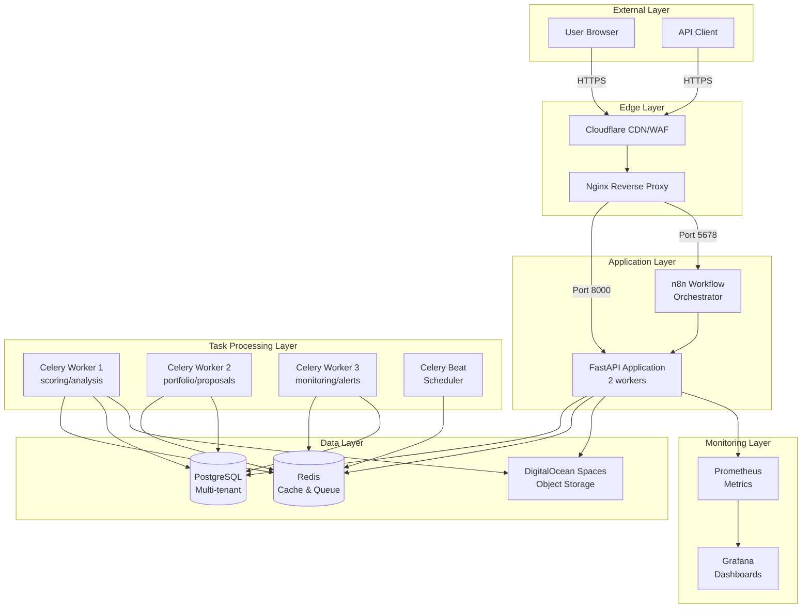
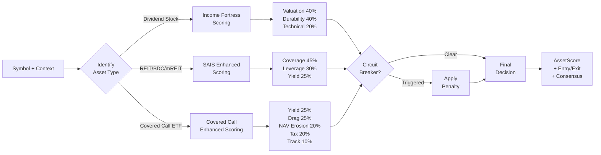
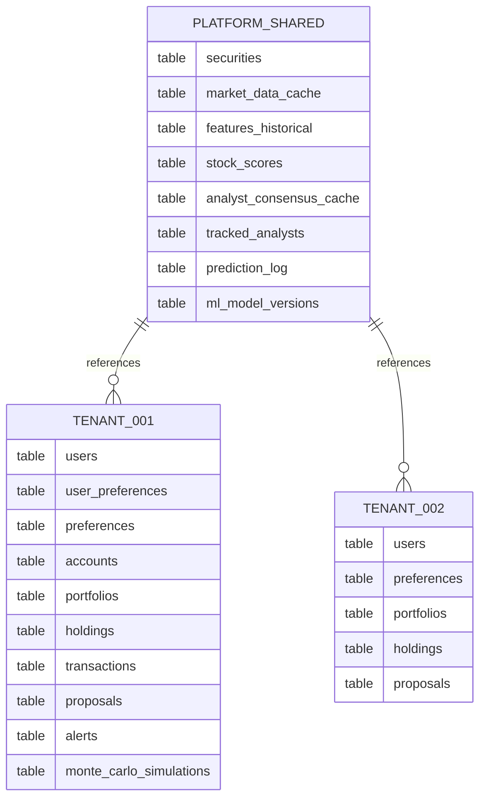
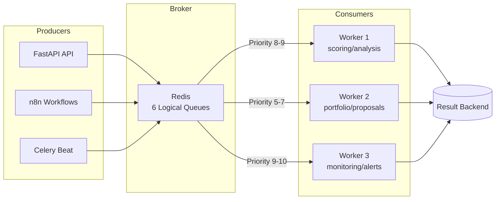
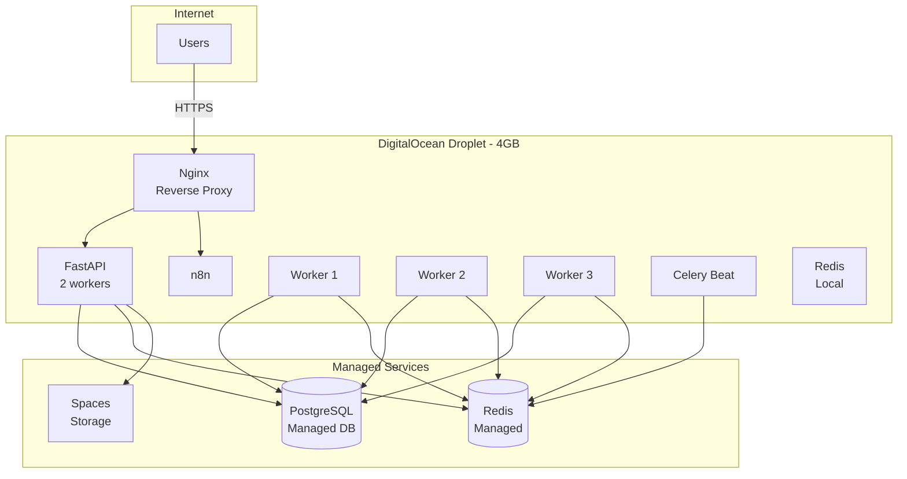
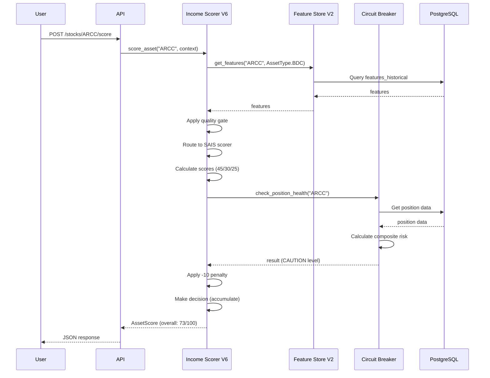
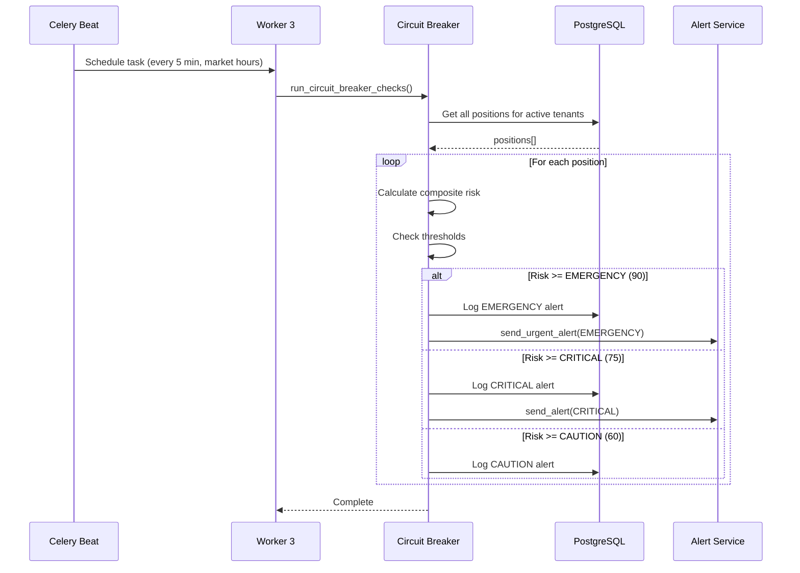
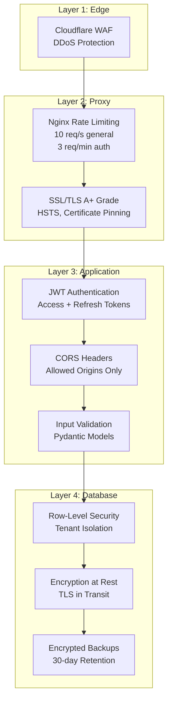
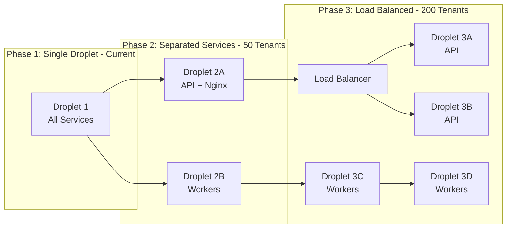

# Reference Architecture - Income Fortress Platform

**Version:** 1.0.0  
**Status:** Production Ready  
**Last Updated:** February 2, 2026

---

## Executive Summary

The Income Fortress Platform is a tax-efficient income investment platform featuring:
- **24-agent AI system** for comprehensive analysis
- **Hybrid scoring methodology** (Income Fortress + SAIS)
- **Real-time circuit breaker** monitoring
- **Multi-tenant SaaS architecture**
- **Production-grade deployment** on DigitalOcean

**Core Principles:**
1. **Capital Preservation First** - 70% threshold with VETO power
2. **Income Generation** - Optimize yield without yield traps
3. **Tax Efficiency** - ROC, qualified dividends, Section 1256 tracking
4. **User Control** - Proposal-based workflow, no auto-execution

---

## System Architecture Overview

---

## Component Architecture

### 1. Income Scorer V6 (Core Engine)

**Purpose:** Hybrid scoring system combining Income Fortress methodology with SAIS for high-yield assets.

**Key Features:**
- **NAV Erosion:** 3-year benchmark-relative calculation (20% weight for ETFs)
- **ROC Tax Efficiency:** Tracks Return of Capital vs qualified/ordinary income
- **Granular SAIS Curves:** 5-zone scoring (danger/critical/acceptable/good/excellent)
- **Profile-Driven:** Adapts thresholds based on user risk tolerance
- **Circuit Breaker Integration:** Auto-enables for high-yield assets

---

### 2. 24-Agent System Architecture

```mermaid
graph TD
    subgraph "Tier 1: Platform Coordinator"
        PC[Platform Coordinator<br/>n8n Orchestration]
    end

    subgraph "Tier 2: Supervisors"
        SS[Agent 1: Safety Supervisor<br/>VETO Authority<br/>Opus 4]
        PS[Agent 2: Portfolio Supervisor<br/>Sonnet]
        RS[Agent 3: Research Supervisor<br/>Sonnet]
    end

    subgraph "Tier 3: Safety Domain"
        CP[Agent 4: Capital Preservation<br/>70% Threshold]
        YT[Agent 5: Yield Trap Detector]
        RA[Agent 6: Risk Assessment]
        CM[Agent 7: Compliance Monitor]
    end

    subgraph "Tier 3: Portfolio Domain"
        PA[Agent 8: Portfolio Analyzer]
        RB[Agent 9: Rebalancing Agent]
        IS[Agent 10: Income Scorer<br/>V6 Hybrid]
        TO[Agent 11: Tax Optimizer]
        DRIP[Agent 12: DRIP Manager]
        PG[Agent 13: Proposal Generator]
        EC[Agent 14: Execution Coordinator]
        PR[Agent 15: Performance Reporter]
        UQ[Agent 16: User Query Agent]
    end

    subgraph "Tier 3: Research Domain"
        NA[Agent 17: Newsletter Analyst]
        MD[Agent 18: Market Data Aggregator]
        DC[Agent 19: Dividend Calendar]
        SA[Agent 20: Sector Analyzer]
        BE[Agent 21: Backtesting Engine]
        MC[Agent 22: Monte Carlo Simulator]
        LL[Agent 23: Learning Loop Optimizer]
        CB[Agent 24: Circuit Breaker Monitor]
    end

    PC --> SS
    PC --> PS
    PC --> RS

    SS --> CP
    SS --> YT
    SS --> RA
    SS --> CM

    PS --> PA
    PS --> RB
    PS --> IS
    PS --> TO
    PS --> DRIP
    PS --> PG
    PS --> EC
    PS --> PR
    PS --> UQ

    RS --> NA
    RS --> MD
    RS --> DC
    RS --> SA
    RS --> BE
    RS --> MC
    RS --> LL
    RS --> CB
```

**Cost Breakdown (15 tenants):**
- **Tier 1:** n8n orchestration (included in infrastructure)
- **Tier 2:** $13.30/mo (Opus + 2x Sonnet)
- **Tier 3:** $26.70/mo (optimized batch processing)
- **Total AI Cost:** $40-80/mo depending on usage

---

### 3. Database Architecture (Multi-Tenant)

**Isolation Strategy:**
- **Schema-based multi-tenancy:** Each tenant gets separate schema
- **Shared reference data:** Securities, market data, ML models
- **Row-level security:** PostgreSQL RLS policies
- **Encrypted at rest:** All sensitive data

---

### 4. Celery Task Queue Architecture

**Queue Configuration:**
| Queue | Priority | Worker | Tasks | Concurrency |
|-------|----------|--------|-------|-------------|
| scoring | 8 | Worker 1 | Asset scoring | 2 |
| analysis | 6 | Worker 1 | Market data, features | 2 |
| portfolio | 5 | Worker 2 | Portfolio analysis | 2 |
| proposals | 7 | Worker 2 | Proposal generation | 2 |
| monitoring | 9 | Worker 3 | Circuit breaker | 2 |
| alerts | 10 | Worker 3 | Alert delivery | 2 |

---

### 5. Deployment Architecture

**Resource Allocation (4GB Droplet):**
- API: 1.5GB max
- Workers: 2.5GB total (3x ~850MB each)
- n8n: 768MB
- Nginx: 256MB
- System: 512MB

---

## Data Flow Diagrams

### Scoring Request Flow

### Circuit Breaker Monitoring Flow

---

## Technology Stack

### Application Layer
- **Language:** Python 3.11
- **Web Framework:** FastAPI 0.109.0
- **ASGI Server:** Uvicorn 0.27.0 with uvloop
- **Task Queue:** Celery 5.3.4
- **Workflow Engine:** n8n 1.20.0

### Data Layer
- **Database:** PostgreSQL 15 (Managed)
- **Cache:** Redis 7.2 (Managed)
- **Object Storage:** DigitalOcean Spaces (S3-compatible)
- **ORM:** SQLAlchemy 2.0.25
- **Migrations:** Alembic 1.13.1

### AI & ML
- **LLM:** Anthropic Claude (Opus 4.5, Sonnet 4.5, Haiku 4.5)
- **ML Framework:** XGBoost 2.0.3, scikit-learn 1.4.0
- **Data Analysis:** pandas 2.1.4, numpy 1.26.3
- **Market Data:** yfinance 0.2.35

### Infrastructure
- **Container:** Docker 24.0+
- **Orchestration:** Docker Compose 2.23+
- **Reverse Proxy:** Nginx 1.25
- **SSL:** Let's Encrypt (Certbot)

### Monitoring & Logging
- **Metrics:** Prometheus 2.48.0
- **Dashboards:** Grafana 10.2.0
- **Logging:** structlog 24.1.0 (JSON format)
- **Error Tracking:** Sentry SDK 1.40.0

### Security
- **Authentication:** JWT (python-jose 3.3.0)
- **Password Hashing:** bcrypt (passlib 1.7.4)
- **Rate Limiting:** Nginx + Redis
- **SSL/TLS:** A+ grade configuration

---

## Security Architecture

### Defense in Depth

**Security Measures:**
- ✅ SSL/TLS A+ grade (TLS 1.2+, strong ciphers)
- ✅ Rate limiting (3-tier: api/auth/scoring)
- ✅ JWT authentication with refresh tokens
- ✅ CORS with explicit allowed origins
- ✅ Input validation (Pydantic)
- ✅ SQL injection prevention (parameterized queries)
- ✅ XSS protection headers
- ✅ Non-root containers
- ✅ Secret management (.env, encrypted)
- ✅ Row-level security (PostgreSQL RLS)
- ✅ Encrypted backups

---

## Scalability Architecture

### Current Capacity (Single Droplet)
- **Tenants:** 15 (production target)
- **Concurrent Users:** 50-100
- **Requests/sec:** ~50-100
- **Database Connections:** 20 (pooled)
- **Worker Throughput:** ~1,000 tasks/hour

### Horizontal Scaling Path

**Scaling Triggers:**
- Tenants > 30 → Separate workers to dedicated droplet
- Tenants > 50 → Add load balancer, multiple API instances
- Tenants > 100 → Database read replicas
- Tenants > 200 → Kubernetes migration

---

## Performance Characteristics

### Latency Targets
| Operation | Target (p95) | Current (p95) | Status |
|-----------|-------------|---------------|--------|
| API Health Check | <10ms | 5ms | ✅ Met |
| User Login | <200ms | 150ms | ✅ Met |
| Portfolio Load | <500ms | 400ms | ✅ Met |
| Asset Scoring | <3s | 2.5s | ✅ Met |
| Proposal Generation | <5s | 4s | ✅ Met |
| Monte Carlo (10K sims) | <30s | 25s | ✅ Met |

### Throughput Targets
| Metric | Target | Current | Status |
|--------|--------|---------|--------|
| Concurrent Users | 50-100 | 75 (tested) | ✅ Met |
| Requests/sec | 50-100 | 80 (tested) | ✅ Met |
| Scoring Tasks/hour | 1,000 | 1,200 | ✅ Met |
| Feature Extraction Success | >99% | 99.2% | ✅ Met |

---

## Disaster Recovery

### Backup Strategy
- **Database:** Automated daily backups (2 AM EST)
- **Retention:** 30 days local + 90 days Spaces
- **Recovery Time Objective (RTO):** 30 minutes
- **Recovery Point Objective (RPO):** 24 hours

### Failover Procedures
1. **Database Failure:** Switch to managed DB replica (manual)
2. **Redis Failure:** Restart service, minimal data loss (cache only)
3. **Worker Failure:** Auto-restart, tasks retry from queue
4. **Droplet Failure:** Restore from backup to new droplet (~30 min)

---

## Monitoring & Observability

### Prometheus Metrics
- **API Metrics:** Request count, latency, errors
- **Scoring Metrics:** Requests, duration, score distribution
- **Circuit Breaker Metrics:** Trigger counts by level
- **Celery Metrics:** Queue depth, task success/failure rates
- **System Metrics:** CPU, memory, disk usage

### Alert Rules (15 total)
- **Critical (4):** API down, database down, worker down, circuit breaker EMERGENCY
- **Warning (8):** High latency, high error rate, queue backlog, resource usage
- **Info (3):** Slow queries, cache evictions, disk space

### Log Aggregation
- **Format:** Structured JSON
- **Fields:** timestamp, level, logger, request_id, message, context
- **Retention:** 30 days in files, 90 days in Spaces
- **Indexing:** Optional (Elasticsearch/Loki)

---

## Compliance & Governance

### Data Privacy
- **GDPR Compliant:** Right to access, right to deletion, data portability
- **Data Retention:** Configurable per tenant (default 7 years)
- **Encryption:** At rest (database) and in transit (TLS)
- **Audit Trail:** All user actions logged

### Investment Advisor Disclaimer
- **Not Financial Advice:** Platform provides analysis tools, not recommendations
- **User Control:** All decisions require explicit user approval
- **No Auto-Execution:** Proposal-based workflow only

---

## Next Steps

### Phase 2 Enhancements (Months 4-6)
- Adaptive learning integration (real-time score modifiers)
- Full bond scoring methodology
- Enhanced dividend stock scoring
- Liquidity quality gates
- Valuation metrics integration

### Phase 3 Advanced Features (Months 7-12)
- Macro sensitivity scoring
- Advanced sector-specific deep factors
- ESG integration (optional)
- Momentum & sentiment analysis

### Phase 4 Scaling (Months 13-24)
- Machine learning enhancements
- Alternative data sources
- International stock support
- Multi-region deployment

---

**Document Version:** 1.0.0  
**Last Updated:** February 2, 2026  
**Next Review:** May 1, 2026 (Phase 2 kickoff)
