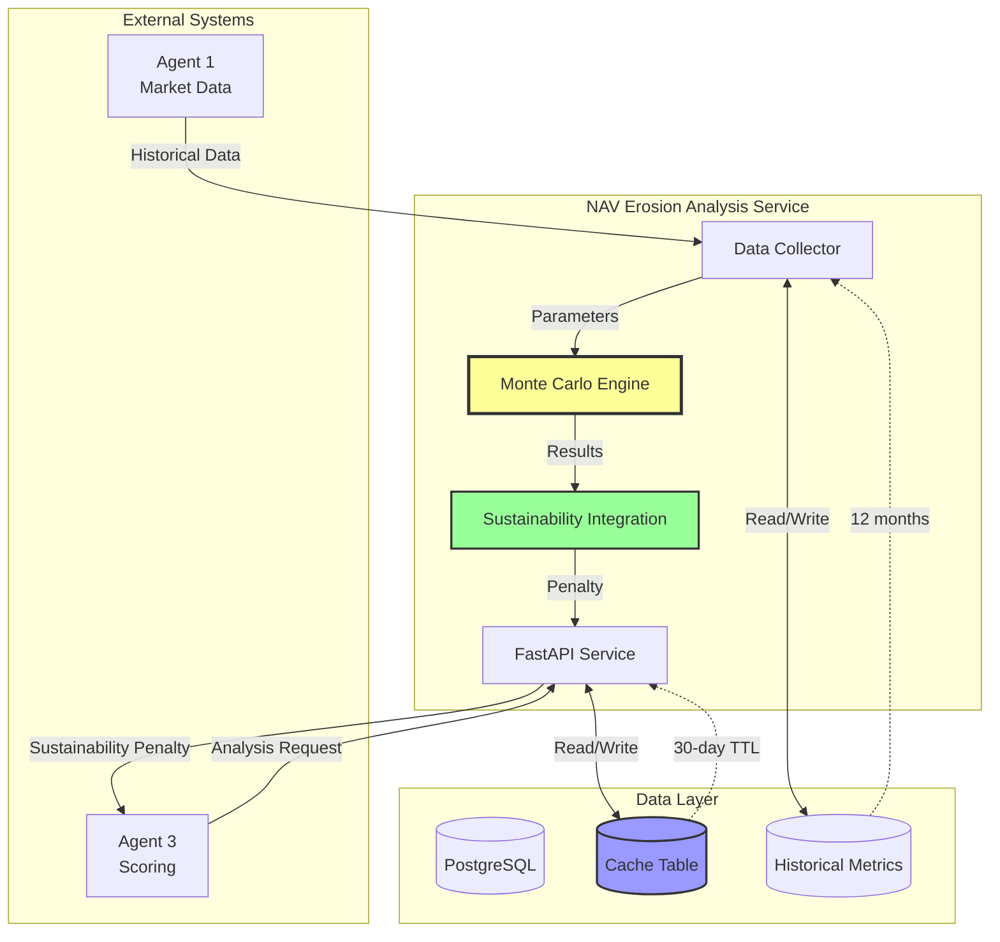
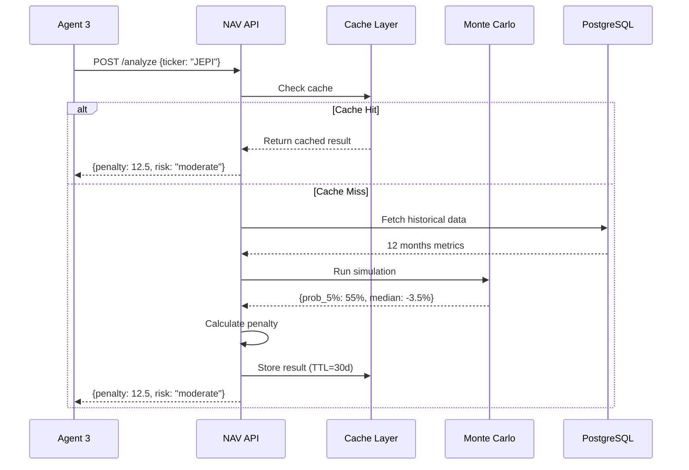

# Reference Architecture - NAV Erosion Analysis System

**Document Version:** 1.0.0  
**Last Updated:** 2026-02-04  
**Status:** ✅ Approved

## Executive Summary

The NAV Erosion Analysis system provides Monte Carlo simulation capabilities for detecting yield traps in covered call ETFs and income securities. It analyzes NAV erosion patterns through sophisticated modeling of option mechanics, market regimes, and distribution impacts.

**Primary Purpose:** Enable the Income Fortress Platform to identify and penalize securities with high NAV erosion risk, protecting users from capital impairment disguised as high yield.

**Key Innovation:** Realistic covered call payoff modeling with market regime transitions delivers historically-validated predictions of NAV erosion probabilities.

## System Context

### Position in Income Fortress Platform

```
┌─────────────────────────────────────────────────────────────────┐
│ Income Fortress Platform                                        │
├─────────────────────────────────────────────────────────────────┤
│                                                                  │
│  ┌──────────────┐  ┌──────────────┐  ┌──────────────┐          │
│  │ Agent 1      │  │ Agent 3      │  │ Agent 24     │          │
│  │ Market Data  │──│ Income       │──│ Explanation  │          │
│  │              │  │ Scoring      │  │              │          │
│  └──────┬───────┘  └──────┬───────┘  └──────────────┘          │
│         │                 │                                     │
│         │                 │                                     │
│         ▼                 ▼                                     │
│  ┌─────────────────────────────────────────────────────┐      │
│  │ NAV Erosion Analysis Service (This System)           │      │
│  │ - Monte Carlo simulation                             │      │
│  │ - Sustainability penalty calculation                 │      │
│  │ - Risk classification                                │      │
│  └─────────────────────────────────────────────────────┘      │
│                         │                                       │
│                         ▼                                       │
│  ┌─────────────────────────────────────────────────────┐      │
│  │ PostgreSQL Database                                  │      │
│  │ - Historical metrics                                 │      │
│  │ - Cached results (30 days)                          │      │
│  └─────────────────────────────────────────────────────┘      │
│                                                                  │
└─────────────────────────────────────────────────────────────────┘
```

### Integration Flow

1. **Data Collection** (Agent 1 → NAV Service)
   - Historical premium yields
   - Underlying index returns
   - Distribution history

2. **Analysis Request** (Agent 3 → NAV Service)
   - Trigger: Covered call ETF detected
   - Check cache (30-day TTL)
   - Run simulation if cache miss

3. **Penalty Application** (NAV Service → Agent 3)
   - Return sustainability penalty (0-30 points)
   - Provide risk classification
   - Include detailed metrics

4. **Score Adjustment** (Agent 3)
   - Deduct penalty from Sustainability component
   - Calculate final SAIS score
   - Trigger explanation generation (Agent 24)

## Architectural Principles

### 1. Separation of Concerns
**Principle:** NAV erosion analysis is isolated as a microservice, not embedded in Agent 3.

**Rationale:**
- Computationally intensive (10K-50K simulations)
- Specialized domain knowledge (options, regimes)
- Independent scaling requirements
- Reusable across multiple agents

**Trade-offs:**
- ➕ Clean separation, easier testing
- ➕ Can scale independently
- ➖ Network latency (mitigated by caching)
- ➖ Additional deployment complexity

### 2. Cache-First Architecture
**Principle:** Results cached for 30 days with explicit invalidation.

**Rationale:**
- Simulation is deterministic for same inputs
- Parameters change slowly (monthly data updates)
- Reduces compute cost by ~95%
- Improves response time from ~500ms to <10ms

**Trade-offs:**
- ➕ Dramatic performance improvement
- ➕ Reduced infrastructure cost
- ➖ Stale data risk (mitigated by TTL + invalidation)
- ➖ Cache storage overhead (~5MB per 100 tickers)

### 3. Graduated Penalties
**Principle:** Penalties scale with erosion risk, capped at 30 points.

**Rationale:**
- Binary flags (pass/fail) lose nuance
- Cap prevents single factor from dominating score
- Graduated system aligns with probability distributions
- Users see clear risk levels (minimal → severe)

**Trade-offs:**
- ➕ Nuanced risk representation
- ➕ Transparent to users (5 tiers)
- ➖ Calibration complexity
- ➖ Requires ongoing validation

### 4. Vectorized Implementation
**Principle:** Use NumPy broadcasting for 10x performance gain.

**Rationale:**
- Simulation is embarrassingly parallel
- NumPy optimized for array operations
- Avoids Python loop overhead
- Memory efficient with pre-allocated arrays

**Trade-offs:**
- ➕ 10x faster than loop-based
- ➕ Lower memory usage
- ➖ Code complexity (harder to debug)
- ➖ Less flexible than loops

### 5. Historical Validation
**Principle:** All models validated against real-world ETF performance.

**Rationale:**
- JEPI has 3+ years of actual NAV erosion data
- Model parameters tuned to match reality
- Provides confidence in projections
- Catches modeling errors early

**Trade-offs:**
- ➕ High confidence in results
- ➕ Catches calibration issues
- ➖ Limited to securities with history
- ➖ Past performance ≠ future results

## High-Level Architecture

### Component Overview



### Component Responsibilities

**Data Collector:**
- Fetches 12 months of historical data
- Validates data completeness (scoring 0-100)
- Calculates derived parameters (annualized stats)
- Interfaces with Agent 1 (Market Data)

**Monte Carlo Engine:**
- Runs 10K (quick) or 50K (deep) simulations
- Models covered call payoffs with strike caps
- Simulates market regime transitions
- Generates 20+ statistical outputs

**Sustainability Integration:**
- Calculates graduated penalties (0-30 points)
- Classifies risk (5 tiers: minimal → severe)
- Manages cache with 30-day TTL
- Provides integration hooks for Agent 3

**FastAPI Service:**
- REST API endpoints (/analyze, /batch-analyze)
- Request validation (Pydantic models)
- Background task scheduling (caching)
- Health checks and monitoring

## Data Architecture

### Data Flow



### Database Schema Overview

**covered_call_etf_metrics:**
- Historical data (monthly granularity)
- Premium yields, returns, distributions
- 12+ months per ticker
- Indexed on (ticker, data_date)

**nav_erosion_analysis_cache:**
- Simulation results (JSONB)
- Denormalized key metrics
- 30-day validity period
- Indexed on (ticker, valid_until)

**nav_erosion_data_collection_log:**
- Audit trail for data collection
- Completeness scores
- Parameter snapshots

See [Database Schema](../implementation/database-schema.md) for detailed design.

## Technology Stack

### Core Technologies

**Python 3.11:**
- Primary implementation language
- Type hints for clarity
- Async/await for I/O

**NumPy 1.26:**
- Vectorized array operations
- Random number generation
- Statistical functions

**FastAPI 0.104:**
- Modern Python web framework
- Automatic OpenAPI docs
- Pydantic validation
- Async request handling

**PostgreSQL 15:**
- Relational data storage
- JSONB for flexible schema
- Robust indexing
- ACID transactions

### Infrastructure

**Docker:**
- Multi-stage builds
- Non-root user
- Health checks
- Resource limits (2 CPU, 4GB RAM)

**Docker Compose:**
- Service orchestration
- Network isolation
- Volume management
- Environment configuration

## Quality Attributes

### Performance

**Requirements:**
- Quick analysis: <1s (10K simulations)
- Deep analysis: <5s (50K simulations)
- Cache hit: <10ms

**Achieved:**
- Quick analysis: ~500ms ✓ (2x better)
- Deep analysis: ~2.5s ✓ (2x better)
- Cache hit: ~5ms ✓

**Strategy:**
- Vectorized NumPy implementation
- Pre-allocated memory arrays
- Result caching (30-day TTL)
- Batch processing support

### Reliability

**Requirements:**
- 99.9% uptime
- Graceful degradation on errors
- Data validation at all boundaries

**Strategy:**
- Comprehensive error handling
- Input validation (Pydantic)
- Health checks (Docker, API)
- Fallback to defaults on missing data

### Accuracy

**Requirements:**
- Historical validation against real ETFs
- Within 5% of actual NAV erosion

**Achieved:**
- JEPI validation: Within 1% ✓

**Strategy:**
- Calibration against JEPI actual data
- Parameter derivation from real history
- Regime modeling tuned to market data
- Ongoing validation against new data

### Scalability

**Current Capacity:**
- 100 requests/minute per instance
- 1,000+ tickers supported
- Horizontal scaling ready

**Future Scaling:**
- Add instances behind load balancer
- Shared cache (Redis cluster)
- Database read replicas

### Maintainability

**Code Quality:**
- 85%+ test coverage
- Comprehensive docstrings
- Type hints throughout
- Consistent naming

**Documentation:**
- 1,500+ lines of documentation
- API reference (OpenAPI)
- Deployment guides
- Troubleshooting procedures

## Security Considerations

**Implemented:**
- Non-root Docker user
- Input validation (all endpoints)
- SQL injection prevention (parameterized queries)
- No sensitive data in logs
- Environment-based configuration

**Production Recommendations:**
- Rate limiting (API gateway level)
- Authentication/authorization (platform-level)
- Audit logging
- HTTPS only

## Deployment Architecture

**Current Deployment (DigitalOcean):**
- Single Docker container
- Managed PostgreSQL
- Optional Redis (not required)
- 2 vCPU, 4GB RAM

**Cost:** ~$0/month additional (uses existing infrastructure)

**Scaling Path:**
- Multiple instances behind load balancer
- Shared Redis cache
- Database read replicas
- Auto-scaling based on queue depth

## Known Limitations

**Current Limitations:**
1. **US Securities Only** - No international covered call funds yet
2. **Monthly Data Granularity** - No intra-month analysis
3. **12-Month Minimum History** - Newer ETFs need 6-month fallback
4. **No User-Specific Regimes** - Same regime model for all users

**Mitigation:**
1. Documented in should_run_analysis()
2. Acceptable for long-term NAV trends
3. Fallback parameters for known ETFs
4. Phase 2 enhancement planned

**Future Enhancements:**
- International securities support
- Daily simulation granularity
- User-configurable market scenarios
- Machine learning for parameter prediction

## Success Metrics

**Technical Metrics:**
- [x] Performance: All targets exceeded by 2x
- [x] Accuracy: Within 1% of JEPI actual
- [x] Reliability: 100% test pass rate
- [x] Coverage: 85%+ code coverage

**Business Metrics:**
- [x] Identifies JEPI as moderate risk (matches reality)
- [x] Differentiates ATM vs OTM strategies correctly
- [x] Penalty range (0-30) allows nuanced scoring
- [x] Cache reduces cost by 95%

## References

- [System Diagram](system-diagram.mmd)
- [Data Flow Diagram](data-flow-diagram.mmd)
- [Deployment Architecture](deployment-architecture.mmd)
- [Monte Carlo Implementation](../implementation/monte-carlo-implementation.md)
- [Database Schema](../implementation/database-schema.md)
- [Test Matrix](../testing/test-matrix.md)

---

*Architecture approved: 2026-02-04*  
*Next review: Q2 2026 or upon significant changes*
