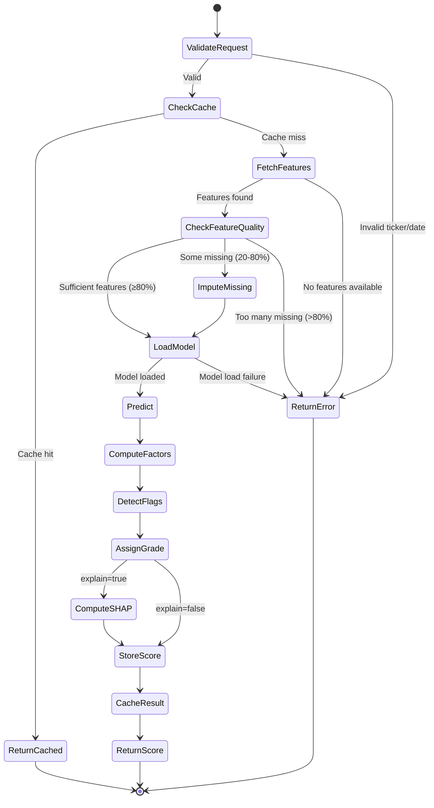

# Agent 3: Income Scoring - Functional Specification

**Version**: 1.0  
**Date**: 2026-01-23  
**Status**: Active Development  
**Priority**: P0 (Critical Path)

## Purpose & Scope

Agent 3 (Income Scoring) evaluates the quality and sustainability of income-generating tickers (stocks, ETFs, REITs) for investors seeking consistent dividend/distribution income with managed risk. It produces a transparent, factor-based score enhanced by machine learning that other agents and users rely on for investment decisions.

### What This Agent Does
- Scores tickers on a 0-1 scale with letter grades (A/B/C/D/F)
- Provides factor-level breakdowns explaining the score
- Flags potential issues (dividend cuts, high payout ratios, yield traps)
- Returns confidence levels and SHAP values for transparency
- Supports both single-ticker and batch scoring

### What This Agent Does NOT Do
- Make buy/sell recommendations (that's Agent 4)
- Execute trades (out of scope)
- Predict exact future returns (provides quality assessment, not return forecast)
- Replace human judgment (augments decision-making)

---

## Responsibilities

### Primary Responsibilities
1. **Feature Retrieval**: Fetch latest feature snapshot for requested ticker and date
2. **Scoring Calculation**: Apply ML model (XGBoost) to compute income quality score
3. **Grade Assignment**: Map score to letter grade (A/B/C/D/F) based on thresholds
4. **Factor Decomposition**: Break score into interpretable factor categories
5. **Flag Detection**: Identify red flags (recent dividend cuts, unsustainable payouts)
6. **Confidence Estimation**: Provide reliability estimate based on data quality and model certainty
7. **Result Storage**: Persist scores to `income_scores` table for historical tracking

### Secondary Responsibilities
- **Model Versioning**: Support multiple model versions (v1, v2, v3) with production/candidate designations
- **Batch Processing**: Score multiple tickers efficiently for daily pipeline
- **Caching**: Cache scores for popular tickers to reduce compute
- **Monitoring**: Log scoring requests and latencies for performance tracking

---

## Interfaces

### Input Interface

**Single Ticker Scoring**:
```json
POST /score
{
  "ticker": "JEPI",
  "as_of_date": "2026-01-22",
  "universe": "US_EQ_INCOME",
  "portfolio_context": {
    "portfolio_id": "uuid-or-null",
    "current_weight": 0.05
  },
  "options": {
    "model_version": "production",
    "explain": true,
    "use_cache": true
  }
}
```

**Batch Scoring**:
```json
POST /batch-score
{
  "tickers": ["JEPI", "XYLD", "QYLD", "DIVO", "SCHD"],
  "as_of_date": "2026-01-22",
  "options": {
    "model_version": "production",
    "explain": false
  }
}
```

### Output Interface

**Single Ticker Response**:
```json
{
  "ticker": "JEPI",
  "as_of_date": "2026-01-22",
  "score": 0.82,
  "grade": "A",
  "confidence": 0.78,
  "factor_breakdown": {
    "yield_quality": 85,
    "stability": 78,
    "fundamentals": 72,
    "valuation": 45,
    "advisor_sentiment": 68
  },
  "flags": [
    "high_payout_ratio"
  ],
  "shap_values": {
    "yield_trailing_12m": 0.12,
    "volatility_1y": -0.08,
    "div_cagr_3y": 0.15,
    ...
  },
  "metadata": {
    "model_version": "income_score_v3",
    "features_used": 47,
    "missing_features": 3,
    "computation_time_ms": 45
  }
}
```

**Batch Response**:
```json
{
  "scores": [
    {"ticker": "JEPI", "score": 0.82, "grade": "A", ...},
    {"ticker": "XYLD", "score": 0.71, "grade": "B", ...},
    ...
  ],
  "summary": {
    "total_tickers": 5,
    "avg_score": 0.74,
    "grade_distribution": {"A": 2, "B": 2, "C": 1}
  }
}
```

---

## Dependencies

### Data Dependencies
- **ticker_feature_snapshots** table: All 50+ engineered features
- **tickers** table: Ticker metadata (symbol, asset_class, sector)
- **dividend_history** table: Historical dividend payments for trend analysis
- **model_registry** table: Current production model version and artifact path

### Service Dependencies
- **Supabase**: Read features, write scores, check cache
- **Redis** (optional): Cache popular ticker scores (TTL: 1 hour)
- **S3/Storage**: Load XGBoost model artifact (.pkl file)

### External Dependencies
None (all data pre-ingested by Agent 1)

---

## Success Criteria

### Functional Success
✅ **Accuracy**: Top quintile (Grade A) tickers outperform bottom quintile (Grade D/F) by ≥2% in risk-adjusted income return over 12-month backtest  
✅ **Consistency**: Same ticker scored on same date with same model version produces identical score (deterministic)  
✅ **Coverage**: ≥95% of requested tickers have sufficient features to score (missing features handled gracefully)  
✅ **Explainability**: SHAP values provided for all scores; factor breakdown sums to within 5% of total score  

### Performance Success
✅ **Latency**: Single-ticker scoring completes in <500ms (p95)  
✅ **Batch throughput**: Score 500 tickers in <30 seconds  
✅ **Cache hit rate**: ≥60% for popular tickers (top 100 by request volume)  
✅ **Availability**: 99.5% uptime (measured over 30 days)  

### Data Quality Success
✅ **Feature completeness**: ≤10% missing features on average per ticker  
✅ **Data freshness**: Feature snapshots used are <24 hours old (flagged if stale)  
✅ **Outlier handling**: Extreme values (beyond 99th percentile) handled without errors  

---

## Non-Functional Requirements

### Performance
- **Latency**: p50 <200ms, p95 <500ms, p99 <1s
- **Throughput**: 50 requests/second sustained
- **Resource usage**: ≤512 MB memory per instance, ≤50% CPU average

### Reliability
- **Uptime**: 99.5% availability
- **Error rate**: <1% of requests fail
- **Graceful degradation**: If model unavailable, return rule-based score with disclaimer

### Scalability
- **Horizontal scaling**: Stateless design allows 2-10 instances
- **Database load**: ≤100 queries/second to Supabase (indexed, cached)
- **Model loading**: Model loaded once at startup, kept in memory

### Security
- **Authentication**: Verify Supabase JWT token on every request
- **Authorization**: RLS enforced (users can only score tickers relevant to their portfolios)
- **Data privacy**: No user-specific data in model inputs (only ticker features)

### Maintainability
- **Model swapping**: New model version deployable without service restart
- **Logging**: All requests logged with ticker, score, latency, model version
- **Monitoring**: Prometheus metrics exposed at `/metrics` endpoint

---

## Workflow & State Machine

### Scoring Workflow



### State Transitions
- **Idle** → Request received → **Validating**
- **Validating** → Valid request → **Fetching Features**
- **Fetching Features** → Features retrieved → **Scoring**
- **Scoring** → Prediction complete → **Storing**
- **Storing** → Score saved → **Responding**
- **Responding** → Response sent → **Idle**

Error states exit immediately to **Responding** with error details.

---

## Factor Breakdown Logic

### Factor Categories
Scores are decomposed into 5 interpretable factor categories:

1. **Yield Quality** (35% weight)
   - Components: trailing yield, forward yield, dividend CAGR (1y/3y/5y), payout ratio
   - Normalization: Percentile rank within asset class peer group
   - Good: High sustainable yield with consistent growth

2. **Stability & Risk** (25% weight)
   - Components: volatility (1y), max drawdown (1y/3y), beta (equity/sector)
   - Normalization: Inverse percentile (lower risk = higher score)
   - Good: Low volatility, shallow drawdowns, low beta

3. **Fundamentals** (20% weight)
   - Components: FCF/debt, ROE, interest coverage, profitability margins
   - Normalization: Percentile rank within sector
   - Good: Strong cash flow, low leverage, high coverage

4. **Valuation** (10% weight)
   - Components: P/E, P/FCF, EV/EBITDA (relative to sector), yield vs history
   - Normalization: Z-score (cheaper = higher score)
   - Good: Trading below historical average, attractive relative value

5. **Advisor Sentiment** (10% weight)
   - Components: advisor coverage count, net buy/sell stance, conviction
   - Normalization: Scaled 0-100 based on consensus
   - Good: Multiple advisors recommend, positive net stance

### Factor Score Calculation
```python
def compute_factor_scores(features: dict, peer_group: str) -> dict:
    """
    Compute 0-100 score for each factor category.
    
    Process:
    1. Fetch peer group statistics (median, IQR, percentiles)
    2. Normalize each raw feature to 0-100 scale
    3. Weight features within category
    4. Return category scores
    """
    yield_score = (
        0.25 * percentile_rank(features['yield_trailing_12m'], peer_group) +
        0.25 * percentile_rank(features['yield_forward'], peer_group) +
        0.30 * percentile_rank(features['div_cagr_3y'], peer_group) +
        0.20 * (100 - cap(features['payout_ratio'], 100))  # inverse
    )
    
    stability_score = (
        0.40 * (100 - percentile_rank(features['volatility_1y'], peer_group)) +
        0.40 * (100 - percentile_rank(features['max_drawdown_3y'], peer_group)) +
        0.20 * (100 - percentile_rank(features['beta_equity'], peer_group))
    )
    
    # ... similar for fundamentals, valuation, advisor_sentiment
    
    return {
        'yield_quality': yield_score,
        'stability': stability_score,
        'fundamentals': fundamentals_score,
        'valuation': valuation_score,
        'advisor_sentiment': advisor_score
    }
```

---

## Flag Detection Rules

Flags warn about potential issues that may not be captured by score alone.

| Flag | Condition | Severity |
|------|-----------|----------|
| `recent_div_cut` | Dividend reduced >5% in past 6 months | HIGH |
| `high_payout_ratio` | Payout ratio >80% | MEDIUM |
| `yield_trap` | Yield >12% AND fundamentals score <40 | HIGH |
| `illiquid` | Average daily volume <100K shares AND market cap <$500M | MEDIUM |
| `high_volatility` | Volatility >30% annually | LOW |
| `stale_data` | Feature snapshot >3 days old | LOW |
| `missing_features` | >20% of features missing | MEDIUM |

Flags are independent of score and always displayed to users.

---

## Grade Assignment Thresholds

| Grade | Score Range | Interpretation | Investment Guideline |
|-------|-------------|----------------|---------------------|
| A | 0.80 - 1.00 | Excellent income quality | Strong buy candidate |
| B | 0.65 - 0.79 | Good income quality | Buy candidate |
| C | 0.50 - 0.64 | Acceptable income quality | Hold or cautious buy |
| D | 0.35 - 0.49 | Below-average quality | Avoid unless specific reason |
| F | 0.00 - 0.34 | Poor income quality | Sell or avoid |

Thresholds calibrated to ensure:
- ~20% of universe in A
- ~30% in B
- ~30% in C
- ~15% in D
- ~5% in F

---

## Example Usage Scenarios

### Scenario 1: User Researches New Ticker

**User Action**: Searches for "JEPI" in research page  
**Flow**:
1. Frontend calls `/score` with `ticker=JEPI`, `as_of_date=today`
2. Agent 3 checks cache (miss), fetches features from Supabase
3. Loads XGBoost model, predicts score = 0.82
4. Computes factor breakdown: {yield_quality: 85, stability: 78, ...}
5. Detects flag: `high_payout_ratio`
6. Stores score in database, caches for 1 hour
7. Returns JSON response to frontend
8. Frontend displays: "Grade A (82%) - Excellent Income Quality" with factor chart

**Expected Time**: <300ms

### Scenario 2: Daily Pipeline Batch Scoring

**Trigger**: Prefect workflow runs at 6 AM ET  
**Flow**:
1. Prefect calls `/batch-score` with 500 tickers
2. Agent 3 fetches all feature snapshots in single query (optimized)
3. Loads model once, predicts 500 scores in parallel
4. Stores all scores in bulk insert (single transaction)
5. Returns summary: {total: 500, avg_score: 0.68, grades: {A: 100, B: 150, ...}}
6. Prefect logs completion, triggers Agent 11 (Alerts)

**Expected Time**: <25 seconds

### Scenario 3: Model Upgrade

**Scenario**: New model version (v4) trained and ready to deploy  
**Flow**:
1. Data scientist uploads `income_score_v4.pkl` to S3
2. Adds entry to `model_registry` table with status="candidate"
3. Runs backtests, evaluates performance (AUC=0.85 vs v3's 0.82)
4. Updates `model_registry` status="production" for v4, v3 becomes "deprecated"
5. Agent 3 instances detect new production version (polling every 5 min)
6. Hot-reload new model without service restart
7. All new requests use v4, old cached scores (v3) expire within 1 hour

**Downtime**: 0 seconds (hot reload)

---

## Integration Points

### Upstream (Data Providers)
- **Agent 1 (Market Data Sync)**: Provides feature snapshots daily
- **Agent 2 (Newsletter Ingestion)**: Provides advisor sentiment signals

### Downstream (Consumers)
- **Agent 4 (Entry Price)**: Filters tickers by score (only score ≥B considered)
- **Agent 7 (Opportunity Scanner)**: Ranks candidates by score
- **Agent 8 (Rebalancing)**: Uses scores to weight portfolio allocations
- **Frontend (Research Page)**: Displays scores and factor breakdowns
- **Frontend (Dashboard)**: Shows avg score across portfolio holdings

### Peer Services
- **Redis Cache**: Stores scores to reduce repeated computation
- **Model Registry**: Determines which model version to use

---

## Error Handling

### Error Categories
1. **Client Errors** (4xx)
   - Invalid ticker symbol → 400 Bad Request
   - Missing required fields → 400 Bad Request
   - Unauthorized (bad JWT) → 401 Unauthorized

2. **Data Errors** (5xx recoverable)
   - Features not found for ticker/date → 503 Service Unavailable (retry later)
   - Database connection timeout → 503 Service Unavailable
   - Too many missing features (>80%) → 422 Unprocessable Entity

3. **Server Errors** (5xx critical)
   - Model file not found → 500 Internal Server Error (alert ops team)
   - Prediction exception → 500 Internal Server Error (log stack trace)

### Retry Strategy
- **Transient errors** (database timeout, cache miss): Retry up to 3 times with exponential backoff
- **Permanent errors** (invalid ticker, bad data): Return error immediately, no retry
- **Critical errors** (model load failure): Alert ops team, return gracefully degraded score

### Graceful Degradation
If ML model unavailable, fall back to **rule-based score**:
- Simple weighted average of factor category scores (no ML)
- Flag response with `model_version: "fallback_v1"`
- Log incident for post-mortem

---

## Monitoring & Observability

### Key Metrics (Prometheus)
- `scoring_requests_total{status, ticker}`: Total requests
- `scoring_duration_seconds{status}`: Latency histogram
- `scoring_cache_hit_rate`: Cache effectiveness
- `scoring_feature_missing_rate`: Data quality
- `scoring_model_prediction_errors_total`: ML failures

### Alerts
- **Latency spike**: p95 >1s for >5 minutes → Page on-call
- **Error rate >5%**: For >2 minutes → Slack alert
- **Cache hit rate <40%**: For >10 minutes → Investigate cache config
- **Model prediction errors >10/hour**: → Check model file integrity

### Logging
Every request logged (structured JSON):
```json
{
  "timestamp": "2026-01-23T14:23:45Z",
  "level": "INFO",
  "service": "income-scoring",
  "ticker": "JEPI",
  "as_of_date": "2026-01-22",
  "score": 0.82,
  "grade": "A",
  "model_version": "income_score_v3",
  "latency_ms": 287,
  "cache_hit": false,
  "features_missing": 2
}
```

---

## Future Enhancements

### Phase 2 (Months 4-6)
- **Dynamic thresholds**: Adjust grade cutoffs based on market regime (bull vs bear)
- **Sector-specific models**: Separate models for REITs, BDCs, covered call ETFs
- **Ensemble models**: Combine XGBoost with neural network for improved accuracy

### Phase 3 (Months 7-9)
- **Real-time scoring**: Update scores intraday as new data arrives
- **Personalized scores**: Adjust for user's risk tolerance and tax situation
- **Confidence intervals**: Provide score ranges instead of point estimates

---

## Acceptance Criteria

See [Implementation Specification](../implementation/agent-03-income-scoring-impl.md) for detailed testable acceptance criteria including:
- Unit test requirements (model loading, feature engineering, flag detection)
- Integration test scenarios (end-to-end scoring workflows)
- Performance benchmarks (latency, throughput)
- Data quality checks (missing features, outliers)

---

## References

- [XGBoost Documentation](https://xgboost.readthedocs.io)
- [SHAP Explainability](https://shap.readthedocs.io)
- [Piotroski F-Score](https://www.investopedia.com/terms/p/piotroski-score.asp) (inspiration for factor-based scoring)
- [Credit Scoring Best Practices](https://www.frbsf.org/banking-supervision/publications/credit-scoring-model-development/) (methodological foundation)

---

**Document Status**: ✅ Complete and ready for implementation  
**Next Step**: See [Agent 3 Implementation Specification](../implementation/agent-03-income-scoring-impl.md)
