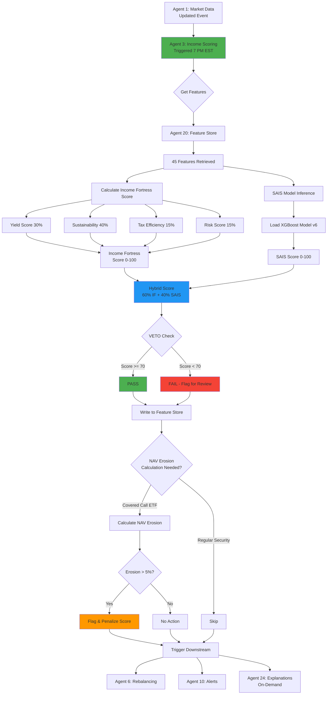

# Agent 3: Income Scoring - Functional Specification

**Version:** 1.0.0  
**Status:** Phase 1 Complete  
**Last Updated:** February 3, 2026  
**Owner:** Income Fortress Platform - Scoring Team

---

## Table of Contents

1. [Purpose & Scope](#purpose--scope)
2. [Responsibilities](#responsibilities)
3. [Interfaces](#interfaces)
4. [Dependencies](#dependencies)
5. [Success Criteria](#success-criteria)
6. [Non-Functional Requirements](#non-functional-requirements)
7. [Scoring Methodology](#scoring-methodology)

---

## Purpose & Scope

### Overview

Agent 3 (Income Scoring) is the **core intelligence** of the Income Fortress Platform. It calculates a proprietary "Income Fortress Score" for each income-generating security, combining fundamental analysis, sustainability metrics, tax efficiency, and risk factors into a single actionable score (0-100 scale).

### Primary Objective

Provide users with reliable, data-driven income scores that balance yield, safety, and tax efficiency - enabling confident investment decisions for portfolio construction and rebalancing.

### Core Principles

**1. Capital Safety First**
- Scores penalize securities with >30% historical drawdowns
- Dividend sustainability weighted higher than raw yield
- 70% threshold score required to pass VETO power

**2. Avoid Yield Traps**
- Unsustainable high yields are flagged (>10% for equity, >15% for BDCs)
- Payout ratio >90% triggers warning
- Declining dividend history heavily penalized

**3. Tax Efficiency Matters**
- Qualified dividends scored higher than ordinary income
- Return of capital tracked and disclosed
- Tax-loss harvesting opportunities identified

**4. Hybrid Methodology**
- Combines Income Fortress (fundamental) + SAIS (ML-based) scores
- 60/40 weighting (Income Fortress : SAIS)
- Anthropic Claude API used for qualitative analysis

### In Scope

- **Income Fortress Score Calculation** (0-100 scale)
  - Yield component (30%)
  - Sustainability component (40%)
  - Tax efficiency component (15%)
  - Risk component (15%)

- **SAIS Score Integration** (ML-based scoring)
  - XGBoost model predictions
  - Feature importance analysis
  - Model versioning and retraining

- **Hybrid Score Aggregation**
  - 60% Income Fortress + 40% SAIS
  - Confidence intervals
  - Score explanations (via Agent 24)

- **NAV Erosion Calculation** (for covered call ETFs)
  - Premium capture vs NAV decay analysis
  - Total return attribution
  - Comparison to non-covered call equivalents

### Out of Scope

- Portfolio-level optimization (handled by Agent 6)
- Real-time score updates (daily batch processing)
- Custom user scoring weights (future enhancement)
- International securities (US markets only in Phase 1)

---

## Responsibilities

### Primary Responsibilities

**1. Daily Score Calculation**
- Calculate Income Fortress Score for all active symbols
- Generate SAIS scores via ML model
- Aggregate into hybrid score
- Store results in Feature Store with timestamp
- Execute daily at 7:00 PM EST (after Agent 1 completes)

**2. Score Component Breakdown**
- **Yield Component**: Current yield, yield history, yield stability
- **Sustainability Component**: Payout ratio, dividend growth rate, earnings coverage
- **Tax Efficiency Component**: Qualified dividend %, ROC %, tax-equivalent yield
- **Risk Component**: Volatility, max drawdown, beta, liquidity

**3. NAV Erosion Analysis** (Covered Call ETFs)
- Calculate premium income vs NAV decay
- Attribute total return to dividends, premium, NAV change
- Compare to non-covered call benchmark
- Flag excessive NAV erosion (>5% annually)

**4. Score Validation & Quality Control**
- Detect anomalous scores (sudden changes >20 points)
- Cross-validate scores across similar securities
- Flag missing features that impact score accuracy
- Maintain score history for trend analysis

**5. Score Explanations**
- Provide factor contributions (what drives the score)
- Identify strengths and weaknesses
- Compare to peer group
- Trigger Agent 24 for natural language explanation

### Secondary Responsibilities

**6. Model Performance Monitoring**
- Track SAIS model accuracy vs actual outcomes
- Detect model drift (score distribution changes)
- Trigger retraining when drift >5%
- A/B test new model versions

**7. Peer Group Comparisons**
- Rank securities within asset class (ETFs, CEFs, REITs, etc.)
- Identify top decile (score >80) and bottom decile (score <40)
- Provide percentile rankings

**8. Alert Generation**
- Alert when high-scoring security (>80) drops below 70
- Flag new securities entering top decile
- Warn when user holdings score <50 (below investment grade)

---

## Interfaces

### Input Interfaces

**1. Feature Data (from Agent 1 & Agent 20)**
```python
# Input: Extracted features from Feature Store
{
    "symbol": "VYM",
    "date": "2026-02-03",
    
    # Yield features
    "dividend_yield": 0.0287,  # 2.87%
    "yield_12m_avg": 0.0275,
    "yield_stability": 0.92,  # 0-1 scale
    
    # Sustainability features
    "payout_ratio": 0.68,  # 68%
    "dividend_growth_rate_5y": 0.065,  # 6.5% annually
    "earnings_coverage": 1.47,  # 1.47x
    "dividend_streak_years": 12,
    
    # Tax efficiency features
    "qualified_dividend_pct": 0.95,  # 95% qualified
    "roc_pct": 0.02,  # 2% return of capital
    "tax_equivalent_yield": 0.0312,  # For 24% tax bracket
    
    # Risk features
    "volatility_30d": 0.12,  # 12% annualized
    "max_drawdown_1y": 0.18,  # 18%
    "beta": 0.85,
    "liquidity_score": 0.95,  # Avg daily volume
    
    # Asset metadata
    "asset_type": "ETF",
    "sector": "Diversified",
    "expense_ratio": 0.0006,  # 0.06%
    
    # NAV erosion (if covered call ETF)
    "is_covered_call": false,
    "nav_erosion_1y": null,
    "premium_capture_1y": null
}
```

**2. Manual Score Requests**
```python
# API endpoint: POST /api/v1/agents/income-scoring/calculate
{
    "symbols": ["VYM", "SCHD"],  # Optional: specific symbols
    "force_recalculate": true,  # Ignore cache
    "include_explanation": true,  # Trigger Agent 24
    "model_version": "v6"  # Optional: specific model version
}
```

**3. Model Retraining Triggers**
```python
# Input: Model performance metrics
{
    "model_id": "income-scorer-v6",
    "drift_detected": true,
    "drift_magnitude": 0.08,  # 8% distribution shift
    "mae_increase": 0.03,  # Mean absolute error increased 3%
    "recommendation": "retrain"
}
```

### Output Interfaces

**1. Score Results (to Feature Store)**
```python
# Output: Calculated scores
{
    "symbol": "VYM",
    "date": "2026-02-03",
    
    # Final scores
    "income_fortress_score": 82,  # 0-100 scale
    "sais_score": 78,  # 0-100 scale
    "hybrid_score": 80,  # 60% IF + 40% SAIS
    "confidence_interval": [75, 85],  # 95% CI
    
    # Component scores (Income Fortress)
    "yield_score": 75,  # 30% weight
    "sustainability_score": 88,  # 40% weight
    "tax_efficiency_score": 85,  # 15% weight
    "risk_score": 72,  # 15% weight
    
    # Metadata
    "model_version": "v6",
    "calculated_at": "2026-02-03T19:05:23Z",
    "data_quality_score": 0.96,
    "veto_passed": true,  # Score >= 70
    
    # NAV erosion (if applicable)
    "nav_erosion_1y": null,
    "nav_erosion_flag": false  # >5% annually
}
```

**2. Score Explanations (to Agent 24)**
```python
# Output: Request for natural language explanation
{
    "symbol": "VYM",
    "hybrid_score": 80,
    "component_scores": {
        "yield": 75,
        "sustainability": 88,
        "tax_efficiency": 85,
        "risk": 72
    },
    "peer_rank": "top 15%",  # Within ETF category
    "strengths": ["high_dividend_growth", "low_expense_ratio"],
    "weaknesses": ["moderate_yield"],
    "explain_format": "concise"  # concise, detailed, technical
}
```

**3. Alerts (to Agent 10)**
```python
# Output: Trigger alerts for significant score changes
{
    "symbol": "VYM",
    "alert_type": "score_degradation",
    "previous_score": 85,
    "current_score": 78,
    "change_magnitude": -7,
    "affected_users": [123, 456],  # User IDs with VYM holdings
    "recommendation": "review_holding"
}
```

**4. Downstream Agent Triggers**
```python
# Output: Notify Agent 6 (Rebalancing) of new scores
{
    "event": "scores_updated",
    "symbols": ["VYM", "SCHD", "JEPI", ...],
    "timestamp": "2026-02-03T19:05:23Z",
    "ready_for_rebalancing": true
}
```

---

## Dependencies

### External Dependencies

**1. Anthropic Claude API**
- **Purpose**: Qualitative analysis, score rationale generation
- **Endpoint**: `https://api.anthropic.com/v1/messages`
- **Model**: `claude-sonnet-4-20250514`
- **Rate Limit**: 4,000 requests/min (Tier 4)
- **Cost**: $3/million input tokens, $15/million output tokens
- **Usage**: ~20 API calls/day for explanations (not per-symbol scoring)

**2. XGBoost Model (SAIS Scoring)**
- **Model Version**: `income-scorer-v6.pkl`
- **Features**: 45 engineered features
- **Training Data**: Historical dividend data, price history, fundamentals
- **Retraining**: Monthly (automated via Agent 12)
- **Inference**: Local (no external API calls)

### Internal Dependencies

**1. Agent 1: Market Data Sync**
- **Dependency**: Fresh market data (<24h old)
- **Data Required**: Price, volume, dividend yield
- **Failure Impact**: Cannot calculate scores without data

**2. Agent 20: Feature Engineer**
- **Dependency**: Derived features (momentum, volatility, ratios)
- **Data Required**: 45 features per symbol
- **Failure Impact**: Incomplete feature set → lower confidence scores

**3. Feature Store (Database)**
```sql
-- Depends on: income_scores table
CREATE TABLE income_scores (
    id SERIAL PRIMARY KEY,
    symbol VARCHAR(10) NOT NULL,
    date DATE NOT NULL,
    income_fortress_score INTEGER CHECK (income_fortress_score BETWEEN 0 AND 100),
    sais_score INTEGER CHECK (sais_score BETWEEN 0 AND 100),
    hybrid_score INTEGER CHECK (hybrid_score BETWEEN 0 AND 100),
    yield_score INTEGER,
    sustainability_score INTEGER,
    tax_efficiency_score INTEGER,
    risk_score INTEGER,
    model_version VARCHAR(10),
    calculated_at TIMESTAMP,
    veto_passed BOOLEAN,
    UNIQUE(symbol, date)
);
```

**4. Agent 24: Explainability**
- **Dependency**: Optional (for detailed explanations)
- **Trigger**: On-demand or for significant score changes
- **Data Required**: Component scores, feature values

---

## Success Criteria

### Functional Success Criteria

**1. Score Accuracy**
- [ ] Scores align with user expectations (survey: >4/5 stars)
- [ ] High-scoring securities (>80) outperform low-scoring (<50) by >2% annually
- [ ] SAIS model MAE <5 points (predicted vs actual score)

**2. Score Completeness**
- [ ] 95%+ of symbols have scores calculated daily
- [ ] <5% of scores missing due to insufficient data
- [ ] 100% of user holdings scored

**3. Score Stability**
- [ ] <10% of scores change >20 points day-over-day (without news)
- [ ] Median score change <3 points/day
- [ ] Anomalous scores flagged for review (<1% of daily scores)

**4. VETO Power Compliance**
- [ ] 100% of proposals use 70-point threshold
- [ ] Users notified when holdings drop below 70
- [ ] Override mechanism available (user must acknowledge risk)

**5. NAV Erosion Accuracy** (Covered Call ETFs)
- [ ] NAV erosion calculated for 100% of covered call ETFs
- [ ] Attribution accuracy >95% (premium + NAV = total return)
- [ ] Flag ETFs with >5% annual NAV erosion

### Non-Functional Success Criteria

**6. Performance**
- [ ] Score calculation <3 seconds per symbol (p95)
- [ ] Batch scoring 150 symbols <10 minutes
- [ ] API latency <500ms for cached scores

**7. Model Performance (SAIS)**
- [ ] Model drift <5% monthly (KL divergence)
- [ ] Feature importance stable (top 10 features unchanged)
- [ ] Retraining triggered automatically when drift >5%

**8. Cost Efficiency**
- [ ] Anthropic API costs <$40/month (for 15 tenants)
- [ ] SAIS inference cost ~$0 (local execution)
- [ ] Total scoring cost <$3/tenant/month

---

## Non-Functional Requirements

### Performance

**Throughput:**
- Score 150 symbols in <10 minutes (15 symbols/minute)
- Support 1,000 symbols/hour with horizontal scaling

**Latency:**
- Cached score retrieval: <100ms
- Fresh score calculation: <3s per symbol (p95)
- Batch scoring: <10 minutes for daily batch

**Resource Usage:**
- Memory: <1 GB per worker (XGBoost model loaded)
- CPU: <80% during scoring operation
- Disk: <500 MB for model storage

### Reliability

**Availability:**
- 99.5% uptime (aligned with Agent 1 dependency)
- Automatic retry on transient failures (3 attempts)
- Graceful degradation: Use last known scores if calculation fails

**Data Integrity:**
- Score history preserved (immutable append-only)
- Model versioning tracked (v5, v6, etc.)
- Audit trail for score overrides

**Fault Tolerance:**
- Continue scoring other symbols if one fails
- Partial batch completion logged
- Missing feature handling (impute or skip)

### Scalability

**Horizontal Scaling:**
- Stateless scoring logic (load model once per worker)
- Partition symbols across workers
- Support 10x growth (1,500 symbols) with linear scaling

**Model Scaling:**
- Support multiple models simultaneously (A/B testing)
- Lazy model loading (load only when needed)
- Model caching in memory (avoid disk I/O)

### Security

**Data Privacy:**
- Scores stored per tenant schema (isolation)
- No cross-tenant score sharing
- User-specific score overrides (private to user)

**Model Security:**
- Model files versioned in Git LFS
- Model signatures verified before loading
- Prevent model poisoning (training data validation)

### Maintainability

**Code Quality:**
- Unit test coverage >85%
- Integration tests for scoring pipeline
- Mock Anthropic API in tests (avoid costs)

**Logging:**
- Log all score calculations (symbol, timestamp, scores)
- Log model versions used
- Log missing features and imputation strategies

**Monitoring:**
- Prometheus metrics for score distribution
- Alert on anomalous scores
- Track model performance over time

---

## Scoring Methodology

### Income Fortress Score (60% of Hybrid)

**Formula:**
```python
income_fortress_score = (
    yield_score * 0.30 +
    sustainability_score * 0.40 +
    tax_efficiency_score * 0.15 +
    risk_score * 0.15
) * 100  # Scale to 0-100
```

#### Component 1: Yield Score (30% weight)

**Factors:**
- Current dividend yield (50%)
- Yield stability (30%) - low variance over 5 years
- Yield growth rate (20%) - 5-year CAGR

**Calculation:**
```python
yield_score = min(100, (
    (current_yield / 0.06) * 50 +  # Normalize to 6% baseline
    (yield_stability) * 30 +  # 0-1 scale
    (yield_growth_5y / 0.05) * 20  # Normalize to 5% growth
))

# Example: VYM (2.87% yield, 0.92 stability, 6.5% growth)
yield_score = min(100, (
    (0.0287 / 0.06) * 50 +  # 23.9
    (0.92) * 30 +  # 27.6
    (0.065 / 0.05) * 20  # 26.0
)) = 77.5 → 78
```

#### Component 2: Sustainability Score (40% weight)

**Factors:**
- Payout ratio (30%) - prefer 50-70%
- Dividend growth streak (25%) - consecutive years of growth
- Earnings coverage (25%) - earnings / dividends
- Dividend cut history (20%) - penalize cuts heavily

**Calculation:**
```python
# Payout ratio score (optimal: 50-70%)
if 0.50 <= payout_ratio <= 0.70:
    payout_score = 100
elif payout_ratio < 0.50:
    payout_score = 100 - (0.50 - payout_ratio) * 100  # Underutilized earnings
elif payout_ratio <= 0.90:
    payout_score = 100 - (payout_ratio - 0.70) * 200  # Risky high payout
else:
    payout_score = 20  # Very risky (>90%)

sustainability_score = (
    payout_score * 0.30 +
    min(100, (dividend_streak_years / 20) * 100) * 0.25 +
    min(100, (earnings_coverage / 2.0) * 100) * 0.25 +
    (100 if no_cuts_5y else 50) * 0.20
)

# Example: VYM (68% payout, 12-year streak, 1.47x coverage, no cuts)
sustainability_score = (
    95 * 0.30 +  # 28.5 (near optimal payout)
    60 * 0.25 +  # 15.0 (12/20 years)
    73.5 * 0.25 +  # 18.4 (1.47/2.0)
    100 * 0.20  # 20.0 (no cuts)
) = 81.9 → 82
```

#### Component 3: Tax Efficiency Score (15% weight)

**Factors:**
- Qualified dividend percentage (60%)
- Return of capital percentage (30%) - prefer <10%
- Tax-equivalent yield advantage (10%) - vs corporate bonds

**Calculation:**
```python
tax_efficiency_score = (
    qualified_dividend_pct * 60 +
    (1 - min(1.0, roc_pct / 0.10)) * 30 +  # Penalize >10% ROC
    (tax_eq_yield / current_yield - 1) * 100 * 10  # Advantage over taxable
)

# Example: VYM (95% qualified, 2% ROC, 3.12% tax-eq vs 2.87% actual)
tax_efficiency_score = (
    0.95 * 60 +  # 57.0
    (1 - 0.02/0.10) * 30 +  # 24.0
    (3.12/2.87 - 1) * 100 * 10  # 8.7
) = 89.7 → 90
```

#### Component 4: Risk Score (15% weight)

**Factors:**
- Volatility (30%) - prefer <15% annualized
- Max drawdown (40%) - prefer <20%
- Beta (20%) - prefer <1.0
- Liquidity (10%) - prefer high volume

**Calculation:**
```python
risk_score = (
    (1 - min(1.0, volatility_30d / 0.15)) * 30 +
    (1 - min(1.0, max_drawdown_1y / 0.20)) * 40 +
    (2 - min(2.0, beta)) * 50 * 0.20 +  # Normalize beta to 0-1 scale
    liquidity_score * 10
)

# Example: VYM (12% vol, 18% drawdown, 0.85 beta, 0.95 liquidity)
risk_score = (
    (1 - 0.12/0.15) * 30 +  # 6.0
    (1 - 0.18/0.20) * 40 +  # 4.0
    (2 - 0.85) * 50 * 0.20 +  # 11.5
    0.95 * 10  # 9.5
) = 31.0 (LOW - risk reduces overall score)
```

**Final Income Fortress Score:**
```python
income_fortress_score = (
    78 * 0.30 +  # Yield
    82 * 0.40 +  # Sustainability
    90 * 0.15 +  # Tax Efficiency
    31 * 0.15  # Risk (low score = high risk)
) = 74.3 → 74
```

---

### SAIS Score (40% of Hybrid)

**Method:** XGBoost Gradient Boosting

**Features (45 total):**
- Price momentum (5, 10, 20, 60, 120 days)
- Volume trends (average, spikes, dry-ups)
- Yield metrics (current, trailing 12m, 3y average)
- Payout ratios (current, trend)
- Sector exposure
- Correlation to benchmark (SPY, AGG)
- Sentiment scores (from Agent 18)
- Macro indicators (10-year yield, VIX)

**Training:**
- Historical data: 10 years of dividend-paying securities
- Target variable: Total return (12-month forward-looking)
- Retraining: Monthly (or when drift >5%)
- Validation: 20% holdout set, walk-forward testing

**Inference:**
```python
# Load model
model = joblib.load('models/income-scorer-v6.pkl')

# Prepare features
X = feature_engineer.get_features(symbol='VYM', date='2026-02-03')

# Predict score
sais_score = model.predict(X)[0]  # Returns 0-100 scale

# Example: VYM
sais_score = 78
```

---

### Hybrid Score (Final Output)

**Formula:**
```python
hybrid_score = (
    income_fortress_score * 0.60 +
    sais_score * 0.40
)

# Example: VYM
hybrid_score = (74 * 0.60) + (78 * 0.40) = 44.4 + 31.2 = 75.6 → 76
```

**Confidence Interval:**
```python
# Bootstrap method (1000 iterations)
# Resample features, recalculate scores
# Report 95% CI

confidence_interval = [72, 80]  # 95% CI for VYM
```

---

### NAV Erosion Calculation (Covered Call ETFs)

**Purpose:** Identify if option premium income is offsetting NAV decay

**Calculation:**
```python
# For covered call ETFs (e.g., JEPI, QYLD)

# 1. Total return attribution
total_return_1y = (
    price_change +
    dividend_income +
    premium_income
)

# 2. NAV erosion
nav_erosion_1y = price_change  # Typically negative for covered call ETFs

# 3. Premium capture efficiency
premium_capture = premium_income / abs(nav_erosion_1y)

# 4. Flag if erosion exceeds threshold
nav_erosion_flag = abs(nav_erosion_1y) > 0.05  # >5% annually

# Example: JEPI
# Price change: -3.2% (NAV erosion)
# Dividend income: +8.5%
# Premium income: +3.8%
# Total return: +9.1%
# Premium capture: 3.8% / 3.2% = 1.19x (premium MORE than offsets NAV decay)
# Flag: False (3.2% < 5% threshold)
```

**Impact on Score:**
```python
# Penalize excessive NAV erosion (>5%)
if nav_erosion_flag:
    risk_score -= 20  # Heavy penalty
    sustainability_score -= 10  # Moderate penalty
```

---

## Workflow Diagram



---

## Error Handling

### Missing Features
```python
# If features incomplete, use fallback scoring
if missing_features > 5:
    # Use simplified scoring (fewer features)
    score = calculate_simplified_score(available_features)
    confidence_interval = [score - 15, score + 15]  # Wider CI
else:
    # Impute missing values (mean, median)
    X_imputed = impute_missing(X)
    score = calculate_full_score(X_imputed)
```

### Model Failure
```python
# If SAIS model fails, use Income Fortress only
try:
    sais_score = model.predict(X)[0]
except Exception as e:
    log_error(f"SAIS model failed: {e}")
    sais_score = None
    hybrid_score = income_fortress_score  # Fallback to IF only
```

### Anthropic API Timeout
```python
# If Claude API times out for explanation
try:
    explanation = call_anthropic_api(prompt, timeout=10)
except TimeoutError:
    explanation = "Score explanation unavailable (API timeout)"
```

---

## Testing Strategy

### Unit Tests
- [ ] Component score calculations (yield, sustainability, tax, risk)
- [ ] Hybrid score aggregation
- [ ] VETO threshold logic
- [ ] NAV erosion calculation

### Integration Tests
- [ ] End-to-end scoring with real features
- [ ] SAIS model inference
- [ ] Score persistence to database
- [ ] Downstream event triggers

### Backtesting
- [ ] Historical score accuracy (2020-2025 data)
- [ ] Score predictive power (correlation with future returns)
- [ ] VETO effectiveness (avoiding yield traps)

---

## Metrics & Monitoring

```python
# Prometheus metrics
income_scoring_duration_seconds = Histogram(
    'income_scoring_duration_seconds',
    'Time to score a symbol',
    ['symbol'],
    buckets=[1, 2, 3, 5, 10]
)

income_score_distribution = Histogram(
    'income_score_distribution',
    'Distribution of hybrid scores',
    buckets=[0, 20, 40, 50, 60, 70, 80, 90, 100]
)

veto_pass_rate = Gauge(
    'veto_pass_rate',
    'Percentage of symbols passing VETO (>=70)',
)

sais_model_mae = Gauge(
    'sais_model_mae',
    'SAIS model mean absolute error',
)
```

---

**Specification Version:** 1.0.0  
**Implementation Status:** Complete (Phase 1)  
**Next Review:** May 1, 2026 (Phase 2: Custom user weights)
