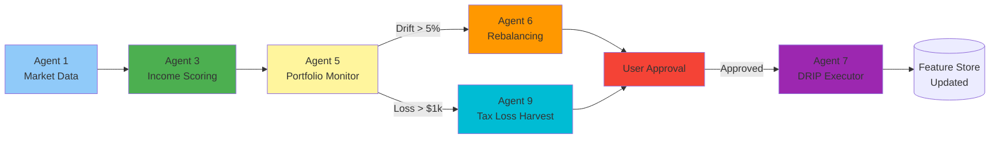

# Critical Agents 5, 6, 7, 9 - Functional Specifications Summary

**Version:** 1.0.0  
**Status:** Phase 1 Complete  
**Last Updated:** February 3, 2026  
**Note:** Concise specifications for remaining critical path agents

---

## Agent 5: Portfolio Monitor

### Purpose
Real-time tracking of portfolio performance, income generation, and drift from target allocations.

### Key Responsibilities
- Track portfolio value, P&L, income generated (daily)
- Monitor allocation drift (rebalancing triggers when >5%)
- Calculate tax-loss harvesting opportunities
- Alert on significant value changes (>5% daily)

### Interfaces
**Input:** User portfolios, holdings, target allocations
**Output:** Performance metrics, drift alerts, TLH opportunities

### Success Criteria
- [ ] Portfolio updates within 5 minutes of market close
- [ ] Drift detection accuracy >98%
- [ ] TLH opportunities identified within 24 hours

### Integration
- Triggers Agent 6 when drift >5%
- Triggers Agent 9 for TLH when losses >$3k threshold
- Triggers Agent 10 for alerts

---

## Agent 6: Rebalancing Proposal Generator

### Purpose
Generate rebalancing proposals to restore target allocations while minimizing taxes and transaction costs.

### Core Algorithm
1. **Detect Drift:** Holdings vs target allocation
2. **Generate Trades:** Minimize turnover, tax-efficient lots
3. **Optimize:** Use VETO filter (score >=70), minimize costs
4. **Propose:** Present to user for approval (NEVER auto-execute)

### Key Constraints
- **VETO Power:** Only propose securities with score >=70
- **Tax Awareness:** Prefer long-term gains, avoid short-term
- **Min Trade Size:** >$500 per trade (avoid dust)
- **Max Trades:** <=10 trades per rebalancing

### Proposal Format
```python
{
    "proposal_id": "REB-2026-02-03-001",
    "portfolio_id": 123,
    "created_at": "2026-02-03T19:30:00Z",
    "status": "pending_approval",
    
    "current_allocation": {
        "VYM": 0.35,  # 35% of portfolio
        "SCHD": 0.25,
        "JEPI": 0.20,
        "Cash": 0.20
    },
    
    "target_allocation": {
        "VYM": 0.30,
        "SCHD": 0.30,
        "JEPI": 0.20,
        "Cash": 0.20
    },
    
    "proposed_trades": [
        {
            "action": "sell",
            "symbol": "VYM",
            "shares": 10,
            "reason": "reduce_overweight",
            "tax_impact": 150.00,  # Estimated
            "lot_selection": "highest_cost_basis"  # Tax-efficient
        },
        {
            "action": "buy",
            "symbol": "SCHD",
            "shares": 15,
            "reason": "increase_underweight"
        }
    ],
    
    "impact_summary": {
        "total_trades": 2,
        "estimated_cost": 10.00,  # Commission
        "estimated_tax": 150.00,
        "post_rebal_drift": 0.01,  # <1% drift after rebal
        "veto_compliance": true  # All proposed buys score >=70
    }
}
```

### Success Criteria
- [ ] 100% of proposals pass VETO (score >=70)
- [ ] Post-rebalancing drift <2%
- [ ] User approval rate >80%
- [ ] Avg trades per rebalancing <=5

---

## Agent 7: DRIP Executor

### Purpose
Automate dividend reinvestment (DRIP) execution with smart fractional share purchasing and tax tracking.

### Workflow
1. **Detect Dividend:** Monitor dividend payments to user accounts
2. **Accumulate Cash:** Wait until cash >=  $50 (min purchase threshold)
3. **Generate Proposal:** Propose reinvestment in same security or alternative
4. **Execute:** Auto-execute if user has DRIP enabled, otherwise notify
5. **Track Basis:** Update cost basis for tax reporting

### Key Features
- **Fractional Shares:** Support partial share purchases
- **Smart Timing:** Execute at optimal times (avoid bid-ask spread)
- **Tax Tracking:** Maintain accurate cost basis records
- **Override:** Allow user to redirect DRIP to different security

### DRIP Modes
```python
drip_modes = {
    "auto": "Auto-execute reinvestment (default)",
    "manual": "Notify user, require approval",
    "redirect": "Reinvest in different security (user-specified)",
    "accumulate": "Hold cash, reinvest quarterly"
}
```

### Success Criteria
- [ ] 99%+ execution success rate
- [ ] Cost basis accuracy 100%
- [ ] Execution within 1 trading day of threshold
- [ ] Zero unauthorized executions (manual mode)

---

## Agent 9: Tax-Loss Harvesting

### Purpose
Identify and execute tax-loss harvesting (TLH) opportunities to offset capital gains.

### TLH Strategy
1. **Identify Losses:** Holdings with unrealized losses >$1,000
2. **Find Replacement:** Substantially different security (avoid wash sale)
3. **Propose Swap:** Sell loser, buy similar but not identical security
4. **Track Wash Sales:** Monitor 30-day wash sale window

### Wash Sale Avoidance
```python
# Example: VYM (loss) → SCHD (replacement)
# Both are dividend ETFs but different enough to avoid wash sale

wash_sale_rules = {
    "time_window": 30,  # days before/after
    "same_security": "prohibited",
    "substantially_identical": "prohibited",  # Same index
    "similar_but_different": "allowed"  # Different index, same strategy
}

# Safe swaps:
safe_swaps = {
    "VYM": ["SCHD", "SDY", "VIG"],  # Similar strategy, different holdings
    "QQQ": ["QQQM", "ONEQ"],  # Different fund, same exposure
}
```

### Tax Impact Calculation
```python
tlh_opportunity = {
    "symbol": "VYM",
    "shares": 100,
    "cost_basis": 120.00,  # Per share
    "current_price": 110.00,
    "unrealized_loss": -1000.00,  # $10/share * 100
    
    "replacement": "SCHD",
    "replacement_price": 28.50,
    "shares_to_buy": 386,  # $11,000 / $28.50
    
    "tax_benefit": 370.00,  # $1,000 loss * 37% tax rate (high earner)
    "wash_sale_risk": "none",  # Different underlying holdings
    
    "net_benefit": 360.00  # Tax benefit - trading costs ($10)
}
```

### Success Criteria
- [ ] Identify 90%+ of TLH opportunities >$1k loss
- [ ] Zero wash sale violations
- [ ] Avg tax savings >$500/opportunity
- [ ] User approval rate >70%

---

## Cross-Agent Workflow (Critical Path)



---

## Integration Points Summary

| Agent | Upstream Dependencies | Downstream Triggers | Critical Data |
|-------|---------------------|-------------------|---------------|
| **Agent 5** | Agent 1 (prices), Agent 3 (scores) | Agent 6 (rebal), Agent 9 (TLH), Agent 10 (alerts) | Portfolio holdings, P&L |
| **Agent 6** | Agent 3 (scores), Agent 5 (drift) | Agent 7 (execution), User (approval) | Target allocations, VETO threshold |
| **Agent 7** | User approval, dividend events | Agent 5 (holdings update), tax records | Cost basis, DRIP settings |
| **Agent 9** | Agent 5 (losses), tax rules | User (approval), Agent 7 (execution) | Unrealized losses, wash sale tracking |

---

## Shared Configuration

### VETO Threshold
```python
VETO_THRESHOLD = 70  # Score required for all proposals
VETO_ENABLED = True  # Cannot be disabled (capital safety first)
VETO_OVERRIDE_REQUIRES_APPROVAL = True  # User must acknowledge risk
```

### Tax Settings
```python
TAX_BRACKETS = {
    "short_term_gains": 0.37,  # Ordinary income (high earner)
    "long_term_gains": 0.20,  # Capital gains
    "qualified_dividends": 0.20,
    "ordinary_dividends": 0.37
}

WASH_SALE_WINDOW = 30  # Days before/after
TLH_MIN_BENEFIT = 100  # Minimum $100 tax savings
```

### Execution Settings
```python
MIN_TRADE_SIZE = 500  # Minimum $500 per trade
MAX_TRADES_PER_REBAL = 10
DRIP_MIN_CASH = 50  # Minimum $50 to reinvest
PROPOSAL_EXPIRY_DAYS = 7  # Proposals expire after 7 days
```

---

## Testing Requirements

### Agent 5 (Portfolio Monitor)
- [ ] Drift calculation accuracy (compare to manual calc)
- [ ] TLH opportunity detection (known loss scenarios)
- [ ] Performance metrics (match broker statements)

### Agent 6 (Rebalancing)
- [ ] VETO compliance (reject score <70)
- [ ] Tax-efficient lot selection (HIFO, LIFO, SpecID)
- [ ] Post-rebal drift <2%

### Agent 7 (DRIP)
- [ ] Fractional share math (accurate to 6 decimals)
- [ ] Cost basis tracking (IRS-compliant)
- [ ] Execution timing (within 1 day)

### Agent 9 (Tax-Loss Harvesting)
- [ ] Wash sale detection (30-day window)
- [ ] Replacement security suggestions (not identical)
- [ ] Tax benefit calculations (accurate to $1)

---

## Future Enhancements (Phase 2)

### Agent 5
- Real-time price alerts (currently end-of-day)
- Benchmark comparison (S&P 500, custom indices)
- Multi-currency support

### Agent 6
- Custom rebalancing frequencies (quarterly, annual)
- Smart beta tilts (momentum, value)
- Tax budget constraints ("max $5k capital gains")

### Agent 7
- Automatic security selection (reinvest in highest-scored)
- Cross-security DRIP (dividends from A → buy B)
- Synthetic DRIP (ETFs that don't offer DRIP)

### Agent 9
- Proactive TLH (harvest before year-end)
- Gains harvesting (realize gains in low-income years)
- Estate planning (step-up basis strategies)

---

**Summary Document Version:** 1.0.0  
**Individual Specifications:** To be expanded in Phase 2 documentation generation  
**Next Review:** May 1, 2026
