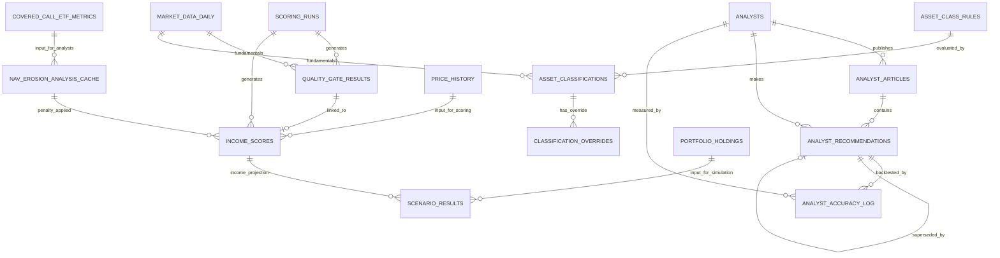

# Data Model Relationships & Dependencies

Entity relationships, foreign keys, data flow, and how tables connect across the platform.

---

## Foreign Key Relationships

### Income Scoring Domain

```
scoring_runs (parent)
    ↓
    ├─→ quality_gate_results (one-to-many)
    │   └─→ income_scores (one-to-one, optional)
    │       └─ quality_gate_id FK
    │
    └─→ income_scores (one-to-many)
        └─ scoring_run_id FK
```

**Schema:** All in `platform_shared`

**FKs:**
- `quality_gate_results.scoring_run_id` → `scoring_runs.id`
- `income_scores.scoring_run_id` → `scoring_runs.id`
- `income_scores.quality_gate_id` → `quality_gate_results.id`

**Semantics:**
- One scoring run produces many quality gate results (one per ticker evaluated)
- Each income score links back to the run that produced it
- Income scores link to their corresponding quality gate result
- If quality gate failed, no income score is created (enforced at app level)

---

### Analyst Intelligence Domain

```
analysts (parent)
    ↓
    ├─→ analyst_articles (one-to-many)
    │   └─→ analyst_recommendations (one-to-many)
    │       └─ article_id FK
    │
    ├─→ analyst_recommendations (one-to-many)
    │   └─ analyst_id FK
    │   └─ superseded_by FK → analyst_recommendations (self-join)
    │
    └─→ analyst_accuracy_log (one-to-many)
        └─ analyst_id FK
        └─ recommendation_id FK → analyst_recommendations
```

**Schema:** All in `platform_shared`

**FKs:**
- `analyst_articles.analyst_id` → `analysts.id`
- `analyst_recommendations.analyst_id` → `analysts.id`
- `analyst_recommendations.article_id` → `analyst_articles.id`
- `analyst_recommendations.superseded_by` → `analyst_recommendations.id` (self-join)
- `analyst_accuracy_log.analyst_id` → `analysts.id`
- `analyst_accuracy_log.recommendation_id` → `analyst_recommendations.id`

**Semantics:**
- One analyst publishes many articles
- Each article contains recommendations for multiple tickers (one row per ticker per article)
- When analyst changes view on a ticker, old recommendation is marked superseded
- Accuracy log backtests recommendations against market outcomes

---

## Data Flow & Dependencies

### Batch Scoring Pipeline (Nightly)

```
1. AGENT 01 — Market Data Service
   └→ Fetches latest data from FMP, Polygon, yfinance, etc.
   └→ Writes: market_data_daily, price_history

2. AGENT 04 — Asset Classification Service
   ├→ Reads: market_data_daily (sector, market cap, fundamentals)
   ├→ Evaluates asset_class_rules against ticker features
   └→ Writes: asset_classifications, classification_overrides (if manual)

3. AGENT 03 — Income Scoring Service
   ├→ Reads: market_data_daily, price_history, asset_classifications
   ├→ Evaluates quality_gate_results:
   │  - Credit rating (from FMP or credit_overrides)
   │  - Free cash flow history (from market_data_daily)
   │  - Dividend history (from price_history)
   │  - ETF AUM and track record (from market_data_daily)
   │  - REIT coverage ratio (from market_data_daily)
   ├→ If quality gate PASSED:
   │  ├→ Computes income_scores (valuation_yield, financial_durability, technical_entry)
   │  └→ Fetches NAV erosion penalty from nav_erosion_analysis_cache
   └→ Writes: scoring_runs, quality_gate_results, income_scores

4. OPTIONAL: NAV Erosion Analysis Service
   ├→ Reads: covered_call_etf_metrics (historical data)
   ├→ Runs Monte Carlo simulations
   └→ Writes: nav_erosion_analysis_cache (7-day validity)
```

### Real-Time Intelligence Pipeline (Continuous)

```
AGENT 02 — Newsletter Ingestion Service
├→ Fetches articles from Seeking Alpha API (continuous)
├→ Extracts recommendations via LLM
├→ Computes embeddings (pgvector)
└→ Writes: analysts, analyst_articles, analyst_recommendations

Intelligence Flow (Nightly)
├→ Reads: analyst_recommendations (published articles)
├→ Backtests against market data (T+30, T+90)
├→ Clusters analyst philosophies (K-Means)
└→ Writes: analyst_accuracy_log, updates analysts.overall_accuracy, sector_alpha

AGENT 12 — Proposal Agent (Optional)
├→ Reads: analyst_recommendations, income_scores
├→ Evaluates alignment between analyst consensus and platform scores
└→ Writes: analyst_recommendations.platform_alignment, platform_scored_at
```

### On-Demand Optimization & Simulation

```
AGENT 05 — Tax Optimization Service (Stateless)
├→ Reads: income_scores, asset_classifications
├→ Computes tax-efficient placement strategies
└→ Returns: no writes (API-only service)

AGENT 06 — Scenario Simulation Service
├→ Reads: income_scores, asset_classifications, portfolio holdings
├→ Runs Monte Carlo scenarios
└→ Writes: scenario_results
```

---

## Read Access Patterns by Service

### Agent 01 — Market Data Service
**Writes:** `market_data_daily`, `price_history`
**Reads:** None (external data source)

### Agent 02 — Newsletter Ingestion Service
**Writes:** `analysts`, `analyst_articles`, `analyst_recommendations`, `analyst_accuracy_log`, `credit_overrides`
**Reads:** `market_data_daily` (for price at publication, fundamentals)

### Agent 03 — Income Scoring Service
**Writes:** `scoring_runs`, `quality_gate_results`, `income_scores`
**Reads:**
- `market_data_daily` (fundamentals, dividends, credit ratings)
- `price_history` (dividend history, volatility)
- `asset_classifications` (asset class type, tax treatment)
- `credit_overrides` (fallback credit grades)
- `nav_erosion_analysis_cache` (NAV erosion penalty for covered call ETFs)

### Agent 04 — Asset Classification Service
**Writes:** `asset_classifications`, `asset_class_rules`, `classification_overrides`
**Reads:** `market_data_daily` (sector, market cap, fundamentals)

### Agent 05 — Tax Optimization Service
**Writes:** None
**Reads:**
- `asset_classifications` (tax treatment, asset class)
- `income_scores` (yields, payouts)
- Portfolio holdings (external API, not in DB)

### Agent 06 — Scenario Simulation Service
**Writes:** `scenario_results`
**Reads:**
- `income_scores` (income projections)
- `asset_classifications` (asset class, volatility profiles)
- Portfolio holdings (external API, not in DB)

### NAV Erosion Analysis Service
**Writes:** `covered_call_etf_metrics`, `nav_erosion_analysis_cache`, `nav_erosion_data_collection_log`
**Reads:** `market_data_daily` (pricing, volatility data)

---

## Common Query Patterns

### 1. Get Latest Score for a Ticker

**Query:**
```sql
SELECT *
FROM income_scores
WHERE ticker = 'JEPI'
  AND (valid_until IS NULL OR valid_until > NOW())
ORDER BY scored_at DESC
LIMIT 1;
```

**Tables involved:** `income_scores`
**Joins needed:** None (self-contained)
**Index used:** `ix_income_scores_ticker_scored`

---

### 2. Get Quality Gate & Score Together

**Query:**
```sql
SELECT
  qg.*,
  is.*
FROM quality_gate_results qg
LEFT JOIN income_scores is ON qg.id = is.quality_gate_id
WHERE qg.ticker = 'JEPI'
  AND qg.evaluated_at >= NOW() - INTERVAL '24 hours'
ORDER BY qg.evaluated_at DESC
LIMIT 1;
```

**Tables involved:** `quality_gate_results`, `income_scores`
**FK join:** `income_scores.quality_gate_id` → `quality_gate_results.id`
**Indexes used:** `ix_qg_ticker_evaluated`, `ix_income_scores_ticker_scored`

---

### 3. Get Analyst Consensus for a Ticker

**Query:**
```sql
SELECT
  ar.analyst_id,
  a.display_name,
  ar.recommendation,
  ar.sentiment_score,
  ar.yield_at_publish,
  ar.published_at,
  ar.decay_weight,
  ar.platform_alignment
FROM analyst_recommendations ar
JOIN analysts a ON ar.analyst_id = a.id
WHERE ar.ticker = 'JEPI'
  AND ar.is_active = TRUE
  AND ar.expires_at > NOW()
ORDER BY ar.decay_weight DESC, ar.published_at DESC;
```

**Tables involved:** `analyst_recommendations`, `analysts`
**FK join:** `analyst_recommendations.analyst_id` → `analysts.id`
**Indexes used:** `ix_analyst_rec_ticker_active_weight`, `ix_analysts_sa_id`

**Result:** Weighted consensus of active, non-expired recommendations from analysts

---

### 4. Check Analyst Accuracy by Sector

**Query:**
```sql
SELECT
  a.display_name,
  aal.sector,
  COUNT(*) as total_calls,
  SUM(CASE WHEN aal.outcome_label = 'Correct' THEN 1 ELSE 0 END)::FLOAT / COUNT(*) as accuracy_rate,
  AVG(CAST(aal.accuracy_delta AS FLOAT)) as avg_delta
FROM analyst_accuracy_log aal
JOIN analysts a ON aal.analyst_id = a.id
WHERE aal.backtest_run_at >= NOW() - INTERVAL '6 months'
GROUP BY a.display_name, aal.sector
ORDER BY a.display_name, accuracy_rate DESC;
```

**Tables involved:** `analyst_accuracy_log`, `analysts`
**FK join:** `analyst_accuracy_log.analyst_id` → `analysts.id`
**Indexes used:** `ix_accuracy_analyst`

---

### 5. Get Articles from an Analyst

**Query:**
```sql
SELECT
  aa.*,
  COUNT(ar.id) as recommendation_count
FROM analyst_articles aa
LEFT JOIN analyst_recommendations ar ON aa.id = ar.article_id
WHERE aa.analyst_id = <analyst_id>
GROUP BY aa.id
ORDER BY aa.published_at DESC
LIMIT 20;
```

**Tables involved:** `analyst_articles`, `analyst_recommendations`
**FK join:** `analyst_recommendations.article_id` → `analyst_articles.id`
**Indexes used:** `ix_analyst_articles_analyst_published`

---

### 6. Find Articles Mentioning a Ticker (Semantic Search)

**Query:**
```sql
-- Text search
SELECT id, title, published_at FROM analyst_articles
WHERE 'JEPI' = ANY(tickers_mentioned)
ORDER BY published_at DESC LIMIT 20;

-- Semantic similarity (approximate NN via IVFFlat)
SELECT id, title, published_at
FROM analyst_articles
WHERE content_embedding <-> (
  SELECT content_embedding FROM analyst_articles
  WHERE id = <query_article_id>
) < 0.5  -- cosine distance threshold
LIMIT 10;
```

**Tables involved:** `analyst_articles`
**Indexes used:** `ix_analyst_articles_embedding` (IVFFlat)

---

### 7. Get Classification & Tax Treatment for a Ticker

**Query:**
```sql
SELECT
  ac.ticker,
  ac.asset_class,
  ac.parent_class,
  ac.confidence,
  ac.tax_efficiency,
  ac.characteristics,
  CASE
    WHEN co.id IS NOT NULL THEN 'OVERRIDE'
    ELSE 'RULE_ENGINE'
  END as source
FROM asset_classifications ac
LEFT JOIN classification_overrides co ON ac.ticker = co.ticker
WHERE ac.ticker = 'JEPI'
  AND (ac.valid_until IS NULL OR ac.valid_until > NOW())
ORDER BY ac.classified_at DESC
LIMIT 1;
```

**Tables involved:** `asset_classifications`, `classification_overrides`
**FK join:** Logical (ticker matching), not explicit FK
**Indexes used:** `ix_asset_classifications_ticker`, `ix_asset_classifications_classified_at`

---

### 8. Score Breakdown for Explainability

**Query:**
```sql
SELECT
  ticker,
  total_score,
  grade,
  recommendation,
  valuation_yield_score,
  financial_durability_score,
  technical_entry_score,
  nav_erosion_penalty,
  factor_details,
  nav_erosion_details
FROM income_scores
WHERE ticker = 'JEPI'
ORDER BY scored_at DESC
LIMIT 1;
```

**Tables involved:** `income_scores` (JSON details)
**Indexes used:** `ix_income_scores_ticker_scored`

**Notes:** `factor_details` and `nav_erosion_details` are JSONB for detailed scoring breakdowns.

---

### 9. Portfolio Scenario Outcomes

**Query:**
```sql
SELECT
  scenario_name,
  scenario_type,
  projected_income_p10,
  projected_income_p50,
  projected_income_p90,
  result_summary,
  vulnerability_ranking,
  created_at
FROM scenario_results
WHERE portfolio_id = '<portfolio_uuid>'
ORDER BY created_at DESC
LIMIT 20;
```

**Tables involved:** `scenario_results`
**Indexes used:** `ix_scenario_results_portfolio_created`

---

### 10. NAV Erosion Risk Assessment

**Query:**
```sql
SELECT
  neac.ticker,
  neac.probability_erosion_gt_5pct,
  neac.probability_erosion_gt_10pct,
  neac.sustainability_penalty,
  neac.analysis_date,
  is.total_score,
  is.total_score - neac.sustainability_penalty as adjusted_score
FROM nav_erosion_analysis_cache neac
JOIN income_scores is ON neac.ticker = is.ticker
WHERE neac.valid_until >= CURRENT_DATE
  AND is.scored_at >= NOW() - INTERVAL '24 hours'
  AND neac.probability_erosion_gt_5pct > 0.3
ORDER BY neac.probability_erosion_gt_5pct DESC;
```

**Tables involved:** `nav_erosion_analysis_cache`, `income_scores`
**FK join:** Logical (ticker matching, no explicit FK)
**Indexes used:** `idx_nav_cache_ticker`, `ix_income_scores_ticker_scored`

---

## Entity Relationship Diagram (Mermaid)



---

## Data Freshness & Validity

### Cache Validity Periods

| Table | Cache Field | Validity | Refresh Trigger |
|-------|------------|----------|-----------------|
| `quality_gate_results` | `valid_until` | 24h | Daily scoring run |
| `income_scores` | `valid_until` | 24h | Daily scoring run |
| `asset_classifications` | `valid_until` | 30 days | On classification or manual override |
| `analyst_recommendations` | `expires_at` | 90 days | Article publication |
| `nav_erosion_analysis_cache` | `valid_until` | 7 days | Manual NAV analysis run |

### Dependency Chain for Freshness

```
market_data_daily (fresh via Agent 01)
    ↓ used by
quality_gate_results (24h cache)
    ↓ blocks if failed
income_scores (24h cache)
    ↓ used by
scenario_results (on-demand)
tax_optimization (on-demand)
dashboard (displays latest valid cache)
```

If market data is stale, downstream scoring is not re-run until next batch. Cache validity is checked at query time.

---

## Transactional Integrity

### ACID Guarantees

**Atomic operations:**
- Scoring run: All quality gates evaluated, all scores written within transaction
- Article ingestion: Article, recommendations, embeddings all written together
- Accuracy backtest: Recommendation and log entry written together

**Example (scoring run):**
```sql
BEGIN;
  INSERT INTO scoring_runs (...) RETURNING id;
  INSERT INTO quality_gate_results (scoring_run_id = ...)
  INSERT INTO income_scores (scoring_run_id = ..., quality_gate_id = ...);
COMMIT;
-- Or all rolled back if error
```

### No Foreign Key Cascades (Intentional)

- Deleting a `scoring_run` does NOT cascade to delete its results
- Reason: Preserve audit trail, allow corrective re-scoring
- Manual cleanup required for data retention policies

---

## Performance Optimization Tips

### For Analytics Queries

Use composite indexes on frequently-filtered columns:
```sql
-- Already indexed
ix_income_scores_ticker_scored (ticker, scored_at DESC)
ix_analyst_rec_ticker_active_weight (ticker, is_active, decay_weight DESC)
ix_analyst_articles_analyst_published (analyst_id, published_at DESC)
```

### For Time-Range Queries

Always filter by date range to avoid full table scans:
```sql
-- GOOD
WHERE scored_at >= NOW() - INTERVAL '24 hours'

-- BAD (full scan)
SELECT * FROM income_scores;
```

### For Vector Similarity

Use IVFFlat approximate index, not exact search:
```sql
-- Fast (approximate)
WHERE content_embedding <-> vector <0.5
  AND valid_until > NOW()

-- Slow (exact)
WHERE content_embedding = vector
```

### Avoid N+1 Queries

Join tables instead of looping:
```sql
-- GOOD (one query)
SELECT a.*, ar.recommendation FROM analysts a
  JOIN analyst_recommendations ar ON a.id = ar.analyst_id
  WHERE ar.ticker = 'JEPI';

-- BAD (N+1)
SELECT * FROM analysts;
-- Then for each analyst: SELECT * FROM analyst_recommendations WHERE analyst_id = ...
```

---

## Next Steps

- **Core Tables:** See [`core-tables.md`](./core-tables.md) for full column definitions
- **Common Queries:** See [`queries.md`](./queries.md) for copy-paste SELECT examples
- **Architecture:** See project README for service deployment info

---

**Last Updated:** 2026-03-12
