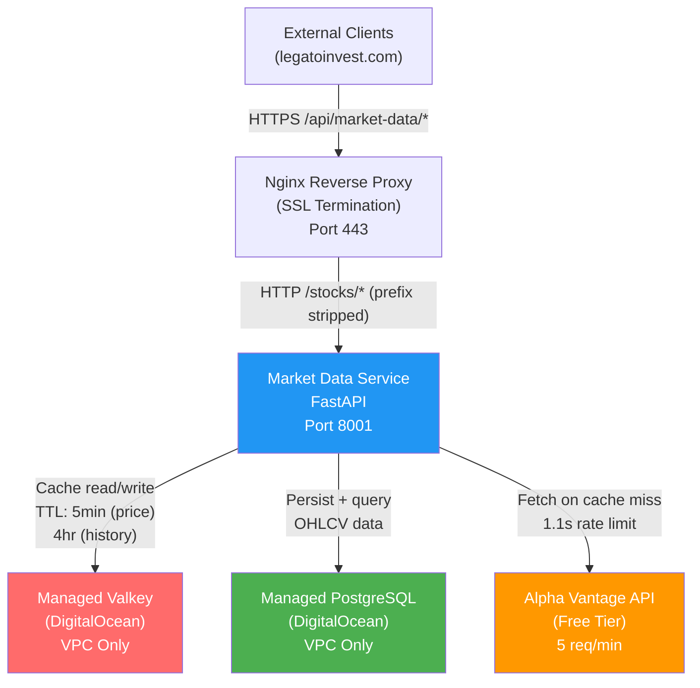
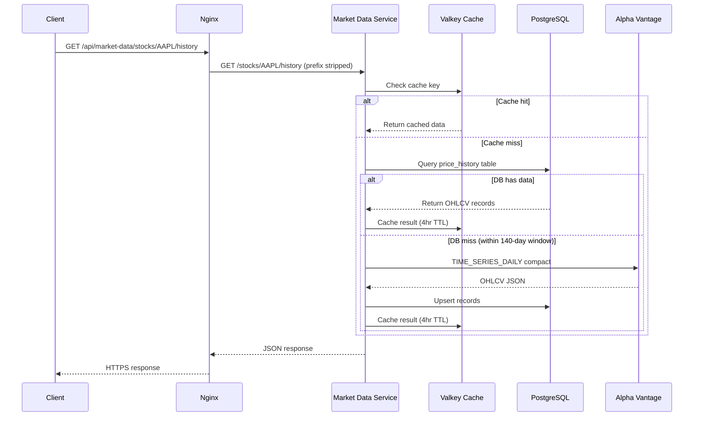
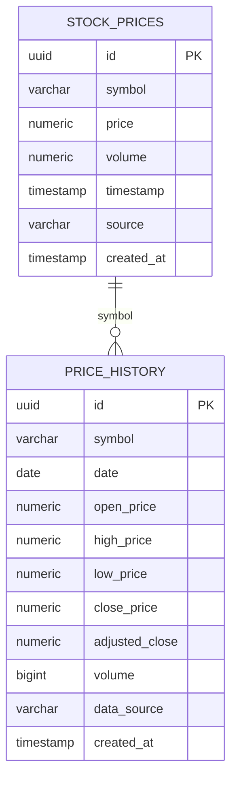

# Market Data Service — Reference Architecture
**Version:** 1.2.0
**Updated:** 2026-02-23
**Status:** Production ✅

---

## Overview

The Market Data Service (Agent 01) is the foundational data layer of the Income Fortress Platform. It provides real-time and historical price data to all other agents via a REST API, with Redis caching and PostgreSQL persistence.

---

## System Architecture

---

## API Endpoints

| Method | Path | Description |
|--------|------|-------------|
| GET | `/health` | Service health with DB and cache status |
| GET | `/stocks/{symbol}/price` | Current price (DB → Cache → Alpha Vantage) |
| GET | `/stocks/{symbol}/history` | OHLCV range query. Params: `start_date`, `end_date`, `limit` (max 365) |
| GET | `/stocks/{symbol}/history/stats` | Min, max, avg, volatility, price change % for period |
| POST | `/stocks/{symbol}/history/refresh` | Force fetch from Alpha Vantage and persist |
| GET | `/api/v1/cache/stats` | Cache hit/miss statistics |

**Public URL pattern:** `https://legatoinvest.com/api/market-data/stocks/{symbol}/price`
**Internal pattern:** `http://localhost:8001/stocks/{symbol}/price`

---

## Data Flow

---

## Data Model

**Unique constraint:** `price_history(symbol, date)` — prevents duplicate records, enables safe upserts.

---

## Infrastructure

| Component | Provider | Notes |
|-----------|----------|-------|
| Droplet | DigitalOcean NYC3 | 2vCPU, 4GB RAM, Ubuntu LTS |
| PostgreSQL | DigitalOcean Managed | VPC-only, no public exposure |
| Valkey | DigitalOcean Managed | VPC-only, replaces local Redis |
| Firewall | DigitalOcean Cloud Firewall | Allows 22, 80, 443 only |
| SSL | Let's Encrypt via Nginx | Auto-renew |
| Container | Docker (Compose V2) | `income-platform-market-data-service` |

---

## Constraints & Limitations

- **Alpha Vantage free tier:** 5 requests/minute, compact window (~100 days), no adjusted close data
- **140-day history cutoff:** Requests for data older than 140 days return DB-only results
- **`change` and `change_percent` fields:** Return 0.0 — free tier doesn't provide intraday change data
- **Planned migration:** Polygon.io + Financial Modeling Prep after Agent 02, unlocking full history and dividend data

---
