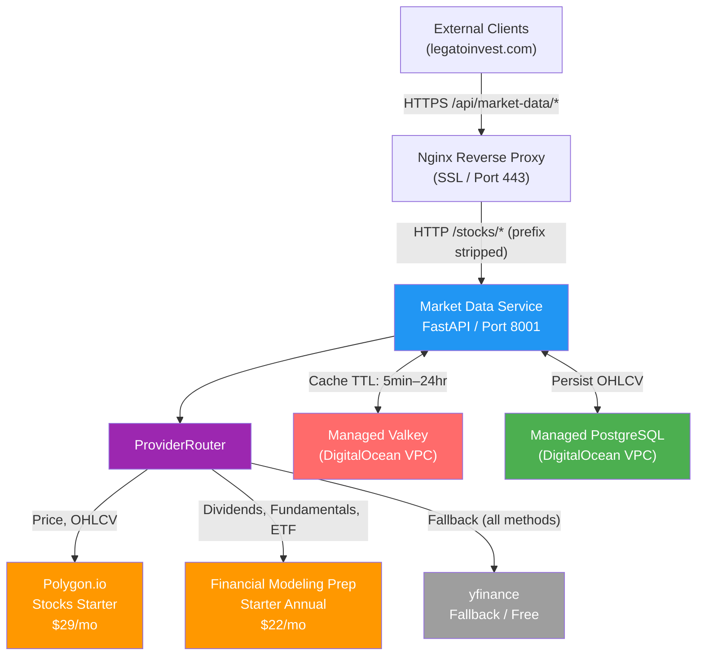
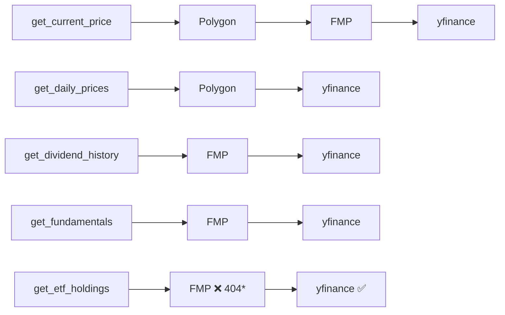
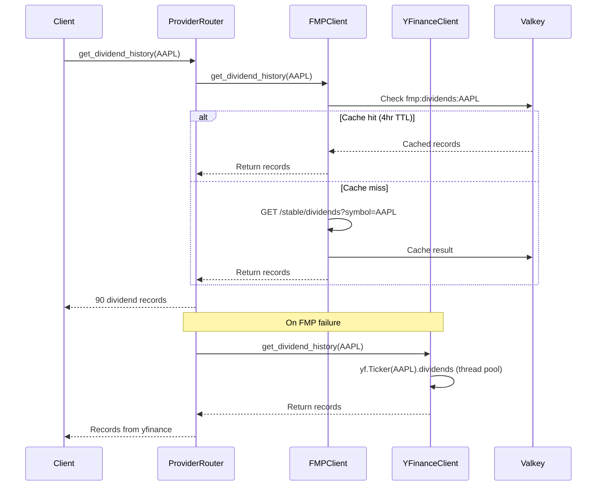

# Market Data Service — Reference Architecture
**Version:** 2.0.0
**Updated:** 2026-02-23
**Status:** Production ✅

---

## Overview

The Market Data Service (Agent 01) provides real-time prices, historical OHLCV, dividend history, fundamentals, and ETF metadata to all Income Fortress agents via a REST API. Version 2.0.0 replaces the single Alpha Vantage provider with a dual-primary + fallback architecture: Polygon.io for price data, Financial Modeling Prep for income data, and yfinance as a fallback.

---

## System Architecture

---

## Provider Routing

*FMP ETF holdings require higher tier — yfinance handles permanently on Starter plan.

---

## API Endpoints

| Method | Path | Provider | Description |
|--------|------|----------|-------------|
| GET | `/health` | — | Service health with DB and cache status |
| GET | `/stocks/{symbol}/price` | Polygon → FMP → yfinance | Current price |
| GET | `/stocks/{symbol}/history` | Polygon → yfinance (DB cache) | OHLCV range. Params: `start_date`, `end_date`, `limit` |
| GET | `/stocks/{symbol}/history/stats` | DB only | Min, max, avg, volatility, price change % |
| POST | `/stocks/{symbol}/history/refresh` | Polygon → yfinance | Force fetch and persist |
| GET | `/stocks/{symbol}/dividends` | FMP → yfinance | Dividend history with ex_date, payment_date, amount |
| GET | `/stocks/{symbol}/fundamentals` | FMP → yfinance | pe_ratio, payout_ratio, debt_to_equity, FCF, sector |
| GET | `/stocks/{symbol}/etf` | yfinance (FMP fallback) | expense_ratio, aum, covered_call, top_holdings |
| GET | `/api/v1/providers/status` | — | Provider health and last_used timestamps |
| GET | `/api/v1/cache/stats` | — | Cache hit/miss statistics |

**Public URL:** `https://legatoinvest.com/api/market-data/stocks/{symbol}/dividends`
**Internal URL:** `http://localhost:8001/stocks/{symbol}/dividends`

---

## Data Flow — Dividend History

---

## Provider Capabilities Matrix

| Capability | Polygon | FMP | yfinance |
|---|---|---|---|
| Current price | ✅ Primary | ✅ Fallback | ✅ Last resort |
| OHLCV history | ✅ Primary (730d) | ❌ | ✅ Fallback |
| Dividend history | ✅ Limited | ✅ Primary (90+ records) | ✅ Fallback |
| Fundamentals | ⚠️ Limited (Starter) | ✅ Primary | ✅ Fallback |
| ETF holdings | ❌ Not available | ❌ Requires higher tier | ✅ Primary |
| Credit ratings | ❌ | ❌ Starter tier | ❌ |
| Adjusted close | ✅ VWAP | ✅ | ✅ auto_adjust |

---

## Infrastructure

| Component | Provider | Notes |
|-----------|----------|-------|
| Droplet | DigitalOcean NYC3 | 2vCPU, 4GB RAM |
| PostgreSQL | Managed DO | VPC-only |
| Valkey | Managed DO | VPC-only |
| Firewall | DO Cloud Firewall | Ports 22, 80, 443 only |
| Polygon.io | Stocks Starter | $29/mo, 100 req/min, 730d history |
| FMP | Starter Annual | $22/mo, 300 req/min, stable API |

---

## Known Limitations

- **FMP ETF holdings** — requires tier above Starter; yfinance serves permanently
- **Credit ratings** — not available on any current provider tier; Income Scorer Junk Filter will need manual data or higher FMP tier
- **`change`/`change_percent`** on price endpoint — returns 0.0 (free tier limitation)
- **`requests_today`** on providers/status — not yet implemented
- **Alpha Vantage** — deprecated, DB contains historical cache from Sessions 1–2

---
