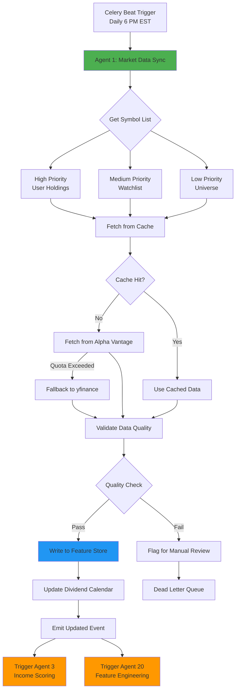

# Agent 1: Market Data Sync - Functional Specification

**Version:** 1.0.0  
**Status:** Phase 1 Complete  
**Last Updated:** February 3, 2026  
**Owner:** Income Fortress Platform - Data Pipeline Team

---

## Table of Contents

1. [Purpose & Scope](#purpose--scope)
2. [Responsibilities](#responsibilities)
3. [Interfaces](#interfaces)
4. [Dependencies](#dependencies)
5. [Success Criteria](#success-criteria)
6. [Non-Functional Requirements](#non-functional-requirements)
7. [Integration Points](#integration-points)

---

## Purpose & Scope

### Overview

Agent 1 (Market Data Sync) is responsible for maintaining up-to-date, accurate market data for all income-generating securities tracked by the platform. This agent serves as the **foundational data layer** for all downstream scoring, analysis, and decision-making agents.

### Primary Objective

Ensure the Feature Store contains fresh, validated market data with <24-hour staleness for all active symbols, enabling reliable income scoring and portfolio analysis.

### In Scope

- **Price Data Synchronization**: Daily OHLCV (Open, High, Low, Close, Volume) for all tracked symbols
- **Dividend Data Updates**: Ex-dividend dates, payment dates, dividend amounts
- **Corporate Actions**: Stock splits, mergers, ticker changes
- **Metadata Management**: Sector, industry, market cap, asset type classification
- **Data Quality Validation**: Missing data detection, outlier identification, cross-source verification
- **Incremental Updates**: Only fetch changed/new data to minimize API costs

### Out of Scope

- Real-time intraday price updates (future enhancement)
- Options chain data (handled by separate agent in Phase 2)
- Fundamental data (P/E ratios, earnings) - delegated to Agent 2
- News/sentiment data - delegated to Agent 18
- International markets (initial deployment US-only)

---

## Responsibilities

### Primary Responsibilities

**1. Daily Market Data Refresh**
- Fetch end-of-day price data for all active symbols (ETFs, CEFs, BDCs, REITs, dividend stocks)
- Update existing records or create new ones in Feature Store
- Track data freshness with timestamps
- Execute daily at 6:00 PM EST (after market close)

**2. Dividend Calendar Maintenance**
- Monitor upcoming ex-dividend dates
- Update dividend payment schedules
- Track dividend yield changes
- Identify special dividends vs regular dividends

**3. Corporate Actions Processing**
- Detect stock splits and adjust historical prices
- Handle ticker symbol changes
- Process merger/acquisition events
- Update asset classifications

**4. Data Quality Assurance**
- Validate data completeness (no missing critical fields)
- Detect outliers (e.g., price spikes >20% without news)
- Cross-verify data across multiple sources (Alpha Vantage, yfinance)
- Flag data quality issues for manual review

**5. Symbol Universe Management**
- Add new symbols based on user portfolio holdings
- Remove symbols with no active positions (after 90-day retention)
- Maintain priority tiers (high-priority: user holdings, medium: watchlist, low: universe)
- Update symbol metadata (sector reclassifications, delistings)

### Secondary Responsibilities

**6. API Cost Optimization**
- Implement tiered refresh rates (high-priority: daily, medium: weekly, low: monthly)
- Cache data to minimize redundant API calls
- Use free data sources (yfinance) before paid APIs (Alpha Vantage)
- Track API usage and costs per symbol

**7. Historical Data Backfill**
- Fetch historical data for newly added symbols (1-year minimum)
- Fill gaps in existing historical data
- Maintain 5-year history for backtesting support

**8. Monitoring & Alerting**
- Log sync status (success/failure) per symbol
- Alert on sync failures >3 consecutive days
- Report data staleness metrics
- Track API quota usage

---

## Interfaces

### Input Interfaces

**1. Symbol Universe Configuration**
```python
# Input: List of symbols to track
{
    "symbol": "VYM",
    "asset_type": "ETF",
    "priority": "high",  # high, medium, low
    "last_synced": "2026-02-02T18:00:00Z",
    "refresh_frequency": "daily"  # daily, weekly, monthly
}
```

**2. Manual Sync Triggers**
```python
# API endpoint: POST /api/v1/agents/market-data-sync/trigger
{
    "symbols": ["VYM", "SCHD"],  # Optional: specific symbols
    "force_refresh": true,  # Ignore cache
    "backfill_days": 30  # Optional: historical backfill
}
```

**3. Corporate Action Events**
```python
# Input: External corporate action feed
{
    "symbol": "AAPL",
    "event_type": "split",  # split, dividend, merger, ticker_change
    "effective_date": "2026-02-15",
    "details": {
        "split_ratio": "4:1"
    }
}
```

### Output Interfaces

**1. Feature Store Updates**
```python
# Output: Market data records
{
    "symbol": "VYM",
    "date": "2026-02-03",
    "open": 115.23,
    "high": 116.45,
    "low": 114.87,
    "close": 116.12,
    "volume": 2_345_678,
    "adjusted_close": 116.12,  # Split-adjusted
    "dividend_yield": 0.0287,  # 2.87%
    "market_cap": 45_000_000_000,  # $45B
    "sector": "Diversified",
    "data_quality_score": 0.98,  # 0-1 scale
    "source": "alpha_vantage",
    "synced_at": "2026-02-03T18:05:23Z"
}
```

**2. Dividend Calendar Updates**
```python
# Output: Dividend events
{
    "symbol": "VYM",
    "ex_dividend_date": "2026-03-15",
    "payment_date": "2026-03-28",
    "dividend_amount": 0.82,  # Per share
    "dividend_type": "regular",  # regular, special
    "frequency": "quarterly",
    "yield_on_cost": 0.0287,
    "updated_at": "2026-02-03T18:05:23Z"
}
```

**3. Data Quality Reports**
```python
# Output: Sync status report
{
    "sync_timestamp": "2026-02-03T18:05:23Z",
    "symbols_attempted": 150,
    "symbols_succeeded": 147,
    "symbols_failed": 3,
    "failed_symbols": ["XYZ", "ABC", "DEF"],
    "avg_data_quality_score": 0.96,
    "api_calls_used": 150,
    "estimated_cost": 0.15,  # $0.15
    "staleness_warnings": [
        {"symbol": "XYZ", "days_stale": 5}
    ]
}
```

**4. Downstream Agent Triggers**
```python
# Output: Trigger Agent 3 (Income Scoring) after successful sync
{
    "event": "market_data_updated",
    "symbols": ["VYM", "SCHD", ...],
    "timestamp": "2026-02-03T18:05:23Z",
    "ready_for_scoring": true
}
```

---

## Dependencies

### External Dependencies

**1. Data Providers**
- **Alpha Vantage API** (Primary)
  - Endpoint: `https://www.alphavantage.co/query`
  - Rate Limit: 5 calls/minute (free tier), 75 calls/minute (premium)
  - Cost: $49.99/month (premium tier)
  - Reliability: 99.5% uptime SLA
  - Fallback: Switch to yfinance if quota exceeded

- **yfinance** (Secondary/Fallback)
  - Python library (free)
  - No rate limits (use responsibly)
  - Reliability: ~95% uptime (best-effort)
  - Data quality: Good for daily prices, limited for dividends

**2. Infrastructure**
- **PostgreSQL Database**: Feature Store table (`feature_store`)
- **Redis Cache**: Symbol data caching (24-hour TTL)
- **Celery Queue**: `market_data_sync` queue
- **Celery Beat**: Scheduled task trigger (daily 6 PM EST)

### Internal Dependencies

**1. Feature Store (Database)**
```sql
-- Depends on: feature_store table schema
CREATE TABLE feature_store (
    id SERIAL PRIMARY KEY,
    symbol VARCHAR(10) NOT NULL,
    date DATE NOT NULL,
    open DECIMAL(10,2),
    high DECIMAL(10,2),
    low DECIMAL(10,2),
    close DECIMAL(10,2),
    volume BIGINT,
    adjusted_close DECIMAL(10,2),
    dividend_yield DECIMAL(6,4),
    data_quality_score DECIMAL(3,2),
    source VARCHAR(50),
    synced_at TIMESTAMP,
    UNIQUE(symbol, date)
);
```

**2. Agent 3 (Income Scoring)**
- **Relationship**: Upstream data provider
- **Trigger**: Agent 1 success triggers Agent 3 scoring
- **Data Contract**: Feature Store must contain data <24h old

**3. Agent 20 (Feature Engineer)**
- **Relationship**: Provides enriched features
- **Trigger**: Agent 1 updates trigger feature recalculation
- **Data Contract**: Raw price data → derived features (momentum, volatility)

---

## Success Criteria

### Functional Success Criteria

**1. Data Freshness**
- [ ] 95%+ of high-priority symbols have data <24 hours old
- [ ] 90%+ of medium-priority symbols have data <7 days old
- [ ] 100% of user-held symbols synced within 24 hours of market close

**2. Data Completeness**
- [ ] <1% missing OHLCV data for any trading day
- [ ] 100% of dividend-paying symbols have accurate ex-div dates
- [ ] All corporate actions processed within 24 hours of announcement

**3. Data Quality**
- [ ] Average data quality score >0.95 (scale 0-1)
- [ ] <0.1% outlier detections (false positives)
- [ ] Cross-source verification for 100% of high-priority symbols

**4. Reliability**
- [ ] 99%+ sync success rate (daily basis)
- [ ] <5% failure rate for individual symbols
- [ ] Recovery within 1 hour for failed syncs (retry mechanism)

**5. Performance**
- [ ] Sync completes within 30 minutes for 150 symbols
- [ ] API response time <2 seconds per symbol (p95)
- [ ] Database write latency <100ms per record

### Non-Functional Success Criteria

**6. Cost Efficiency**
- [ ] API costs <$80/month for 15 tenants (150 symbols)
- [ ] 80%+ cache hit rate for repeated queries
- [ ] Free tier (yfinance) used for 50%+ of symbols

**7. Scalability**
- [ ] Support 500 symbols without performance degradation
- [ ] Support 15 tenants with schema isolation
- [ ] Horizontal scaling ready (stateless agent design)

**8. Observability**
- [ ] 100% of sync operations logged
- [ ] Success/failure metrics available in Prometheus
- [ ] Alerts triggered for staleness >24 hours

---

## Non-Functional Requirements

### Performance

**Throughput:**
- Process 150 symbols in <30 minutes (5 symbols/minute)
- Handle 1,000 symbols/hour if scaled horizontally

**Latency:**
- API fetch: <2s per symbol (p95)
- Database write: <100ms (p95)
- End-to-end sync: <30 minutes for daily batch

**Resource Usage:**
- Memory: <512 MB per worker
- CPU: <50% during sync operation
- Disk: <1 GB for 5-year historical data per symbol

### Reliability

**Availability:**
- 99.5% uptime (SLA: <3.6 hours downtime/month)
- Automatic retry on transient failures (3 attempts, exponential backoff)
- Graceful degradation: Use cached data if APIs unavailable

**Data Integrity:**
- ACID transactions for database writes
- Idempotent operations (safe to re-run)
- Audit trail for all data modifications

**Fault Tolerance:**
- Continue processing other symbols if one fails
- Dead letter queue for persistent failures
- Manual intervention queue for data quality issues

### Scalability

**Horizontal Scaling:**
- Stateless agent design (scale workers independently)
- Partition symbols across workers (round-robin or hash-based)
- Support 10x growth (1,500 symbols) with linear scaling

**Data Volume:**
- 5-year historical data: ~1,800 rows per symbol
- 1,000 symbols = 1.8M rows (manageable with partitioning)
- Archive data >5 years to cold storage

### Security

**API Key Management:**
- Store API keys in environment variables (not code)
- Rotate keys quarterly
- Use separate keys per environment (dev, staging, prod)

**Data Access:**
- Read-only access to external APIs
- Write access restricted to Feature Store tables only
- Schema-based tenant isolation (multi-tenancy)

### Maintainability

**Code Quality:**
- Unit test coverage >80%
- Integration tests for API interactions
- Mock external APIs in tests (avoid quota consumption)

**Logging:**
- Structured logging (JSON format)
- Log levels: DEBUG (development), INFO (production)
- Sensitive data masked (API keys redacted)

**Monitoring:**
- Prometheus metrics exported
- Grafana dashboard for sync status
- PagerDuty alerts for critical failures

---

## Integration Points

### Upstream Dependencies

**1. Portfolio Management System**
- **Trigger**: New symbol added to user portfolio
- **Action**: Add symbol to high-priority sync list
- **Frequency**: Real-time (on portfolio update)

**2. Symbol Universe Service**
- **Trigger**: Periodic universe refresh (weekly)
- **Action**: Update symbol metadata (sector, asset type)
- **Frequency**: Weekly (Sunday 1 AM EST)

### Downstream Consumers

**1. Agent 3: Income Scoring**
- **Trigger**: Market data updated event
- **Data Required**: Latest price, dividend yield, volume
- **SLA**: Data <24 hours old

**2. Agent 5: Portfolio Monitor**
- **Trigger**: Price update
- **Data Required**: Current price, day change, volume
- **SLA**: Near real-time (within 1 hour of market close)

**3. Agent 13: Backtesting Engine**
- **Trigger**: User initiates backtest
- **Data Required**: Historical OHLCV (1-5 years)
- **SLA**: Historical data complete (no gaps)

**4. Agent 20: Feature Engineer**
- **Trigger**: Market data updated
- **Data Required**: OHLCV, volume for feature calculation
- **SLA**: Synchronous processing (within 5 minutes)

### External Integrations

**1. Data Quality Dashboard**
- **Interface**: REST API endpoint `/api/v1/data-quality/report`
- **Purpose**: Display sync status to operations team
- **Format**: JSON with sync stats, failed symbols, staleness warnings

**2. Cost Tracking System**
- **Interface**: Emit cost metrics to Prometheus
- **Purpose**: Track API usage costs per tenant
- **Format**: `api_cost_total{provider="alpha_vantage", tenant="tenant_1"}`

---

## Workflow Diagram



---

## Error Handling

### Retry Strategy

**Transient Failures (Network, Rate Limits):**
```python
# Exponential backoff with jitter
retry_delays = [10s, 30s, 90s]  # Max 3 retries
jitter = random(0, 5s)  # Avoid thundering herd
```

**Permanent Failures (Symbol Delisted, Invalid Ticker):**
```python
# Move to dead letter queue, alert operations
if failure_count > 3:
    send_to_dlq(symbol, error_details)
    notify_ops_team(symbol, "Persistent sync failure")
```

### Graceful Degradation

**API Quota Exceeded:**
1. Switch to yfinance (free tier)
2. Reduce sync frequency for low-priority symbols
3. Alert operations team to upgrade API tier

**Database Unavailable:**
1. Queue updates in Redis (temporary buffer)
2. Retry database writes every 5 minutes
3. Escalate if database down >15 minutes

---

## Testing Strategy

### Unit Tests

- [ ] Symbol list retrieval (mocked database)
- [ ] API response parsing (mocked Alpha Vantage response)
- [ ] Data quality validation logic
- [ ] Corporate action processing
- [ ] Cache hit/miss logic

### Integration Tests

- [ ] End-to-end sync with test symbols (sandbox API)
- [ ] Feature Store write and read (test database)
- [ ] Dividend calendar updates
- [ ] Downstream event triggers (Agent 3, Agent 20)

### Performance Tests

- [ ] Sync 150 symbols (measure completion time <30 min)
- [ ] Sync 500 symbols (validate scalability)
- [ ] Concurrent sync (multiple workers)

### Failure Mode Tests

- [ ] API timeout handling
- [ ] API quota exceeded (switch to fallback)
- [ ] Database connection failure (queuing)
- [ ] Invalid symbol handling (delisted ticker)

---

## Metrics & Monitoring

### Key Metrics

```python
# Prometheus metrics
market_data_sync_duration_seconds = Histogram(
    'market_data_sync_duration_seconds',
    'Time to sync all symbols',
    buckets=[60, 300, 600, 1800, 3600]  # 1m, 5m, 10m, 30m, 1h
)

market_data_sync_success_total = Counter(
    'market_data_sync_success_total',
    'Successful symbol syncs',
    ['symbol', 'source']
)

market_data_sync_failure_total = Counter(
    'market_data_sync_failure_total',
    'Failed symbol syncs',
    ['symbol', 'source', 'error_type']
)

market_data_staleness_hours = Gauge(
    'market_data_staleness_hours',
    'Hours since last successful sync',
    ['symbol']
)

api_cost_total = Counter(
    'api_cost_total',
    'Cumulative API costs',
    ['provider', 'tenant']
)
```

### Alerts

**Critical (P0):**
- Market data sync failed for >10% of symbols (3 consecutive days)
- All data sources unavailable (Alpha Vantage + yfinance down)

**High (P1):**
- High-priority symbol stale for >24 hours
- API quota exceeded (need to upgrade tier)
- Sync duration >60 minutes (performance degradation)

**Medium (P2):**
- Data quality score <0.90 for >5% of symbols
- API cost exceeds budget ($80/month)

---

## Future Enhancements (Phase 2+)

- [ ] Real-time intraday price updates (websocket feeds)
- [ ] Options chain data integration
- [ ] International market support (European, Asian exchanges)
- [ ] Machine learning-based outlier detection
- [ ] Automatic symbol discovery (trending income securities)
- [ ] Historical dividend adjustments (special dividends)

---

**Specification Version:** 1.0.0  
**Implementation Status:** Complete (Phase 1)  
**Last Updated:** February 3, 2026  
**Next Review:** May 1, 2026 (Phase 2 planning)
