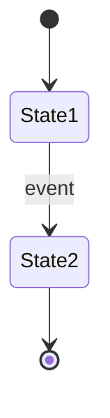

# {{COMPONENT_NAME}} - Functional Specification

**Version**: 1.0  
**Date**: {{DATE}}  
**Status**: Draft  
**Priority**: TBD

## Purpose & Scope

[Describe what this component does in 2-3 sentences]

### What This Component Does
- [Primary function 1]
- [Primary function 2]
- [Primary function 3]

### What This Component Does NOT Do
- [Out of scope item 1]
- [Out of scope item 2]

---

## Responsibilities

### Primary Responsibilities
1. **[Responsibility 1]**: [Description]
2. **[Responsibility 2]**: [Description]
3. **[Responsibility 3]**: [Description]

### Secondary Responsibilities
- **[Secondary item 1]**: [Description]
- **[Secondary item 2]**: [Description]

---

## Interfaces

### Input Interface

**Primary Input**:
```json
{
  "field1": "value",
  "field2": 123,
  "field3": {
    "nested": "value"
  }
}
```

### Output Interface

**Primary Output**:
```json
{
  "result": "value",
  "metadata": {
    "timestamp": "ISO-8601",
    "version": "1.0"
  }
}
```

---

## Dependencies

### Data Dependencies
- **[Table/Source 1]**: [What data is needed]
- **[Table/Source 2]**: [What data is needed]

### Service Dependencies
- **[Service 1]**: [Why needed]
- **[Service 2]**: [Why needed]

### External Dependencies
- **[External API 1]**: [Purpose]

---

## Success Criteria

### Functional Success
✅ **[Criterion 1]**: [Measurable metric]  
✅ **[Criterion 2]**: [Measurable metric]  
✅ **[Criterion 3]**: [Measurable metric]  

### Performance Success
✅ **Latency**: [Target response time]  
✅ **Throughput**: [Requests per second]  
✅ **Availability**: [Uptime percentage]  

### Data Quality Success
✅ **[Quality metric 1]**: [Target]  
✅ **[Quality metric 2]**: [Target]  

---

## Non-Functional Requirements

### Performance
- **Latency**: p50 <Xms, p95 <Yms, p99 <Zms
- **Throughput**: X requests/second sustained
- **Resource usage**: ≤X MB memory, ≤Y% CPU

### Reliability
- **Uptime**: 99.X% availability
- **Error rate**: <X% of requests fail
- **Graceful degradation**: [How it degrades when dependencies fail]

### Scalability
- **Horizontal scaling**: [Can it scale horizontally?]
- **Database load**: [Queries per second limits]
- **Concurrency**: [How many simultaneous operations?]

### Security
- **Authentication**: [How is it authenticated?]
- **Authorization**: [Access control model]
- **Data privacy**: [What data needs protection?]

### Maintainability
- **Logging**: [What gets logged?]
- **Monitoring**: [What metrics are exposed?]
- **Documentation**: [API docs auto-generated?]

---

## Workflow & State Machine

[Describe the workflow, ideally with a Mermaid diagram]



---

## Example Usage Scenarios

### Scenario 1: [Common Use Case]

**User Action**: [What user does]  
**Flow**:
1. [Step 1]
2. [Step 2]
3. [Step 3]

**Expected Time**: <X seconds

### Scenario 2: [Edge Case]

**Trigger**: [What triggers this]  
**Flow**:
1. [Step 1]
2. [Step 2]

**Expected Behavior**: [What should happen]

---

## Integration Points

### Upstream (Data Providers)
- **[Provider 1]**: Provides [what data/service]

### Downstream (Consumers)
- **[Consumer 1]**: Uses this component for [purpose]
- **[Consumer 2]**: Uses this component for [purpose]

### Peer Services
- **[Peer 1]**: Collaborates on [what]

---

## Error Handling

### Error Categories
1. **Client Errors (4xx)**
   - [Error type 1] → [HTTP code] [Response]
   - [Error type 2] → [HTTP code] [Response]

2. **Server Errors (5xx)**
   - [Error type 1] → [HTTP code] [Response]
   - [Error type 2] → [HTTP code] [Response]

### Retry Strategy
- **Transient errors**: Retry [X] times with exponential backoff
- **Permanent errors**: Return error immediately
- **Critical errors**: Alert ops team

### Graceful Degradation
If [dependency] unavailable:
- [Fallback behavior 1]
- [Fallback behavior 2]

---

## Monitoring & Observability

### Key Metrics
- `component_requests_total{status}`: Total requests
- `component_duration_seconds{status}`: Latency histogram
- `component_errors_total{type}`: Error counts

### Alerts
- **[Alert 1]**: Condition → Action
- **[Alert 2]**: Condition → Action

### Logging
Every request logged (structured JSON):
```json
{
  "timestamp": "ISO-8601",
  "level": "INFO|ERROR",
  "service": "component-name",
  "message": "...",
  "metadata": {}
}
```

---

## Future Enhancements

### Phase 2
- [Enhancement 1]
- [Enhancement 2]

### Phase 3
- [Enhancement 1]
- [Enhancement 2]

---

## Acceptance Criteria

See [Implementation Specification](../implementation/{{COMPONENT_NAME}}-impl.md) for detailed testable acceptance criteria.

---

## References

- [Related documentation 1]
- [External reference 1]

---

**Document Status**: Draft  
**Next Step**: Create implementation specification with testing details
