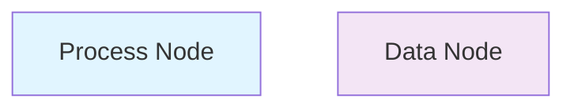

# Documentation Standards & Style Guide

## Writing Principles

**Clarity over cleverness** - Use direct language. Assume reader is smart but unfamiliar with specific details.

**Specification over inspiration** - Be precise. Use exact names, specific numbers, testable criteria.

**Structure for skimmability** - Use headers, bold emphasis sparingly, short paragraphs. Readers should extract key info in 30 seconds.

**Examples over abstractions** - Show concrete examples rather than theoretical explanations.

## Document Structure & Formatting

### Heading Hierarchy
```markdown
# [Document Title]
Main topic, only one H1 per document

## Major Section
Logical grouping of related content

### Subsection
Specific aspect of major section

#### Detail Point (use sparingly)
Granular detail only if necessary
```

### Paragraph Length
- Aim for 3-4 sentences per paragraph maximum
- One idea per paragraph
- Use line breaks between related paragraphs for readability

### Emphasis
- **Bold** for key terms, names, critical points
- *Italics* sparingly, only for introducing new terms
- `Code` for technical terms, file names, variables
- **Avoid CAPS** except for acronyms

### Lists
Use unordered lists for:
- Items in no particular order
- Options to choose from
- Components in a system

Use ordered lists for:
- Sequential steps
- Prioritized items
- Numbered references

Keep list items short (one sentence each when possible).

## Specification Document Format

### Functional Specification Template

```markdown
# [Component Name] - Functional Specification

**Status**: [Stable | In Progress | Under Review]
**Last Updated**: YYYY-MM-DD
**Author**: [Name]

## Purpose & Scope

[2-3 sentences. What does this component do? What problem does it solve?]

## Responsibilities

Describe specific tasks this component owns:
- Responsibility 1
- Responsibility 2
- Responsibility 3

## Interfaces

### Input
Describe what this component receives:
- [Interface 1]: [Format, expected values]
- [Interface 2]: [Format, expected values]

### Output
Describe what this component produces:
- [Interface 1]: [Format, expected values]
- [Interface 2]: [Format, expected values]

## Dependencies

What other components or systems does this depend on?
- **Upstream**: Components that feed into this one
- **Downstream**: Components that consume output
- **External**: Third-party systems, APIs, services

## Success Criteria

How do we know this component is working correctly?
- Criterion 1: [Measurable, testable description]
- Criterion 2: [Measurable, testable description]
- Criterion 3: [Measurable, testable description]

## Non-Functional Requirements

- **Performance**: [SLA for latency, throughput]
- **Reliability**: [Uptime target, error rates]
- **Scalability**: [Expected growth trajectory, limits]
- **Maintainability**: [Code quality standards, documentation]

## Diagram(s)

[Embed Mermaid diagram showing this component's role]

See [system-architecture.mmd](../architecture/system-architecture.mmd) for context.

## Related Specifications

- [Component X Functional Spec](component-x-functional.md) - Upstream dependency
- [Component Y Functional Spec](component-y-functional.md) - Downstream consumer
```

### Implementation Specification Template

```markdown
# [Component Name] - Implementation Specification

**Status**: [Stable | In Progress | Under Review]
**Last Updated**: YYYY-MM-DD
**Author**: [Name]

## Overview

[Extends functional spec. Brief summary of what's being implemented.]

**Functional Spec Reference**: [Link to functional spec](../functional/component-functional.md)

## Technical Design

### Architecture
[How is this component structured internally?]

### Key Algorithms/Approaches
[What algorithms or patterns are used?]

### Technology Choices
[Why these specific tools/libraries?]

## API & Interfaces

### Methods/Functions
```python
def component_main(param1: Type, param2: Type) -> ReturnType:
    """
    Purpose of this function.
    
    Args:
        param1: Description and valid values
        param2: Description and valid values
    
    Returns:
        Description of return value
    
    Raises:
        ExceptionType: When this is raised
    """
```

### Input/Output Format
```
Input: [Exact format, schema, examples]
Output: [Exact format, schema, examples]
```

## Dependencies & Integrations

### Required Libraries
- library-name (version X.Y.Z) - Purpose
- other-lib (version A.B.C) - Purpose

### External Services
- Service Name (API version X) - What's called, frequency
- Another Service - What's called, frequency

### Internal Components
- Component A - Data flowing in/out
- Component B - Dependency type

## Testing & Acceptance

### Unit Test Requirements
What functions/methods need tests?
```
test_[function_name]:
  - Normal case: [expected behavior]
  - Edge case 1: [input], expect [output]
  - Edge case 2: [input], expect [output]
  - Error case: [condition], expect [exception]
```

### Integration Test Scenarios
How does this work with dependencies?
```
Scenario 1: [Component A] → [Component B] → [this component]
  Input: [sample data]
  Expected: [behavior and output]
  
Scenario 2: [This component] → [Component X]
  Input: [sample data]
  Expected: [behavior and output]
```

### Acceptance Criteria (Testable)
- Criterion 1: `[When X happens], [verify Y is true]`
- Criterion 2: `[When A input], [verify B output]`
- Criterion 3: `[Measure C], [should be within range D]`

Example:
- `When processing valid payload, system responds in < 500ms`
- `When upstream service unavailable, component returns error code 503 and logs attempt`
- `Over 1000 runs with identical input, variance in output is < 5%`

### Known Edge Cases & Failure Modes

| Scenario | Input/Condition | Expected Behavior | Error Handling |
|----------|-----------------|------------------|---|
| Normal operation | Valid input | Process successfully | N/A |
| Missing dependency | Service X down | Return 503 error | Log and alert |
| Invalid input | Malformed JSON | Validate and reject | Return 400 with details |
| Resource limit | Input > 1GB | Chunk and process | Monitor memory |

### Performance & Reliability SLAs

- **Latency SLA**: [P95 latency < X ms, P99 < Y ms]
- **Throughput SLA**: [Minimum X requests/sec]
- **Error Rate SLA**: [< X% errors over monitoring period]
- **Availability SLA**: [Y% uptime, Z hour maintenance window]

## Implementation Notes

### Critical Gotchas
[Things that commonly go wrong during implementation]

### Best Practices
[Recommended patterns for implementation]

### References
[Key documentation, examples, external resources]

## Diagram(s)

[Mermaid diagrams showing this component's internal structure]

## Related Specifications

- [Component X Functional Spec](component-x-functional.md)
- [Component X Implementation Spec](component-x-impl.md)
```

## Code Examples in Specifications

### Python
```python
def example_function(param: str) -> bool:
    """Concise description."""
    if not param:
        raise ValueError("param cannot be empty")
    
    return len(param) > 0
```

### JavaScript
```javascript
async function exampleFunction(param) {
    if (!param) throw new Error("param required");
    return param.length > 0;
}
```

### API Endpoint
```
POST /api/v1/component/process
Content-Type: application/json

{
    "payload": {...},
    "options": {...}
}

Response 200 OK:
{
    "result": {...},
    "metadata": {...}
}
```

## Mermaid Diagram Conventions

### Naming
- Use clear, concise component names
- Use consistent terminology across all diagrams
- Use `PascalCase` for component names
- Use `snake_case` for relationship descriptions

### Colors & Styling
When specifying colors in Mermaid:


Standard colors:
- Process/Logic: Light Blue (#e1f5ff)
- Data: Light Purple (#f3e5f5)
- External: Light Green (#e8f5e9)
- Error/Warning: Light Red (#ffebee)

### Diagram Types

**System Architecture**: Flowchart showing components and data flows
**Component Interaction**: Sequence diagram for workflows
**Data Model**: Entity or class diagram
**State Machine**: State diagram for behaviors

## Change Notation

When updating specifications:

```markdown
## Technical Design

### Architecture (Updated 2025-01-23)
[Previous approach description removed]

**CHANGED**: Now using event-driven pattern instead of polling.
**WHY**: Reduced latency from 5s to <100ms.

[New approach description]
```

## Cross-References

Always use relative paths:

```markdown
See [Reference Architecture](../architecture/reference-architecture.md)
for system overview.

See [System Diagram](../architecture/system-diagram.mmd) for visual.

Related: [Component X Implementation](component-x-impl.md)
```

## Status Markers

Mark document status clearly:

```markdown
**Status**: Stable | **Last Updated**: 2025-01-23 | **Next Review**: 2025-04-23
```

Status meanings:
- **Stable**: Agreed upon, unlikely to change
- **In Progress**: Under active development, expect changes
- **Under Review**: Submitted for approval, not final
- **Deprecated**: No longer used, for reference only

## Tables for Comparisons

Use tables for side-by-side comparisons:

```markdown
| Aspect | Option A | Option B |
|--------|----------|----------|
| Performance | Good | Excellent |
| Complexity | Simple | Moderate |
| Cost | $X | $Y |
| Risk | Low | Medium |
```

## Code Documentation Standards

### Python Docstrings
```python
def function_name(param1: str, param2: int) -> dict:
    """
    One-line summary of what this does.
    
    Longer explanation if needed, describing the function's
    purpose, behavior, and any important side effects.
    
    Args:
        param1: Description of param1, including valid values
        param2: Description of param2, including valid values
    
    Returns:
        Description of return value and structure
    
    Raises:
        ValueError: When param1 is empty
        TypeError: When param2 is not an integer
    
    Example:
        >>> result = function_name("test", 42)
        >>> print(result["status"])
        "success"
    """
```

## Validation Checklist for Specifications

- [ ] Clear purpose statement
- [ ] All responsibilities listed
- [ ] Interfaces completely specified
- [ ] Dependencies identified
- [ ] Success criteria are measurable and testable
- [ ] SLAs defined (if applicable)
- [ ] Edge cases documented
- [ ] Diagrams included and referenced
- [ ] Related specs cross-referenced
- [ ] Status and date current
- [ ] No undefined acronyms
- [ ] Code examples are tested/valid

## Tools for Writing & Rendering

- **Markdown Editor**: Use VS Code, Cursor IDE, or similar
- **Mermaid Diagrams**: Use https://mermaid.live for live editing
- **Spell Check**: Built-in or use plugins
- **Link Validation**: Check paths relative to document location

## Example: Complete Specification

Reference the `examples/` folder in the skill for a complete,
validated specification document with all sections properly filled.
