# Mermaid Diagram Conventions

This document defines standards for creating consistent, clear Mermaid diagrams across all platform documentation.

## Core Principles

1. **Clarity**: Diagrams should communicate clearly without extensive explanation
2. **Consistency**: Use same styles, colors, naming across all diagrams
3. **Purpose**: Each diagram has one clear purpose
4. **Linked**: Diagrams should link back to relevant specs

## Diagram Types & When to Use

### System Architecture (Flowchart)

**Purpose**: Show how major components interact and data flows between them

**When to use**: 
- Showing overall platform structure
- High-level component relationships
- Data flow between systems

**Example**:
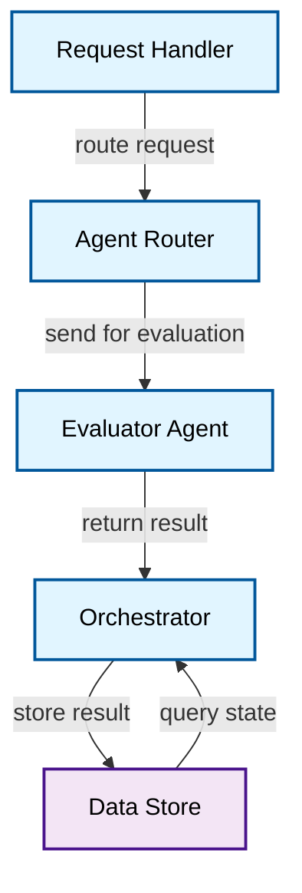

### Component Interaction (Sequence Diagram)

**Purpose**: Show temporal flow and message passing between components

**When to use**:
- Documenting a specific workflow
- Showing timing and order of operations
- Illustrating error handling paths

**Example**:
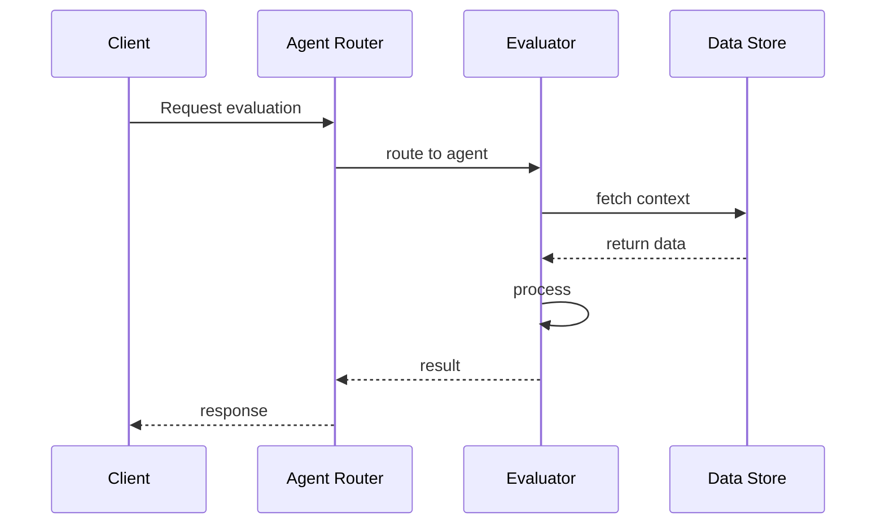

### Data Model (Entity Relationship or Class)

**Purpose**: Show data structures and relationships

**When to use**:
- Documenting database schema
- Showing data class relationships
- Defining information architecture

**Example**:
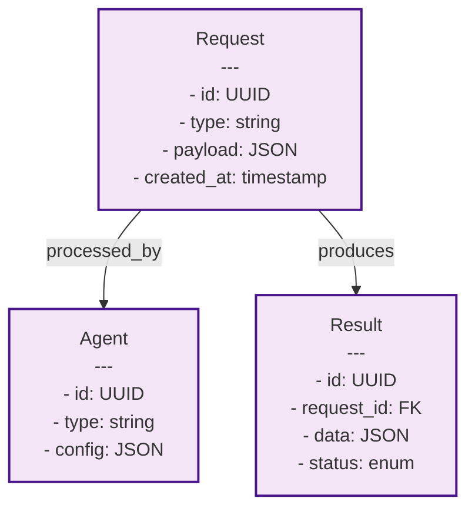

### State Machine (State Diagram)

**Purpose**: Show states and transitions for agents or workflows

**When to use**:
- Documenting agent states
- Showing workflow stages
- Illustrating state transitions and conditions

**Example**:
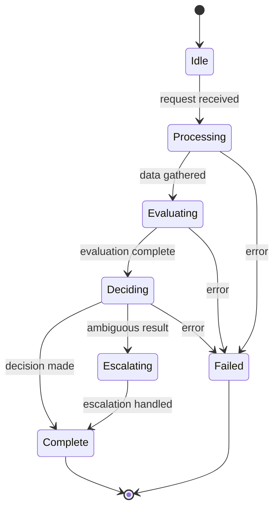

## Naming Conventions

### Component Names
- Use clear, descriptive names
- Use PascalCase for component names: `RequestRouter`, `EvaluatorAgent`, `DataStore`
- Use consistent names across all diagrams

### Relationships/Edges
- Use snake_case for action descriptions: `send_request`, `return_result`, `store_data`
- Be specific: avoid generic "calls" or "uses"
- Example: ✓ `routes to agent` vs ✗ `calls`

### Variables/Data
- Use camelCase for variables: `requestId`, `userData`, `confidenceScore`
- Use UPPER_CASE for constants: `MAX_RETRIES`, `TIMEOUT_MS`

## Color Coding

### Standard Color Palette

**Process/Logic** - Light Blue
```
fill:#e1f5ff, stroke:#01579b
Used for: Agents, handlers, processors, logic components
```

**Data** - Light Purple
```
fill:#f3e5f5, stroke:#4a148c
Used for: Databases, data stores, data structures
```

**External Services** - Light Green
```
fill:#e8f5e9, stroke:#1b5e20
Used for: Third-party APIs, external systems
```

**Decision Points** - Light Orange
```
fill:#ffe0b2, stroke:#e65100
Used for: Branching logic, conditional paths
```

**Error/Warning** - Light Red
```
fill:#ffebee, stroke:#b71c1c
Used for: Error paths, failure states
```

### Applying Colors in Mermaid

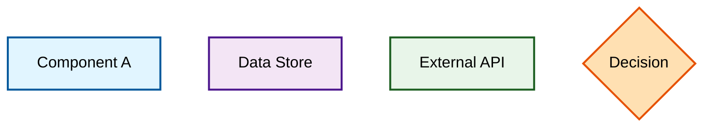

## Relationship Types

### Data Flow vs Control Flow

**Data Flow** → (solid arrow)
```mermaid
A -->|data passes| B
```

**Control Flow** -- (dashed line for async)
```mermaid
A -.->|async call| B
```

**Bidirectional**
```mermaid
A <-->|query/update| B
```

### Labeling Relationships

Be explicit about what flows:
```mermaid
A -->|passes request| B
B -->|returns result| C
C -->|stores in| D
```

## Diagram Layout Guidelines

### Flowchart Direction
- **Top to bottom** (TD): Most common, best for showing hierarchies
- **Left to right** (LR): For horizontal workflows
- Avoid: Right to left (RL) and bottom to top (BT) unless specifically needed

### Node Organization
1. **Top level**: Entry points, initial components
2. **Middle**: Processing components
3. **Bottom**: Output/termination
4. **Sides**: External systems, auxiliary components

Example:
```
    [Entry]
      ↓
   [Process A] → [External API]
      ↓
   [Process B]
      ↓
   [Data Store]
```

## Common Patterns

### Error Handling
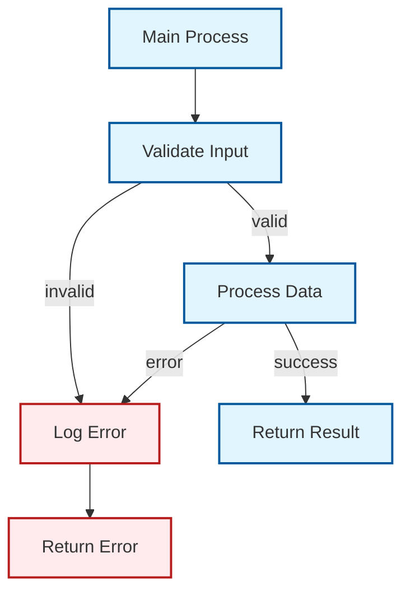

### Retry Logic
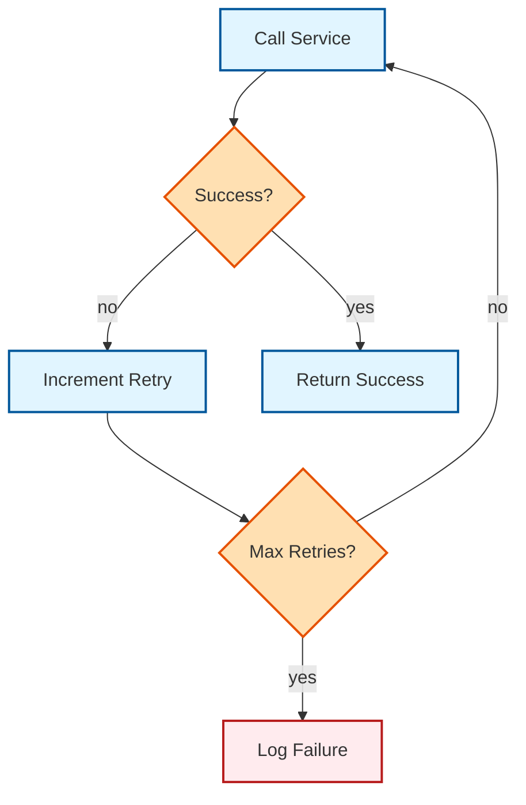

### Parallel Processing
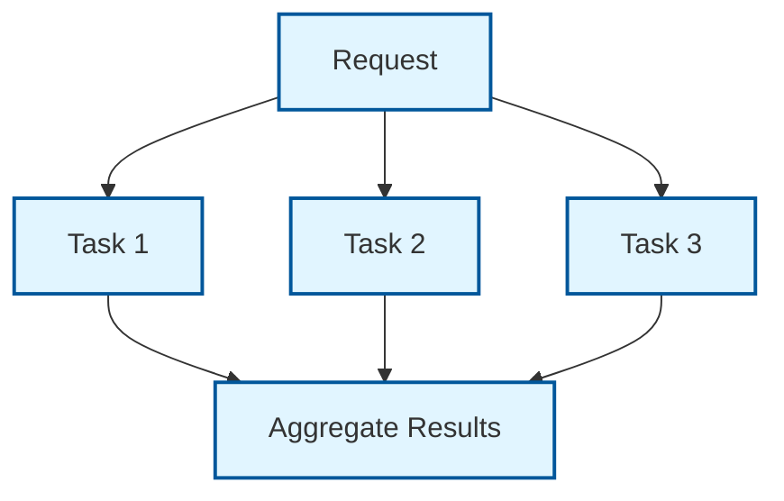

## Best Practices

1. **Keep it simple** - Avoid overcomplicated diagrams
   - If diagram has > 15 nodes, split into multiple
   - Focus on one concern per diagram

2. **Make it readable** - Consider viewers who are unfamiliar
   - Use clear labels
   - Avoid crossing lines where possible
   - Group related components

3. **Use consistent style** - All diagrams should feel cohesive
   - Same colors for same types
   - Same naming conventions
   - Same formatting rules

4. **Add legends when needed** - If color scheme isn't obvious
   ```
   Legend:
   🔵 Blue: Processing/Logic
   🟣 Purple: Data/Storage
   🟢 Green: External Services
   ```

5. **Version diagrams** - Like code, diagrams change
   - Include date or version
   - Keep old versions for reference

6. **Reference specs** - Link diagrams to relevant documentation
   ```markdown
   See [System Architecture Spec](../architecture/reference-architecture.md)
   for details on each component.
   ```

## Testing Diagrams

Before including in documentation, verify:

- [ ] Diagram is clear without written explanation
- [ ] Component names match specs
- [ ] Colors are used consistently
- [ ] Labels on arrows are clear
- [ ] Layout flows logically
- [ ] Font is readable
- [ ] No overly long labels (use abbreviation if needed)
- [ ] All critical components included
- [ ] Non-critical details excluded

## Tools for Creating Mermaid Diagrams

- **Live editor**: https://mermaid.live
- **VS Code**: Install Mermaid plugin
- **Markdown preview**: Most markdown viewers render Mermaid
- **GitHub**: Renders Mermaid in markdown files
- **Google Docs**: Use Mermaid.live, embed as image

## Examples by Type

### Example: System Architecture

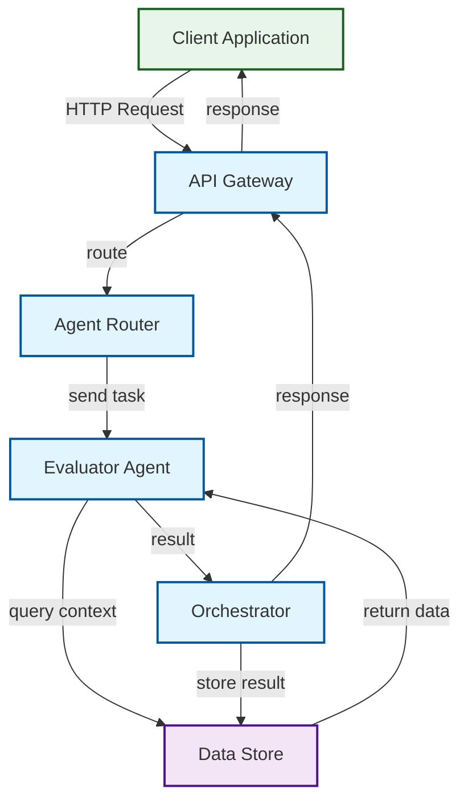

### Example: Sequence Diagram

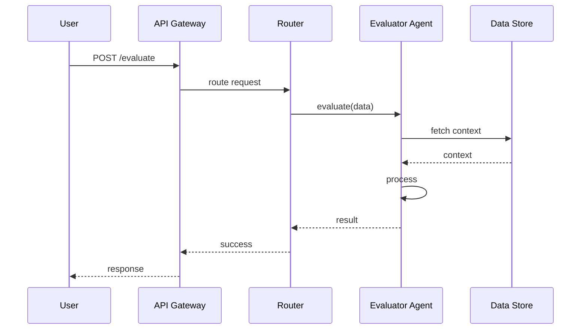

### Example: State Diagram

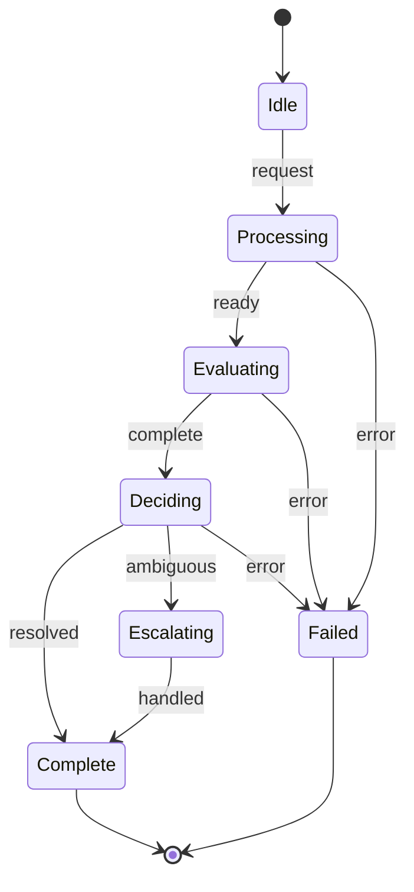
